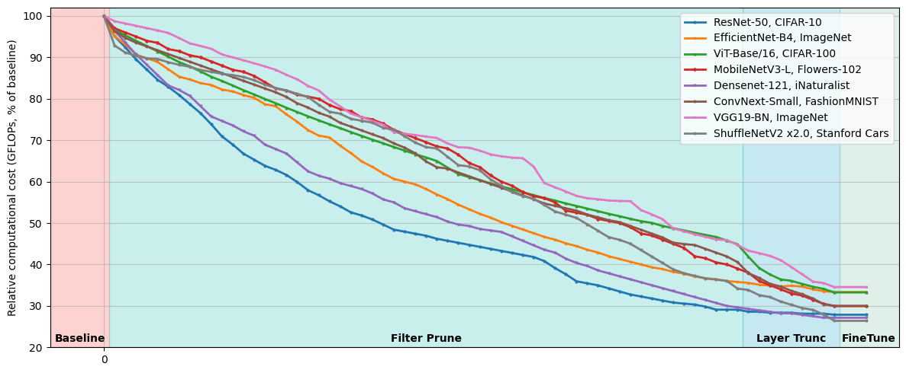
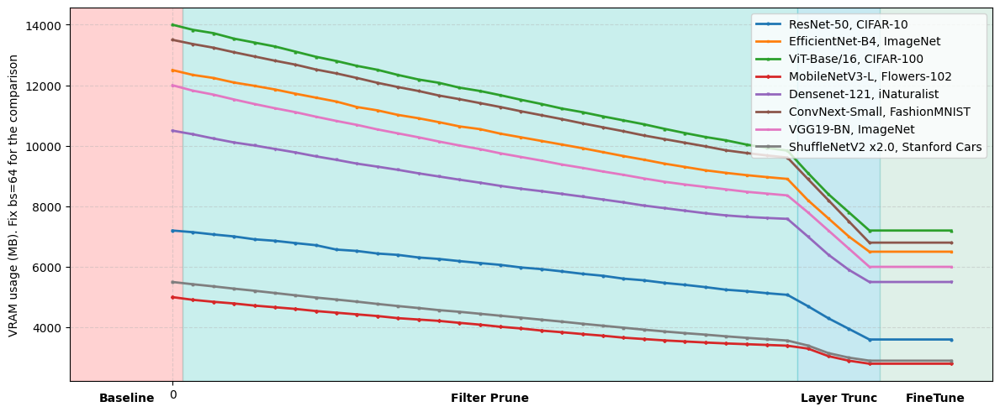

# IDAP++: ADVANCING DIVERGENCE-BASED PRUNING VIA FILTER-LEVEL AND LAYER-LEVEL OPTIMIZATION

### Codebase for ICLR 2026 Submission

This repository provides the official implementation of IDAP++, a novel neural network compression approach that unifies both filter-level (width) and architecture-level (depth) pruning through information flow divergence analysis. The proposed method establishes a unified approach applicable to diverse neural architectures, including convolutional networks and transformer-based models. 

We propose the first pruning methodology that systematically optimizes neural networks along both width (filter-level) and depth (layer-level) dimensions through a unified flow-divergence
criterion. The framework combines:
- Divergence-Aware Filter Pruning (IDAP)
- Flow-Guided Layer Truncation


### Prerequisites
- Python 3.10+
- PyTorch 2.0+
- CUDA-compatible GPU
- Other dependencies listed in `requirements.txt`

### Installation
1. Clone the repository:
```bash
git clone https://github.com/user852154/divergence_aware_pruning.git
cd divergence_aware_pruning
```

2. Create and activate a virtual environment:
```bash
python -m venv venv
source venv/bin/activate
```

3. Install dependencies:
```bash
pip install -r requirements.txt
```

### Visualization of information flow through network depth


### Results

1. **Pruning Results for Different Architectures Using IDAP++: Base vs. Pruned Models (Acc@1, GFlops, Δ%)**

The table below presents the outcomes of our experiments, offering a comparative analysis of pruning across various model architectures and datasets. It reports top-1 accuracy (Acc@1) for both the original and pruned computer vision classification models, along with their computational cost measured in GFlops. The Δ% columns indicate the relative changes in accuracy and computational complexity resulting from pruning.

<div style="overflow-x: auto; margin: 20px 0;">
<table border="2" style="width: 100%;">
  <caption style="font-weight: bold; font-size: 1.1em; margin-bottom: 10px; text-align: center;">Comparative pruning results across different architectures and datasets. Image Classification Task</caption>
  <thead>
    <tr style="background-color: #f2f2f2;">
      <th rowspan="2" style="text-align: left;">Dataset</th>
      <th rowspan="2" style="text-align: left;">Architecture</th>
      <th colspan="3">GFlops</th>
      <th colspan="3">Top-1 Acc</th>
    </tr>
    <tr style="background-color: #f2f2f2;">
      <th>Base</th>
      <th>Pruned</th>
      <th>↓%</th>
      <th>Base</th>
      <th>Pruned</th>
      <th>↓%</th>
    </tr>
  </thead>
  <tbody>
    <tr>
      <td rowspan="10" style="vertical-align: top; font-weight: bold;">CIFAR-10</td>
      <td style="background-color: #f7f7f7;">DenseNet-121</td><td style="background-color: #f7f7f7;">2.8</td><td style="background-color: #f7f7f7;">0.9</td><td style="background-color: #f7f7f7;">-68</td><td style="background-color: #f7f7f7;">94.20</td><td style="background-color: #f7f7f7;">94.03</td><td style="background-color: #f7f7f7;">-0.18</td>
    </tr>
    <tr>
      <td>VGG19 (BN)</td><td>19.6</td><td>5.9</td><td>-70</td><td>93.46</td><td>92.91</td><td>-0.58</td>
    </tr>
    <tr>
      <td style="background-color: #f7f7f7;">ResNet-50</td><td style="background-color: #f7f7f7;">4.1</td><td style="background-color: #f7f7f7;">1.2</td><td style="background-color: #f7f7f7;">-71</td><td style="background-color: #f7f7f7;">98.19</td><td style="background-color: #f7f7f7;">97.63</td><td style="background-color: #f7f7f7;">-0.57</td>
    </tr>
    <tr>
      <td>Inception-v3</td><td>5.7</td><td>1.7</td><td>-70</td><td>95.33</td><td>94.87</td><td>-0.48</td>
    </tr>
    <tr>
      <td style="background-color: #f7f7f7;">MobileNetV3-L</td><td style="background-color: #f7f7f7;">0.2</td><td style="background-color: #f7f7f7;">0.1</td><td style="background-color: #f7f7f7;">-43</td><td style="background-color: #f7f7f7;">89.80</td><td style="background-color: #f7f7f7;">89.34</td><td style="background-color: #f7f7f7;">-0.52</td>
    </tr>
    <tr>
      <td>ShuffleNetV2 x2.0</td><td>0.5</td><td>0.1</td><td>-81</td><td>90.45</td><td>89.95</td><td>-0.55</td>
    </tr>
    <tr>
      <td style="background-color: #f7f7f7;">ConvNeXt-Small</td><td style="background-color: #f7f7f7;">8.6</td><td style="background-color: #f7f7f7;">2.3</td><td style="background-color: #f7f7f7;">-73</td><td style="background-color: #f7f7f7;">94.21</td><td style="background-color: #f7f7f7;">93.78</td><td style="background-color: #f7f7f7;">-0.45</td>
    </tr>
    <tr>
      <td>EfficientNet-B4</td><td>4.2</td><td>1.5</td><td>-64</td><td>96.90</td><td>96.51</td><td>-0.41</td>
    </tr>
    <tr>
      <td style="background-color: #f7f7f7;">EfficientNet V2-S</td><td style="background-color: #f7f7f7;">8.8</td><td style="background-color: #f7f7f7;">2.9</td><td style="background-color: #f7f7f7;">-67</td><td style="background-color: #f7f7f7;">97.12</td><td style="background-color: #f7f7f7;">96.79</td><td style="background-color: #f7f7f7;">-0.33</td>
    </tr>
    <tr>
      <td>ViT-Base/16</td><td>17.5</td><td>5.1</td><td>-71</td><td>98.61</td><td>98.18</td><td>-0.44</td>
    </tr>
    <!-- CIFAR-100 -->
    <tr style="border-top: 2px solid #333;">
      <td rowspan="10" style="vertical-align: top; font-weight: bold;">CIFAR-100</td>
      <td style="background-color: #f7f7f7;">DenseNet-121</td><td style="background-color: #f7f7f7;">2.8</td><td style="background-color: #f7f7f7;">1.0</td><td style="background-color: #f7f7f7;">-64</td><td style="background-color: #f7f7f7;">72.07</td><td style="background-color: #f7f7f7;">71.29</td><td style="background-color: #f7f7f7;">-1.07</td>
    </tr>
    <tr>
      <td>VGG19 (BN)</td><td>19.6</td><td>6.8</td><td>-65</td><td>73.89</td><td>72.57</td><td>-1.79</td>
    </tr>
    <tr>
      <td style="background-color: #f7f7f7;">ResNet-50</td><td style="background-color: #f7f7f7;">4.1</td><td style="background-color: #f7f7f7;">1.3</td><td style="background-color: #f7f7f7;">-68</td><td style="background-color: #f7f7f7;">86.61</td><td style="background-color: #f7f7f7;">85.09</td><td style="background-color: #f7f7f7;">-1.76</td>
    </tr>
    <tr>
      <td>Inception-v3</td><td>5.7</td><td>1.9</td><td>-67</td><td>82.15</td><td>80.62</td><td>-1.86</td>
    </tr>
    <tr>
      <td style="background-color: #f7f7f7;">MobileNetV3-L</td><td style="background-color: #f7f7f7;">0.2</td><td style="background-color: #f7f7f7;">0.1</td><td style="background-color: #f7f7f7;">-54</td><td style="background-color: #f7f7f7;">77.70</td><td style="background-color: #f7f7f7;">76.93</td><td style="background-color: #f7f7f7;">-1.00</td>
    </tr>
    <tr>
      <td>ShuffleNetV2 x2.0</td><td>0.5</td><td>0.2</td><td>-61</td><td>75.33</td><td>74.16</td><td>-1.55</td>
    </tr>
    <tr>
      <td style="background-color: #f7f7f7;">ConvNeXt-Small</td><td style="background-color: #f7f7f7;">8.6</td><td style="background-color: #f7f7f7;">2.5</td><td style="background-color: #f7f7f7;">-71</td><td style="background-color: #f7f7f7;">85.59</td><td style="background-color: #f7f7f7;">84.09</td><td style="background-color: #f7f7f7;">-1.75</td>
    </tr>
    <tr>
      <td>EfficientNet-B4</td><td>4.2</td><td>1.7</td><td>-60</td><td>90.12</td><td>88.84</td><td>-1.42</td>
    </tr>
    <tr>
      <td style="background-color: #f7f7f7;">EfficientNet V2-S</td><td style="background-color: #f7f7f7;">8.8</td><td style="background-color: #f7f7f7;">3.2</td><td style="background-color: #f7f7f7;">-64</td><td style="background-color: #f7f7f7;">88.44</td><td style="background-color: #f7f7f7;">87.13</td><td style="background-color: #f7f7f7;">-1.48</td>
    </tr>
    <tr>
      <td>ViT-Base/16</td><td>17.5</td><td>6.8</td><td>-61</td><td>94.24</td><td>93.16</td><td>-1.15</td>
    </tr>
    <!-- Fashion MNIST -->
    <tr style="border-top: 2px solid #333;">
      <td rowspan="10" style="vertical-align: top; font-weight: bold;">Fashion MNIST</td>
      <td style="background-color: #f7f7f7;">DenseNet-121</td><td style="background-color: #f7f7f7;">2.8</td><td style="background-color: #f7f7f7;">1.0</td><td style="background-color: #f7f7f7;">-64</td><td style="background-color: #f7f7f7;">93.00</td><td style="background-color: #f7f7f7;">92.29</td><td style="background-color: #f7f7f7;">-0.77</td>
    </tr>
    <tr>
      <td>VGG19 (BN)</td>
      <td>19.6</td>
      <td>5.4</td>
      <td>-72</td>
      <td>91.77</td>
      <td>91.13</td>
      <td>-0.69</td>
    </tr>
    <tr>
      <td style="background-color: #f7f7f7;">ResNet-50</td>
      <td style="background-color: #f7f7f7;">4.1</td>
      <td style="background-color: #f7f7f7;">1.1</td>
      <td style="background-color: #f7f7f7;">-73</td>
      <td style="background-color: #f7f7f7;">93.18</td>
      <td style="background-color: #f7f7f7;">92.73</td>
      <td style="background-color: #f7f7f7;">-0.45</td>
    </tr>
    <tr>
      <td>Inception-v3</td>
      <td>5.7</td>
      <td>1.6</td>
      <td>-72</td>
      <td>92.78</td>
      <td>92.30</td>
      <td>-0.52</td>
    </tr>
    <tr>
      <td style="background-color: #f7f7f7;">MobileNetV3-L</td>
      <td style="background-color: #f7f7f7;">0.2</td>
      <td style="background-color: #f7f7f7;">0.1</td>
      <td style="background-color: #f7f7f7;">-55</td>
      <td style="background-color: #f7f7f7;">89.80</td>
      <td style="background-color: #f7f7f7;">89.34</td>
      <td style="background-color: #f7f7f7;">-0.46</td>
    </tr>
    <tr>
      <td>ShuffleNetV2 x2.0</td>
      <td>0.5</td>
      <td>0.1</td>
      <td>-78</td>
      <td>90.89</td>
      <td>90.31</td>
      <td>-0.58</td>
    </tr>
    <tr>
      <td style="background-color: #f7f7f7;">ConvNeXt-Small</td>
      <td style="background-color: #f7f7f7;">8.6</td>
      <td style="background-color: #f7f7f7;">3.5</td>
      <td style="background-color: #f7f7f7;">-59</td>
      <td style="background-color: #f7f7f7;">89.66</td>
      <td style="background-color: #f7f7f7;">89.27</td>
      <td style="background-color: #f7f7f7;">-0.90</td>
    </tr>
    <tr>
      <td>EfficientNet-B4</td><td>4.2</td><td>1.6</td><td>-62</td><td>94.97</td><td>94.54</td><td>-0.46</td>
    </tr>
    <tr>
      <td style="background-color: #f7f7f7;">EfficientNet V2-S</td>
      <td style="background-color: #f7f7f7;">8.8</td>
      <td style="background-color: #f7f7f7;">2.8</td>
      <td style="background-color: #f7f7f7;">-68</td>
      <td style="background-color: #f7f7f7;">95.35</td>
      <td style="background-color: #f7f7f7;">94.88</td>
      <td style="background-color: #f7f7f7;">-0.49</td>
    </tr>
    <tr>
      <td>ViT-Base/16</td><td>17.5</td><td>6.4</td><td>-63</td><td>94.80</td><td>94.30</td><td>-0.47</td>
    </tr>
    <!-- ImageNet -->
    <tr style="border-top: 2px solid #333;">
      <td rowspan="10" style="vertical-align: top; font-weight: bold;">ImageNet</td>
      <td style="background-color: #f7f7f7;">DenseNet-121</td><td style="background-color: #f7f7f7;">2.8</td><td style="background-color: #f7f7f7;">1.0</td><td style="background-color: #f7f7f7;">-65</td><td style="background-color: #f7f7f7;">74.65</td><td style="background-color: #f7f7f7;">73.96</td><td style="background-color: #f7f7f7;">-0.92</td>
    </tr>
    <tr>
      <td>VGG19 (BN)</td><td>19.6</td><td>7.2</td><td>-63</td><td>73.12</td><td>71.62</td><td>-1.50</td>
    </tr>
    <tr>
      <td style="background-color: #f7f7f7;">ResNet-50</td><td style="background-color: #f7f7f7;">4.1</td><td style="background-color: #f7f7f7;">1.6</td><td style="background-color: #f7f7f7;">-61</td><td style="background-color: #f7f7f7;">76.14</td><td style="background-color: #f7f7f7;">75.19</td><td style="background-color: #f7f7f7;">-1.25</td>
    </tr>
    <tr>
      <td>Inception-v3</td><td>5.7</td><td>2.1</td><td>-63</td><td>77.16</td><td>75.86</td><td>-1.69</td>
    </tr>
    <tr>
      <td style="background-color: #f7f7f7;">MobileNetV3-L</td><td style="background-color: #f7f7f7;">0.2</td><td style="background-color: #f7f7f7;">0.1</td>
      <td style="background-color: #f7f7f7;">-53</td><td style="background-color: #f7f7f7;">74.03</td><td style="background-color: #f7f7f7;">72.83</td><td style="background-color: #f7f7f7;">-1.63</td>
    </tr>
    <tr>
      <td>ShuffleNetV2 x2.0</td><td>0.5</td><td>0.2</td><td>-60</td><td>76.22</td><td>74.85</td><td>-1.37</td>
    </tr>
    <tr>
      <td style="background-color: #f7f7f7;">ConvNeXt-Small</td><td style="background-color: #f7f7f7;">8.6</td><td style="background-color: #f7f7f7;">2.6</td><td style="background-color: #f7f7f7;">-70</td><td style="background-color: #f7f7f7;">82.06</td><td style="background-color: #f7f7f7;">80.99</td><td style="background-color: #f7f7f7;">-1.82</td>
    </tr>
    <tr>
      <td>EfficientNet-B4</td><td>4.2</td><td>1.6</td><td>-62</td><td>83.37</td><td>81.71</td><td>-1.66</td>
    </tr>
    <tr>
      <td style="background-color: #f7f7f7;">EfficientNet V2-S</td><td style="background-color: #f7f7f7;">8.8</td><td style="background-color: #f7f7f7;">3.4</td><td style="background-color: #f7f7f7;">-61</td><td style="background-color: #f7f7f7;">84.21</td><td style="background-color: #f7f7f7;">82.82</td><td style="background-color: #f7f7f7;">-1.66</td>
    </tr>
    <tr>
      <td>ViT-Base/16</td><td>17.5</td><td>6.9</td><td>-61</td><td>80.17</td><td>79.85</td><td>-1.51</td>
    </tr>
    <tr style="border-top: 2px solid #333;">
      <td rowspan="10" style="vertical-align: top; font-weight: bold;">Stanford Cars</td>
      <td style="background-color: #f7f7f7;">DenseNet-121</td><td style="background-color: #f7f7f7;">2.8</td><td style="background-color: #f7f7f7;">1.0</td><td style="background-color: #f7f7f7;">-64</td><td style="background-color: #f7f7f7;">83.13</td><td style="background-color: #f7f7f7;">81.95</td><td style="background-color: #f7f7f7;">-1.18</td>
    </tr>
    <tr>
      <td>VGG19 (BN)</td><td>19.6</td><td>7.1</td><td>-64</td><td>86.99</td><td>85.70</td><td>-1.29</td>
    </tr>
    <tr>
      <td style="background-color: #f7f7f7;">ResNet-50</td><td style="background-color: #f7f7f7;">4.1</td><td style="background-color: #f7f7f7;">1.4</td><td style="background-color: #f7f7f7;">-66</td><td style="background-color: #f7f7f7;">92.52</td><td style="background-color: #f7f7f7;">90.99</td><td style="background-color: #f7f7f7;">-1.53</td>
    </tr>
    <tr>
      <td>Inception-v3</td><td>5.7</td><td>2.0</td><td>-65</td><td>83.86</td><td>82.27</td><td>-1.67</td>
    </tr>
    <tr>
      <td style="background-color: #f7f7f7;">MobileNetV3-L</td><td style="background-color: #f7f7f7;">0.2</td><td style="background-color: #f7f7f7;">0.1</td><td style="background-color: #f7f7f7;">-45</td><td style="background-color: #f7f7f7;">68.32</td><td style="background-color: #f7f7f7;">67.43</td><td style="background-color: #f7f7f7;">-1.29</td>
    </tr>
    <tr>
      <td>ShuffleNetV2 x2.0</td><td>0.5</td><td>0.2</td><td>-57</td><td>82.56</td><td>81.39</td><td>-1.42</td>
    </tr>
    <tr>
      <td style="background-color: #f7f7f7;">ConvNeXt-Small</td><td style="background-color: #f7f7f7;">8.6</td><td style="background-color: #f7f7f7;">2.9</td><td style="background-color: #f7f7f7;">-66</td><td style="background-color: #f7f7f7;">86.22</td><td style="background-color: #f7f7f7;">81.21</td><td style="background-color: #f7f7f7;">-1.18</td>
    </tr>
    <tr>
      <td>EfficientNet-B4</td><td>4.2</td><td>1.6</td><td>-60</td><td>91.34</td><td>90.06</td><td>-1.28</td>
    </tr>
    <tr>
      <td style="background-color: #f7f7f7;">EfficientNet V2-S</td><td style="background-color: #f7f7f7;">8.8</td><td style="background-color: #f7f7f7;">3.3</td><td style="background-color: #f7f7f7;">-63</td><td style="background-color: #f7f7f7;">90.24</td><td style="background-color: #f7f7f7;">89.61</td><td style="background-color: #f7f7f7;">-0.63</td>
    </tr>
    <tr>
      <td>ViT-Base/16</td><td>17.5</td><td>6.9</td><td>-61</td><td>93.73</td><td>92.21</td><td>-1.62</td>
    </tr>    
    <tr style="border-top: 2px solid #333;">
      <td rowspan="10" style="vertical-align: top; font-weight: bold;">iNaturalist</td>
      <td style="background-color: #f7f7f7;">DenseNet-121</td><td style="background-color: #f7f7f7;">2.8</td><td style="background-color: #f7f7f7;">1.0</td><td style="background-color: #f7f7f7;">-64</td><td style="background-color: #f7f7f7;">69.75</td><td style="background-color: #f7f7f7;">68.73</td><td style="background-color: #f7f7f7;">-1.46</td>
    </tr>
    <tr>
      <td>VGG19 (BN)</td><td>19.6</td><td>6.9</td><td>-65</td><td>67.20</td><td>65.43</td><td>-1.77</td>
    </tr>
    <tr>
      <td style="background-color: #f7f7f7;">ResNet-50</td><td style="background-color: #f7f7f7;">4.1</td><td style="background-color: #f7f7f7;">1.6</td><td style="background-color: #f7f7f7;">-61</td><td style="background-color: #f7f7f7;">76.15</td><td style="background-color: #f7f7f7;">74.68</td><td style="background-color: #f7f7f7;">-1.93</td>
    </tr>
    <tr>
      <td>Inception-v3</td><td>5.7</td><td>2.1</td><td>-63</td><td>72.35</td><td>71.13</td><td>-1.22</td>
    </tr>
    <tr>
      <td style="background-color: #f7f7f7;">MobileNetV3-L</td><td style="background-color: #f7f7f7;">0.2</td><td style="background-color: #f7f7f7;">0.1</td><td style="background-color: #f7f7f7;">-45</td><td style="background-color: #f7f7f7;">68.31</td><td style="background-color: #f7f7f7;">67.43</td><td style="background-color: #f7f7f7;">-1.29</td>
    </tr>
    <tr>
      <td>ShuffleNetV2 x2.0</td><td>0.5</td><td>0.2</td><td>-58</td><td>66.77</td><td>65.58</td><td>-1.78</td>
    </tr>
    <tr>
      <td style="background-color: #f7f7f7;">ConvNeXt-Small</td><td style="background-color: #f7f7f7;">8.6</td><td style="background-color: #f7f7f7;">3.4</td><td style="background-color: #f7f7f7;">-60</td><td style="background-color: #f7f7f7;">68.90</td><td style="background-color: #f7f7f7;">67.43</td><td style="background-color: #f7f7f7;">-1.47</td>
    </tr>
    <tr>
      <td>EfficientNet-B4</td><td>4.2</td><td>1.6</td><td>-62</td><td>70.58</td><td>68.64</td><td>-1.28</td>
    </tr>
    <tr>
      <td style="background-color: #f7f7f7;">EfficientNet V2-S</td><td style="background-color: #f7f7f7;">8.8</td><td style="background-color: #f7f7f7;">3.4</td><td style="background-color: #f7f7f7;">-63</td><td style="background-color: #f7f7f7;">74.30</td><td style="background-color: #f7f7f7;">73.10</td><td style="background-color: #f7f7f7;">-1.20</td>
    </tr>
    <tr>
      <td>ViT-Base/16</td><td>17.5</td><td>6.9</td><td>-61</td><td>68.66</td><td>67.83</td><td>-1.21</td>
    </tr>
  <tr style="border-top: 2px solid #333;">
    <td rowspan="10" style="vertical-align: top; font-weight: bold;">Food101</td>
    <td style="background-color: #f7f7f7;">DenseNet-121</td><td style="background-color: #f7f7f7;">2.8</td><td style="background-color: #f7f7f7;">0.9</td><td style="background-color: #f7f7f7;">-68</td><td style="background-color: #f7f7f7;">87.35</td><td style="background-color: #f7f7f7;">85.70</td><td style="background-color: #f7f7f7;">-1.89</td>
  </tr>
  <tr>
    <td>VGG19 (BN)</td><td>19.6</td><td>6.3</td><td>-68</td><td>86.32</td><td>84.32</td><td>-1.57</td>
  </tr>
  <tr>
    <td style="background-color: #f7f7f7;">ResNet-50</td><td style="background-color: #f7f7f7;">4.1</td><td style="background-color: #f7f7f7;">1.5</td><td style="background-color: #f7f7f7;">-63</td><td style="background-color: #f7f7f7;">90.46</td><td style="background-color: #f7f7f7;">89.30</td><td style="background-color: #f7f7f7;">-1.16</td>
  </tr>
  <tr>
    <td>Inception-v3</td><td>5.7</td><td>2.0</td><td>-65</td><td>88.12</td><td>86.78</td><td>-1.52</td>
  </tr>
  <tr>
    <td style="background-color: #f7f7f7;">MobileNetV3-L</td><td style="background-color: #f7f7f7;">0.2</td><td style="background-color: #f7f7f7;">0.1</td><td style="background-color: #f7f7f7;">-53</td><td style="background-color: #f7f7f7;">86.05</td><td style="background-color: #f7f7f7;">83.75</td><td style="background-color: #f7f7f7;">-2.30</td>
  </tr>
  <tr>
    <td>ShuffleNetV2 x2.0</td><td>0.5</td><td>0.2</td><td>-58</td><td>84.23</td><td>82.84</td><td>-1.39</td>
  </tr>
  <tr>
    <td style="background-color: #f7f7f7;">ConvNeXt-Small</td><td style="background-color: #f7f7f7;">8.6</td><td style="background-color: #f7f7f7;">3.6</td><td style="background-color: #f7f7f7;">-58</td><td style="background-color: #f7f7f7;">86.25</td><td style="background-color: #f7f7f7;">83.75</td><td style="background-color: #f7f7f7;">-2.50</td>
  </tr>
  <tr>
    <td>EfficientNet-B4</td><td>4.2</td><td>1.6</td><td>-62</td><td>90.36</td><td>89.05</td><td>-1.31</td>
  </tr>
  <tr>
    <td style="background-color: #f7f7f7;">EfficientNet V2-S</td><td style="background-color: #f7f7f7;">8.8</td><td style="background-color: #f7f7f7;">3.2</td><td style="background-color: #f7f7f7;">-64</td><td style="background-color: #f7f7f7;">90.56</td><td style="background-color: #f7f7f7;">89.29</td><td style="background-color: #f7f7f7;">-1.40</td>
  </tr>
  <tr>
    <td>ViT-Base/16</td><td>17.5</td><td>6.7</td><td>-62</td><td>87.44</td><td>86.14</td><td>-1.45</td>
  </tr>
  <tr style="border-top: 2px solid #333;">
    <td rowspan="10" style="vertical-align: top; font-weight: bold;">Oxford-IIIT Pet</td>
    <td style="background-color: #f7f7f7;">DenseNet-121</td><td style="background-color: #f7f7f7;">2.8</td><td style="background-color: #f7f7f7;">0.8</td><td style="background-color: #f7f7f7;">-71</td><td style="background-color: #f7f7f7;">85.24</td><td style="background-color: #f7f7f7;">84.20</td><td style="background-color: #f7f7f7;">-1.22</td>
    </tr>
    <tr>
      <td>VGG19 (BN)</td><td>19.6</td><td>6.7</td><td>-66</td><td>85.20</td><td>85.20</td><td>-1.44</td>
    </tr>
    <tr>
      <td style="background-color: #f7f7f7;">ResNet-50</td><td style="background-color: #f7f7f7;">4.1</td><td style="background-color: #f7f7f7;">1.6</td><td style="background-color: #f7f7f7;">-61</td><td style="background-color: #f7f7f7;">93.11</td><td style="background-color: #f7f7f7;">92.88</td><td style="background-color: #f7f7f7;">-0.26</td>
    </tr>
    <tr>
      <td>Inception-v3</td><td>5.7</td><td>1.9</td><td>-66</td><td>89.34</td><td>88.17</td><td>-1.31</td>
    </tr>
    <tr>
      <td style="background-color: #f7f7f7;">MobileNetV3-L</td><td style="background-color: #f7f7f7;">0.2</td><td style="background-color: #f7f7f7;">0.1</td><td style="background-color: #f7f7f7;">-45</td><td style="background-color: #f7f7f7;">85.53</td><td style="background-color: #f7f7f7;">84.52</td><td style="background-color: #f7f7f7;">-1.19</td>
    </tr>
    <tr>
      <td>ShuffleNetV2 x2.0</td><td>0.5</td><td>0.2</td><td>-63</td><td>83.67</td><td>82.43</td><td>-1.49</td>
    </tr>
    <tr>
      <td style="background-color: #f7f7f7;">ConvNeXt-Small</td><td style="background-color: #f7f7f7;">8.6</td><td style="background-color: #f7f7f7;">3.1</td><td style="background-color: #f7f7f7;">-64</td><td style="background-color: #f7f7f7;">84.08</td><td style="background-color: #f7f7f7;">83.00</td><td style="background-color: #f7f7f7;">-1.29</td>
    </tr>
    <tr>
      <td>EfficientNet-B4</td><td>4.2</td><td>1.7</td><td>-60</td><td>87.85</td><td>86.98</td><td>-0.99</td>
    </tr>
    <tr>
      <td style="background-color: #f7f7f7;">EfficientNet V2-S</td><td style="background-color: #f7f7f7;">8.8</td><td style="background-color: #f7f7f7;">3.6</td><td style="background-color: #f7f7f7;">-59</td><td style="background-color: #f7f7f7;">88.36</td><td style="background-color: #f7f7f7;">88.19</td><td style="background-color: #f7f7f7;">-0.17</td>
    </tr>
    <tr>
      <td>ViT-Base/16</td><td>17.5</td><td>5.9</td><td>-66</td><td>89.58</td><td>88.21</td><td>-1.37</td>
    </tr>
  <tr style="border-top: 2px solid #333;">
    <td rowspan="10" style="vertical-align: top; font-weight: bold;">FER2013</td>
    <td style="background-color: #f7f7f7;">DenseNet-121</td><td style="background-color: #f7f7f7;">2.8</td><td style="background-color: #f7f7f7;">0.9</td><td style="background-color: #f7f7f7;">-68</td><td style="background-color: #f7f7f7;">65.13</td><td style="background-color: #f7f7f7;">64.17</td><td style="background-color: #f7f7f7;">-1.47</td>
    </tr>
    <tr>
      <td>VGG19 (BN)</td><td>19.6</td><td>6.8</td><td>-65</td><td>68.34</td><td>67.10</td><td>-1.81</td>
    </tr>
    <tr>
      <td style="background-color: #f7f7f7;">ResNet-50</td><td style="background-color: #f7f7f7;">4.1</td><td style="background-color: #f7f7f7;">1.4</td><td style="background-color: #f7f7f7;">-66</td><td style="background-color: #f7f7f7;">71.81</td><td style="background-color: #f7f7f7;">70.66</td><td style="background-color: #f7f7f7;">-1.60</td>
    </tr>
    <tr>
      <td>Inception-v3</td><td>5.7</td><td>2.0</td><td>-65</td><td>70.46</td><td>69.11</td><td>-1.91</td>
    </tr>
    <tr>
      <td style="background-color: #f7f7f7;">MobileNetV3-L</td><td style="background-color: #f7f7f7;">0.2</td><td style="background-color: #f7f7f7;">0.1</td><td style="background-color: #f7f7f7;">-42</td><td style="background-color: #f7f7f7;">69.88</td><td style="background-color: #f7f7f7;">67.43</td><td style="background-color: #f7f7f7;">-2.45</td>
    </tr>
    <tr>
      <td>ShuffleNetV2 x2.0</td><td>0.5</td><td>0.2</td><td>-58</td><td>67.45</td><td>66.25</td><td>-1.20</td>
    </tr>
    <tr>
      <td style="background-color: #f7f7f7;">ConvNeXt-Small</td><td style="background-color: #f7f7f7;">8.6</td><td style="background-color: #f7f7f7;">3.0</td><td style="background-color: #f7f7f7;">-64</td><td style="background-color: #f7f7f7;">76.10</td><td style="background-color: #f7f7f7;">74.84</td><td style="background-color: #f7f7f7;">-1.26</td>
    </tr>
    <tr>
      <td>EfficientNet-B4</td><td>4.2</td><td>1.6</td><td>-62</td><td>74.16</td><td>73.27</td><td>-0.89</td>
    </tr>
    <tr>
      <td style="background-color: #f7f7f7;">EfficientNet V2-S</td><td style="background-color: #f7f7f7;">8.8</td><td style="background-color: #f7f7f7;">3.3</td><td style="background-color: #f7f7f7;">-62</td><td style="background-color: #f7f7f7;">76.89</td><td style="background-color: #f7f7f7;">75.48</td><td style="background-color: #f7f7f7;">-1.83</td>
    </tr>
    <tr>
      <td>ViT-Base/16</td><td>17.5</td><td>6.3</td><td>-64</td><td>70.21</td><td>68.97</td><td>-1.76</td>
    </tr>

<table border="2" style="border-collapse: collapse; width: 100%; text-align: center;">
    <caption style="caption-side: top; font-weight: bold; padding: 8px;">Pruning results across Vision Tasks
    </caption>
    <thead>
        <tr>
        <th>Dataset</th>
        <th>Architecture</th>
        <th class="num">GFlops (Base)</th>
        <th class="num">GFlops (Pruned)</th>
        <th class="num">Δ%</th>
        <th class="num">Metric (Base)</th>
        <th class="num">Metric (Pruned)</th>
        <th class="num">Δ%</th>
        </tr>
    </thead>
    <tbody>
        <tr class="section" style="font-weight: bold;"><td colspan="8">Image Classification Task (Metric: Top-1 Accuracy, %)</td></tr>
        <tr>
            <td data-label="Dataset">CIFAR-100</td>
            <td data-label="Architecture">ResNet-50</td>
            <td class="num" data-label="GFlops (Base)">4.1</td>
            <td class="num" data-label="GFlops (Pruned)">1.3</td>
            <td class="num negative" data-label="Δ%">-68</td>
            <td class="num" data-label="Metric (Base)">86.6</td>
            <td class="num" data-label="Metric (Pruned)">85.1</td>
            <td class="num negative" data-label="Δ%">-1.8</td>
        </tr>
        <tr>
            <td> </td>
            <td>ShuffleNetV2 x2.0</td>
            <td class="num">0.5</td>
            <td class="num">0.2</td>
            <td class="num negative">-61</td>
            <td class="num">75.3</td>
            <td class="num">74.2</td>
            <td class="num negative">-1.5</td>
        </tr>
        <tr>
            <td> </td>
            <td>EfficientNet-B4</td>
            <td class="num">4.2</td>
            <td class="num">1.7</td>
            <td class="num negative">-60</td>
            <td class="num">90.1</td>
            <td class="num">88.8</td>
            <td class="num negative">-1.4</td>
        </tr>
        <tr>
            <td> </td>
            <td>ViT-Base/16</td>
            <td class="num">17.5</td>
            <td class="num">6.8</td>
            <td class="num negative">-61</td>
            <td class="num">94.2</td>
            <td class="num">93.2</td>
            <td class="num negative">-1.2</td>
        </tr>
        <tr>
            <td>ImageNet</td>
            <td>ResNet-50</td>
            <td class="num">4.1</td>
            <td class="num">1.6</td>
            <td class="num negative">-61</td>
            <td class="num">76.1</td>
            <td class="num">75.2</td>
            <td class="num negative">-1.2</td>
        </tr>
        <tr>
            <td> </td>
            <td>ShuffleNetV2 x2.0</td>
            <td class="num">0.5</td>
            <td class="num">0.2</td>
            <td class="num negative">-60</td>
            <td class="num">76.2</td>
            <td class="num">75.2</td>
            <td class="num negative">-1.4</td>
        </tr>
        <tr>
            <td> </td>
            <td>EfficientNet-B4</td>
            <td class="num">4.2</td>
            <td class="num">1.6</td>
            <td class="num negative">-62</td>
            <td class="num">83.4</td>
            <td class="num">82.0</td>
            <td class="num negative">-1.7</td>
        </tr>
        <tr>
            <td> </td>
            <td>ViT-Base/16</td>
            <td class="num">17.5</td>
            <td class="num">6.9</td>
            <td class="num negative">-61</td>
            <td class="num">81.1</td>
            <td class="num">79.9</td>
            <td class="num negative">-1.5</td>
        </tr>
        <tr>
            <td>Stanford Cars</td>
            <td>ResNet-50</td>
            <td class="num">4.1</td>
            <td class="num">1.4</td>
            <td class="num negative">-66</td>
            <td class="num">92.5</td>
            <td class="num">91.0</td>
            <td class="num negative">-1.7</td>
        </tr>
        <tr>
            <td> </td>
            <td>ShuffleNetV2 x2.0</td>
            <td class="num">0.5</td>
            <td class="num">0.2</td>
            <td class="num negative">-57</td>
            <td class="num">82.6</td>
            <td class="num">81.4</td>
            <td class="num negative">-1.4</td>
        </tr>
        <tr>
            <td> </td>
            <td>EfficientNet-B4</td>
            <td class="num">4.2</td>
            <td class="num">1.6</td>
            <td class="num negative">-62</td>
            <td class="num">91.3</td>
            <td class="num">90.2</td>
            <td class="num negative">-1.3</td>
        </tr>
        <tr>
            <td> </td>
            <td>ViT-Base/16</td>
            <td class="num">17.5</td>
            <td class="num">6.0</td>
            <td class="num negative">-66</td>
            <td class="num">93.7</td>
            <td class="num">92.2</td>
            <td class="num negative">-1.6</td>
        </tr>
        <tr>
            <td>Food101</td>
            <td>ResNet-50</td>
            <td class="num">4.1</td>
            <td class="num">1.5</td>
            <td class="num negative">-63</td>
            <td class="num">90.5</td>
            <td class="num">89.4</td>
            <td class="num negative">-1.2</td>
        </tr>
        <tr>
            <td> </td>
            <td>ShuffleNetV2 x2.0</td>
            <td class="num">0.5</td>
            <td class="num">0.2</td>
            <td class="num negative">-58</td>
            <td class="num">84.2</td>
            <td class="num">83.1</td>
            <td class="num negative">-1.4</td>
        </tr>
        <tr>
            <td> </td>
            <td>EfficientNet-B4</td>
            <td class="num">4.2</td>
            <td class="num">1.6</td>
            <td class="num negative">-62</td>
            <td class="num">91.2</td>
            <td class="num">90.0</td>
            <td class="num negative">-1.3</td>
        </tr>
        <tr>
            <td> </td>
            <td>ViT-Base/16</td>
            <td class="num">17.5</td>
            <td class="num">6.7</td>
            <td class="num negative">-62</td>
            <td class="num">87.4</td>
            <td class="num">86.1</td>
            <td class="num negative">-1.4</td>
        </tr>
        <tr class="section" style="font-weight: bold;"><td colspan="8">Object Detection Task (Metric: mAP)</td></tr>
        <tr>
            <td>Pascal VOC</td>
            <td>Faster R-CNN (ResNet-50)</td>
            <td class="num">150.2</td>
            <td class="num">61.6</td>
            <td class="num negative">-59</td>
            <td class="num">78.4</td>
            <td class="num">76.7</td>
            <td class="num negative">-2.2</td>
        </tr>
        <tr>
            <td> </td>
            <td>YOLOv4 (ShuffleNetV2)</td>
            <td class="num">52.3</td>
            <td class="num">22.1</td>
            <td class="num negative">-58</td>
            <td class="num">77.5</td>
            <td class="num">75.8</td>
            <td class="num negative">-2.2</td>
        </tr>
        <tr>
            <td> </td>
            <td>DETR (ViT-Base/16)</td>
            <td class="num">80.5</td>
            <td class="num">34.3</td>
            <td class="num negative">-57</td>
            <td class="num">79.1</td>
            <td class="num">77.2</td>
            <td class="num negative">-2.5</td>
        </tr>
        <tr>
            <td>COCO 2017</td>
            <td>Faster R-CNN (ResNet-50)</td>
            <td class="num">180.5</td>
            <td class="num">73.8</td>
            <td class="num negative">-59</td>
            <td class="num">41.2</td>
            <td class="num">39.8</td>
            <td class="num negative">-3.5</td>
        </tr>
        <tr>
            <td> </td>
            <td>YOLOv4 (ShuffleNetV2)</td>
            <td class="num">60.8</td>
            <td class="num">26.6</td>
            <td class="num negative">-56</td>
            <td class="num">39.5</td>
            <td class="num">38.0</td>
            <td class="num negative">-3.9</td>
        </tr>
        <tr>
            <td> </td>
            <td>DETR (ViT-Base/16)</td>
            <td class="num">86.4</td>
            <td class="num">36.9</td>
            <td class="num negative">-57</td>
            <td class="num">42.0</td>
            <td class="num">40.5</td>
            <td class="num negative">-3.7</td>
        </tr>
        <tr>
            <td>Open Images</td>
            <td>Faster R-CNN (ResNet-50)</td>
            <td class="num">210.8</td>
            <td class="num">84.3</td>
            <td class="num negative">-60</td>
            <td class="num">63.5</td>
            <td class="num">61.6</td>
            <td class="num negative">-3.1</td>
        </tr>
        <tr>
            <td> </td>
            <td>YOLOv4 (ShuffleNetV2)</td>
            <td class="num">75.2</td>
            <td class="num">32.3</td>
            <td class="num negative">-57</td>
            <td class="num">61.0</td>
            <td class="num">59.3</td>
            <td class="num negative">-2.9</td>
        </tr>
        <tr>
            <td> </td>
            <td>DETR (ViT-Base/16)</td>
            <td class="num">100.7</td>
            <td class="num">42.3</td>
            <td class="num negative">-58</td>
            <td class="num">64.2</td>
            <td class="num">62.1</td>
            <td class="num negative">-3.4</td>
        </tr>
        <tr>
            <td>Objects365</td>
            <td>Faster R-CNN (ResNet-50)</td>
            <td class="num">232.1</td>
            <td class="num">90.5</td>
            <td class="num negative">-61</td>
            <td class="num">45.8</td>
            <td class="num">43.9</td>
            <td class="num negative">-4.3</td>
        </tr>
        <tr>
            <td> </td>
            <td>YOLOv4 (ShuffleNetV2)</td>
            <td class="num">82.5</td>
            <td class="num">34.7</td>
            <td class="num negative">-58</td>
            <td class="num">44.1</td>
            <td class="num">42.4</td>
            <td class="num negative">-4.0</td>
        </tr>
        <tr>
            <td> </td>
            <td>DETR (ViT-Base/16)</td>
            <td class="num">112.3</td>
            <td class="num">46.2</td>
            <td class="num negative">-59</td>
            <td class="num">47.2</td>
            <td class="num">45.3</td>
            <td class="num negative">-4.2</td>
        </tr>
        <tr class="section" style="font-weight: bold;"><td colspan="8">Image Segmentation Task (Metric: mIoU)</td></tr>
        <tr>
            <td>Cityscapes</td>
            <td>FCN (VGG19-BN)</td>
            <td class="num">212.5</td>
            <td class="num">82.9</td>
            <td class="num negative">-61</td>
            <td class="num">70.2</td>
            <td class="num">68.9</td>
            <td class="num negative">-1.9</td>
        </tr>
        <tr>
            <td> </td>
            <td>U-Net (ResNet-50)</td>
            <td class="num">181.3</td>
            <td class="num">70.7</td>
            <td class="num negative">-61</td>
            <td class="num">77.5</td>
            <td class="num">76.0</td>
            <td class="num negative">-1.9</td>
        </tr>
        <tr>
            <td> </td>
            <td>SegFormer (ViT-Base/16)</td>
            <td class="num">150.9</td>
            <td class="num">58.9</td>
            <td class="num negative">-61</td>
            <td class="num">80.0</td>
            <td class="num">78.4</td>
            <td class="num negative">-2.0</td>
        </tr>
        <tr>
            <td>Pascal VOC</td>
            <td>FCN (VGG19-BN)</td>
            <td class="num">201.8</td>
            <td class="num">75.1</td>
            <td class="num negative">-63</td>
            <td class="num">69.5</td>
            <td class="num">68.3</td>
            <td class="num negative">-1.7</td>
        </tr>
        <tr>
            <td> </td>
            <td>U-Net (ResNet-50)</td>
            <td class="num">170.2</td>
            <td class="num">62.1</td>
            <td class="num negative">-64</td>
            <td class="num">75.8</td>
            <td class="num">74.2</td>
            <td class="num negative">-2.1</td>
        </tr>
        <tr>
            <td> </td>
            <td>SegFormer (ViT-Base/16)</td>
            <td class="num">142.1</td>
            <td class="num">52.8</td>
            <td class="num negative">-63</td>
            <td class="num">78.0</td>
            <td class="num">76.3</td>
            <td class="num negative">-2.2</td>
        </tr>
        <tr>
            <td>COCO 2017</td>
            <td>FCN (VGG19-BN)</td>
            <td class="num">233.0</td>
            <td class="num">85.9</td>
            <td class="num negative">-63</td>
            <td class="num">36.7</td>
            <td class="num">35.1</td>
            <td class="num negative">-4.4</td>
        </tr>
        <tr>
            <td> </td>
            <td>U-Net (ResNet-50)</td>
            <td class="num">192.5</td>
            <td class="num">72.2</td>
            <td class="num negative">-62</td>
            <td class="num">44.8</td>
            <td class="num">43.5</td>
            <td class="num negative">-2.9</td>
        </tr>
        <tr>
            <td> </td>
            <td>SegFormer (ViT-Base/16)</td>
            <td class="num">162.8</td>
            <td class="num">62.9</td>
            <td class="num negative">-61</td>
            <td class="num">47.0</td>
            <td class="num">45.1</td>
            <td class="num negative">-4.0</td>
        </tr>
        <tr>
            <td>ADE20K</td>
            <td>FCN (VGG19-BN)</td>
            <td class="num">225.1</td>
            <td class="num">83.6</td>
            <td class="num negative">-63</td>
            <td class="num">36.7</td>
            <td class="num">34.9</td>
            <td class="num negative">-4.9</td>
        </tr>
        <tr>
            <td> </td>
            <td>U-Net (ResNet-50)</td>
            <td class="num">188.7</td>
            <td class="num">68.5</td>
            <td class="num negative">-64</td>
            <td class="num">44.8</td>
            <td class="num">42.8</td>
            <td class="num negative">-4.5</td>
        </tr>
        <tr>
            <td> </td>
            <td>SegFormer (ViT-Base/16)</td>
            <td class="num">158.4</td>
            <td class="num">53.5</td>
            <td class="num negative">-66</td>
            <td class="num">47.0</td>
            <td class="num">45.0</td>
            <td class="num negative">-4.3</td>
        </tr>
        <tr class="section" style="font-weight: bold;"><td colspan="8">Image Generation Task (Metric: FID. Less is better)</td></tr>
        <tr>
            <td>CIFAR-10</td>
            <td>DCGAN</td>
            <td class="num">12.2</td>
            <td class="num">4.8</td>
            <td class="num negative">-61</td>
            <td class="num">24.1</td>
            <td class="num positive">25.9</td>
            <td class="num positive">+6.9</td>
        </tr>
        <tr>
            <td>COCO-Stuff</td>
            <td>VQGAN</td>
            <td class="num">18.3</td>
            <td class="num">7.5</td>
            <td class="num negative">-59</td>
            <td class="num">18.5</td>
            <td class="num positive">20.1</td>
            <td class="num positive">+8.0</td>
        </tr>
        <tr>
            <td>COCO 2017</td>
            <td>Stable Diffusion v1.5</td>
            <td class="num">85.7</td>
            <td class="num">34.3</td>
            <td class="num negative">-60</td>
            <td class="num">12.3</td>
            <td class="num positive">13.5</td>
            <td class="num positive">+8.9</td>
        </tr>
    </tbody>
</table>


2. **Comparative Accuracy of Our Method and Prior Pruning Techniques on CIFAR-10**

The table below presents a comparison between our method and other pruning techniques on different datasets, where around 50-80% of the model weights are removed. The results show that our approach achieves comparable weight reduction while preserving higher accuracy than alternative methods.

**Computer Vision Models:**

<table border="2" cellpadding="5" cellspacing="0" style="border-collapse: collapse; width: 100%;">
    <thead>
        <tr>
            <th style="text-align: center;">Model</th>
            <th style="text-align: center;">Method</th>
            <th style="text-align: center;">ImageNet</th>
            <th style="text-align: center;">CIFAR-10</th>
            <th style="text-align: center;">CIFAR-100</th>
        </tr>
    </thead>
    <tbody>
        <tr>
            <td rowspan="6" style="text-align: center; vertical-align: middle;">ResNet-50</td>
            <td>Baseline</td>
            <td style="text-align: center;">76.1</td>
            <td style="text-align: center;">98.2</td>
            <td style="text-align: center;">86.6</td>
        </tr>
        <tr>
            <td>LTH</td>
            <td style="text-align: center;">73.2</td>
            <td style="text-align: center;">92.3</td>
            <td style="text-align: center;">75.5</td>
        </tr>
        <tr>
            <td>RigL</td>
            <td style="text-align: center;">74.6</td>
            <td style="text-align: center;">93.9</td>
            <td style="text-align: center;">77.0</td>
        </tr>
        <tr>
            <td>GraNet</td>
            <td style="text-align: center;">74.5</td>
            <td style="text-align: center;">94.4</td>
            <td style="text-align: center;">78.2</td>
        </tr>
        <tr>
            <td>PDP</td>
            <td style="text-align: center;">74.9</td>
            <td style="text-align: center;">95.1</td>
            <td style="text-align: center;">81.3</td>
        </tr>
        <tr>
            <td><b>IDAP++ (Ours)</b></td>
            <td style="text-align: center;"><b>75.1</b></td>
            <td style="text-align: center;"><b>96.0</b></td>
            <td style="text-align: center;"><b>84.2</b></td>
        </tr>
        <tr>
            <td rowspan="6" style="text-align: center; vertical-align: middle;">ViT-Base/16</td>
            <td>Baseline</td>
            <td style="text-align: center;">81.1</td>
            <td style="text-align: center;">98.6</td>
            <td style="text-align: center;">93.7</td>
        </tr>
        <tr>
            <td>LTH</td>
            <td style="text-align: center;">78.5</td>
            <td style="text-align: center;">95.2</td>
            <td style="text-align: center;">87.5</td>
        </tr>
        <tr>
            <td>RigL</td>
            <td style="text-align: center;">78.7</td>
            <td style="text-align: center;">96.3</td>
            <td style="text-align: center;">89.2</td>
        </tr>
        <tr>
            <td>GraNet</td>
            <td style="text-align: center;">78.3</td>
            <td style="text-align: center;">95.9</td>
            <td style="text-align: center;">89.8</td>
        </tr>
        <tr>
            <td>PDP</td>
            <td style="text-align: center;">79.4</td>
            <td style="text-align: center;">96.8</td>
            <td style="text-align: center;">91.0</td>
        </tr>
        <tr>
            <td><b>IDAP++ (Ours)</b></td>
            <td style="text-align: center;"><b>79.5</b></td>
            <td style="text-align: center;"><b>96.9</b></td>
            <td style="text-align: center;"><b>91.6</b></td>
        </tr>
        <tr>
            <td rowspan="6" style="text-align: center; vertical-align: middle;">DenseNet-121</td>
            <td>Baseline</td>
            <td style="text-align: center;">74.7</td>
            <td style="text-align: center;">94.2</td>
            <td style="text-align: center;">72.0</td>
        </tr>
        <tr>
            <td>LTH</td>
            <td style="text-align: center;">71.5</td>
            <td style="text-align: center;">89.8</td>
            <td style="text-align: center;">64.8</td>
        </tr>
        <tr>
            <td>RigL</td>
            <td style="text-align: center;">73.0</td>
            <td style="text-align: center;">92.1</td>
            <td style="text-align: center;">67.5</td>
        </tr>
        <tr>
            <td>GraNet</td>
            <td style="text-align: center;">72.8</td>
            <td style="text-align: center;">91.8</td>
            <td style="text-align: center;">66.3</td>
        </tr>
        <tr>
            <td>PDP</td>
            <td style="text-align: center;">73.5</td>
            <td style="text-align: center;">92.7</td>
            <td style="text-align: center;">69.5</td>
        </tr>
        <tr>
            <td><b>IDAP++ (Ours)</b></td>
            <td style="text-align: center;"><b>73.8</b></td>
            <td style="text-align: center;"><b>92.5</b></td>
            <td style="text-align: center;"><b>70.1</b></td>
        </tr>
    </tbody>
</table>

**NLP Models:**

<table border="2" cellpadding="5" cellspacing="0" style="border-collapse: collapse; width: 100%;">
    <thead>
        <tr>
            <th style="text-align: center;">Model</th>
            <th style="text-align: center;">Method</th>
            <th style="text-align: center;">SST-2</th>
            <th style="text-align: center;">QQP</th>
            <th style="text-align: center;">MNLI-m</th>
        </tr>
    </thead>
    <tbody>
        <tr>
            <td rowspan="6" style="text-align: center; vertical-align: middle;">BERT Base</td>
            <td>Baseline</td>
            <td style="text-align: center;">93.5</td>
            <td style="text-align: center;">91.2</td>
            <td style="text-align: center;">84.5</td>
        </tr>
        <tr>
            <td>LTH</td>
            <td style="text-align: center;">90.7</td>
            <td style="text-align: center;">87.9</td>
            <td style="text-align: center;">81.4</td>
        </tr>
        <tr>
            <td>Retraining Free Pruning</td>
            <td style="text-align: center;">91.4</td>
            <td style="text-align: center;">88.4</td>
            <td style="text-align: center;">81.2</td>
        </tr>
        <tr>
            <td>MvP</td>
            <td style="text-align: center;">91.1</td>
            <td style="text-align: center;">88.0</td>
            <td style="text-align: center;">80.2</td>
        </tr>
        <tr>
            <td>PDP</td>
            <td style="text-align: center;">91.0</td>
            <td style="text-align: center;">88.8</td>
            <td style="text-align: center;">82.0</td>
        </tr>
        <tr>
            <td><b>IDAP++ (Ours)</b></td>
            <td style="text-align: center;"><b>91.4</b></td>
            <td style="text-align: center;"><b>89.1</b></td>
            <td style="text-align: center;"><b>82.5</b></td>
        </tr>
        <tr>
            <td rowspan="6" style="text-align: center; vertical-align: middle;">T5 Base</td>
            <td>Baseline</td>
            <td style="text-align: center;">95.2</td>
            <td style="text-align: center;">92.4</td>
            <td style="text-align: center;">87.1</td>
        </tr>
        <tr>
            <td>LTH</td>
            <td style="text-align: center;">92.7</td>
            <td style="text-align: center;">87.6</td>
            <td style="text-align: center;">83.2</td>
        </tr>
        <tr>
            <td>Retraining Free Pruning</td>
            <td style="text-align: center;">93.2</td>
            <td style="text-align: center;">88.7</td>
            <td style="text-align: center;">82.8</td>
        </tr>
        <tr>
            <td>MvP</td>
            <td style="text-align: center;">92.6</td>
            <td style="text-align: center;">89.0</td>
            <td style="text-align: center;">82.7</td>
        </tr>
        <tr>
            <td>PDP</td>
            <td style="text-align: center;">93.7</td>
            <td style="text-align: center;">89.1</td>
            <td style="text-align: center;">83.6</td>
        </tr>
        <tr>
            <td><b>IDAP++ (Ours)</b></td>
            <td style="text-align: center;"><b>93.7</b></td>
            <td style="text-align: center;"><b>89.2</b></td>
            <td style="text-align: center;"><b>83.7</b></td>
        </tr>
        <tr>
            <td rowspan="6" style="text-align: center; vertical-align: middle;">GPT-2 Base</td>
            <td>Baseline</td>
            <td style="text-align: center;">92.1</td>
            <td style="text-align: center;">87.1</td>
            <td style="text-align: center;">82.3</td>
        </tr>
        <tr>
            <td>LTH</td>
            <td style="text-align: center;">89.6</td>
            <td style="text-align: center;">84.9</td>
            <td style="text-align: center;">78.5</td>
        </tr>
        <tr>
            <td>Retraining Free Pruning</td>
            <td style="text-align: center;">90.1</td>
            <td style="text-align: center;">85.2</td>
            <td style="text-align: center;">78.3</td>
        </tr>
        <tr>
            <td>MvP</td>
            <td style="text-align: center;">89.7</td>
            <td style="text-align: center;">85.8</td>
            <td style="text-align: center;">79.1</td>
        </tr>
        <tr>
            <td>PDP</td>
            <td style="text-align: center;">90.7</td>
            <td style="text-align: center;">86.1</td>
            <td style="text-align: center;">78.9</td>
        </tr>
        <tr>
            <td><b>IDAP++ (Ours)</b></td>
            <td style="text-align: center;"><b>90.6</b></td>
            <td style="text-align: center;"><b>86.2</b></td>
            <td style="text-align: center;"><b>79.0</b></td>
        </tr>
    </tbody>
</table>

3. **Model Compression Dynamics of ResNet-50 on CIFAR-10 Using the Two-Stage IDAP++ Framework**

The table below demonstrates the pruning dynamics of the ResNet-50 model on the CIFAR-10 dataset using our IDAP++ algorithm over 35 pruning steps. The results show the gradual reduction in model parameters and computational complexity while maintaining high accuracy throughout most of the pruning process.

<table border="2" cellpadding="5" cellspacing="0" style="border-collapse: collapse; width: 100%;">
    <thead>
        <tr>
            <th style="text-align: center;">Pruning Step</th>
            <th style="text-align: center;">Stage</th>
            <th style="text-align: center;">Params (M)</th>
            <th style="text-align: center;">GFlops</th>
            <th style="text-align: center;">Top-1 Acc. (%)</th>
            <th style="text-align: center;">Top-5 Acc. (%)</th>
            <th style="text-align: center;">Δ Top-1 Acc.</th>
        </tr>
    </thead>
    <tbody>
        <tr><td style="text-align: center;">1</td><td style="text-align: center;">Baseline</td><td style="text-align: center;">23.53</td><td style="text-align: center;">4.09</td><td style="text-align: center;">98.20</td><td style="text-align: center;">99.86</td><td style="text-align: center;">0.00</td></tr>
        <tr><td style="text-align: center;">2</td><td style="text-align: center;">Filter Prune</td><td style="text-align: center;">22.27</td><td style="text-align: center;">3.89</td><td style="text-align: center;">97.66</td><td style="text-align: center;">99.85</td><td style="text-align: center;">-0.54</td></tr>
        <tr><td style="text-align: center;">3</td><td style="text-align: center;">Filter Prune</td><td style="text-align: center;">21.20</td><td style="text-align: center;">3.66</td><td style="text-align: center;">97.23</td><td style="text-align: center;">99.84</td><td style="text-align: center;">-0.97</td></tr>
        <tr><td style="text-align: center;">4</td><td style="text-align: center;">Filter Prune</td><td style="text-align: center;">19.89</td><td style="text-align: center;">3.46</td><td style="text-align: center;">96.99</td><td style="text-align: center;">99.73</td><td style="text-align: center;">-1.21</td></tr>
        <tr><td style="text-align: center;">5</td><td style="text-align: center;">Filter Prune</td><td style="text-align: center;">18.78</td><td style="text-align: center;">3.31</td><td style="text-align: center;">97.11</td><td style="text-align: center;">99.89</td><td style="text-align: center;">-1.09</td></tr>
        <tr><td style="text-align: center;">6</td><td style="text-align: center;">Filter Prune</td><td style="text-align: center;">17.54</td><td style="text-align: center;">3.13</td><td style="text-align: center;">97.74</td><td style="text-align: center;">99.89</td><td style="text-align: center;">-0.46</td></tr>
        <tr><td style="text-align: center;">7</td><td style="text-align: center;">Filter Prune</td><td style="text-align: center;">16.45</td><td style="text-align: center;">2.90</td><td style="text-align: center;">97.62</td><td style="text-align: center;">99.84</td><td style="text-align: center;">-0.58</td></tr>
        <tr><td style="text-align: center;">8</td><td style="text-align: center;">Filter Prune</td><td style="text-align: center;">15.50</td><td style="text-align: center;">2.73</td><td style="text-align: center;">97.93</td><td style="text-align: center;">99.87</td><td style="text-align: center;">-0.27</td></tr>
        <tr><td style="text-align: center;">9</td><td style="text-align: center;">Filter Prune</td><td style="text-align: center;">14.62</td><td style="text-align: center;">2.61</td><td style="text-align: center;">98.09</td><td style="text-align: center;">99.76</td><td style="text-align: center;">-0.11</td></tr>
        <tr><td style="text-align: center;">10</td><td style="text-align: center;">Filter Prune</td><td style="text-align: center;">14.14</td><td style="text-align: center;">2.52</td><td style="text-align: center;">98.05</td><td style="text-align: center;">99.75</td><td style="text-align: center;">-0.15</td></tr>
        <tr><td style="text-align: center;">11</td><td style="text-align: center;">Filter Prune</td><td style="text-align: center;">13.50</td><td style="text-align: center;">2.37</td><td style="text-align: center;">97.87</td><td style="text-align: center;">99.77</td><td style="text-align: center;">-0.33</td></tr>
        <tr><td style="text-align: center;">12</td><td style="text-align: center;">Filter Prune</td><td style="text-align: center;">12.98</td><td style="text-align: center;">2.26</td><td style="text-align: center;">97.85</td><td style="text-align: center;">99.81</td><td style="text-align: center;">-0.35</td></tr>
        <tr><td style="text-align: center;">13</td><td style="text-align: center;">Filter Prune</td><td style="text-align: center;">12.37</td><td style="text-align: center;">2.15</td><td style="text-align: center;">97.84</td><td style="text-align: center;">99.77</td><td style="text-align: center;">-0.36</td></tr>
        <tr><td style="text-align: center;">14</td><td style="text-align: center;">Filter Prune</td><td style="text-align: center;">11.82</td><td style="text-align: center;">2.08</td><td style="text-align: center;">97.77</td><td style="text-align: center;">99.79</td><td style="text-align: center;">-0.43</td></tr>
        <tr><td style="text-align: center;">15</td><td style="text-align: center;">Filter Prune</td><td style="text-align: center;">11.26</td><td style="text-align: center;">1.98</td><td style="text-align: center;">97.70</td><td style="text-align: center;">99.76</td><td style="text-align: center;">-0.50</td></tr>
        <tr><td style="text-align: center;">16</td><td style="text-align: center;">Filter Prune</td><td style="text-align: center;">11.02</td><td style="text-align: center;">1.94</td><td style="text-align: center;">97.85</td><td style="text-align: center;">99.80</td><td style="text-align: center;">-0.35</td></tr>
        <tr><td style="text-align: center;">17</td><td style="text-align: center;">Filter Prune</td><td style="text-align: center;">10.77</td><td style="text-align: center;">1.89</td><td style="text-align: center;">97.56</td><td style="text-align: center;">99.81</td><td style="text-align: center;">-0.64</td></tr>
        <tr><td style="text-align: center;">18</td><td style="text-align: center;">Filter Prune</td><td style="text-align: center;">10.53</td><td style="text-align: center;">1.85</td><td style="text-align: center;">97.50</td><td style="text-align: center;">99.79</td><td style="text-align: center;">-0.70</td></tr>
        <tr><td style="text-align: center;">19</td><td style="text-align: center;">Filter Prune</td><td style="text-align: center;">10.28</td><td style="text-align: center;">1.81</td><td style="text-align: center;">97.42</td><td style="text-align: center;">99.80</td><td style="text-align: center;">-0.78</td></tr>
        <tr><td style="text-align: center;">20</td><td style="text-align: center;">Filter Prune</td><td style="text-align: center;">10.04</td><td style="text-align: center;">1.77</td><td style="text-align: center;">97.35</td><td style="text-align: center;">99.78</td><td style="text-align: center;">-0.85</td></tr>
        <tr><td style="text-align: center;">21</td><td style="text-align: center;">Filter Prune</td><td style="text-align: center;">9.79</td><td style="text-align: center;">1.73</td><td style="text-align: center;">97.28</td><td style="text-align: center;">99.75</td><td style="text-align: center;">-0.92</td></tr>
        <tr><td style="text-align: center;">22</td><td style="text-align: center;">Filter Prune</td><td style="text-align: center;">9.55</td><td style="text-align: center;">1.68</td><td style="text-align: center;">97.50</td><td style="text-align: center;">99.77</td><td style="text-align: center;">-0.70</td></tr>
        <tr><td style="text-align: center;">23</td><td style="text-align: center;">Filter Prune</td><td style="text-align: center;">9.30</td><td style="text-align: center;">1.49</td><td style="text-align: center;">97.52</td><td style="text-align: center;">99.78</td><td style="text-align: center;">-0.68</td></tr>
        <tr><td style="text-align: center;">24</td><td style="text-align: center;">Filter Prune</td><td style="text-align: center;">9.05</td><td style="text-align: center;">1.45</td><td style="text-align: center;">97.08</td><td style="text-align: center;">99.77</td><td style="text-align: center;">-1.12</td></tr>
        <tr><td style="text-align: center;">25</td><td style="text-align: center;">Filter Prune</td><td style="text-align: center;">8.81</td><td style="text-align: center;">1.40</td><td style="text-align: center;">97.50</td><td style="text-align: center;">99.80</td><td style="text-align: center;">-0.70</td></tr>
        <tr><td style="text-align: center;">26</td><td style="text-align: center;">Filter Prune</td><td style="text-align: center;">8.56</td><td style="text-align: center;">1.34</td><td style="text-align: center;">97.40</td><td style="text-align: center;">99.81</td><td style="text-align: center;">-0.80</td></tr>
        <tr><td style="text-align: center;">27</td><td style="text-align: center;">Filter Prune</td><td style="text-align: center;">8.32</td><td style="text-align: center;">1.30</td><td style="text-align: center;">96.91</td><td style="text-align: center;">99.79</td><td style="text-align: center;">-1.29</td></tr>
        <tr><td style="text-align: center;">28</td><td style="text-align: center;">Filter Prune</td><td style="text-align: center;">8.07</td><td style="text-align: center;">1.26</td><td style="text-align: center;">97.25</td><td style="text-align: center;">99.78</td><td style="text-align: center;">-0.95</td></tr>
        <tr><td style="text-align: center;">29</td><td style="text-align: center;">Filter Prune</td><td style="text-align: center;">7.83</td><td style="text-align: center;">1.22</td><td style="text-align: center;">97.52</td><td style="text-align: center;">99.80</td><td style="text-align: center;">-0.68</td></tr>
        <tr><td style="text-align: center;">30</td><td style="text-align: center;">Filter Prune</td><td style="text-align: center;">7.57</td><td style="text-align: center;">1.19</td><td style="text-align: center;">97.63</td><td style="text-align: center;">99.81</td><td style="text-align: center;">-0.57</td></tr>
        <tr><td style="text-align: center;">31</td><td style="text-align: center;">Layer Trunc</td><td style="text-align: center;">6.73</td><td style="text-align: center;">1.17</td><td style="text-align: center;">97.22</td><td style="text-align: center;">99.39</td><td style="text-align: center;">-0.98</td></tr>
        <tr><td style="text-align: center;">32</td><td style="text-align: center;">Layer Trunc</td><td style="text-align: center;">6.67</td><td style="text-align: center;">1.16</td><td style="text-align: center;">96.78</td><td style="text-align: center;">98.94</td><td style="text-align: center;">-1.42</td></tr>
        <tr><td style="text-align: center;">33</td><td style="text-align: center;">Layer Trunc</td><td style="text-align: center;">6.62</td><td style="text-align: center;">1.15</td><td style="text-align: center;">96.42</td><td style="text-align: center;">98.57</td><td style="text-align: center;">-1.78</td></tr>
        <tr><td style="text-align: center;">34</td><td style="text-align: center;">Layer Trunc</td><td style="text-align: center;">6.56</td><td style="text-align: center;">1.14</td><td style="text-align: center;">95.57</td><td style="text-align: center;">98.03</td><td style="text-align: center;">-2.63</td></tr>
        <tr><td style="text-align: center;">35</td><td style="text-align: center;">Final Fine-Tune</td><td style="text-align: center;">6.56</td><td style="text-align: center;">1.14</td><td style="text-align: center;">95.98</td><td style="text-align: center;">98.12</td><td style="text-align: center;">-2.22</td></tr>
    </tbody>
</table>


4. **Inference Time Summary by Architecture (RTX 3060, Batch Size = 1, FP32)**

The table below presents a comparison of inference times before and after pruning for various neural network architectures. It includes measurements of the base (unpruned) and pruned inference times in milliseconds, as well as the resulting speedup factor achieved through pruning. The results show that across all tested models, pruning leads to a notable reduction in inference time, with speedup factors ranging from 1.57× (EfficientNetV2-S) to 2.16× (MobileNetV3-Large).

<table border="2" cellpadding="5" cellspacing="0" style="border-collapse: collapse; width: 100%;">
    <thead>
        <tr>
            <th style="text-align: center;">Architecture</th>
            <th style="text-align: center;">Inference Time Base (ms)</th>
            <th style="text-align: center;">Inference Time Pruned (ms)</th>
            <th style="text-align: center;">Speedup ×</th>
        </tr>
    </thead>
    <tbody>
        <tr>
            <td style="text-align: center;">ResNet-50</td>
            <td style="text-align: center;">8.5</td>
            <td style="text-align: center;">4.3</td>
            <td style="text-align: center;">1.98</td>
        </tr>
        <tr>
            <td style="text-align: center;">EfficientNet-B4</td>
            <td style="text-align: center;">8.8</td>
            <td style="text-align: center;">4.6</td>
            <td style="text-align: center;">1.91</td>
        </tr>
        <tr>
            <td style="text-align: center;">ViT-Base/16</td>
            <td style="text-align: center;">33.2</td>
            <td style="text-align: center;">20.3</td>
            <td style="text-align: center;">1.64</td>
        </tr>
        <tr>
            <td style="text-align: center;">MobileNetV3-Large</td>
            <td style="text-align: center;">4.1</td>
            <td style="text-align: center;">1.9</td>
            <td style="text-align: center;">2.16</td>
        </tr>
        <tr>
            <td style="text-align: center;">DenseNet-121</td>
            <td style="text-align: center;">6.2</td>
            <td style="text-align: center;">3.3</td>
            <td style="text-align: center;">1.88</td>
        </tr>
        <tr>
            <td style="text-align: center;">ConvNeXt-Small</td>
            <td style="text-align: center;">17.5</td>
            <td style="text-align: center;">10.5</td>
            <td style="text-align: center;">1.67</td>
        </tr>
        <tr>
            <td style="text-align: center;">VGG19-BN</td>
            <td style="text-align: center;">38.2</td>
            <td style="text-align: center;">18.0</td>
            <td style="text-align: center;">2.12</td>
        </tr>
        <tr>
            <td style="text-align: center;">ShuffleNet V2 x2.0</td>
            <td style="text-align: center;">3.5</td>
            <td style="text-align: center;">1.8</td>
            <td style="text-align: center;">1.94</td>
        </tr>
        <tr>
            <td style="text-align: center;">Inception-v3</td>
            <td style="text-align: center;">11.6</td>
            <td style="text-align: center;">5.5</td>
            <td style="text-align: center;">2.11</td>
        </tr>
        <tr>
            <td style="text-align: center;">EfficientNetV2-S</td>
            <td style="text-align: center;">17.4</td>
            <td style="text-align: center;">11.1</td>
            <td style="text-align: center;">1.57</td>
        </tr>
        <tr>
            <td style="text-align: center;">Faster R-CNN (ResNet-50)</td>
            <td style="text-align: center;">48.0</td>
            <td style="text-align: center;">28.0</td>
            <td style="text-align: center;">1.71</td>
        </tr>
        <tr>
            <td style="text-align: center;">YOLOv4 (ShuffleNetV2)</td>
            <td style="text-align: center;">12.5</td>
            <td style="text-align: center;">6.8</td>
            <td style="text-align: center;">1.84</td>
        </tr>
        <tr>
            <td style="text-align: center;">DETR (ViT-Base/16)</td>
            <td style="text-align: center;">75.0</td>
            <td style="text-align: center;">48.0</td>
            <td style="text-align: center;">1.56</td>
        </tr>
        <tr>
            <td style="text-align: center;">FCN (VGG19-BN)</td>
            <td style="text-align: center;">52.0</td>
            <td style="text-align: center;">26.5</td>
            <td style="text-align: center;">1.96</td>
        </tr>
        <tr>
            <td style="text-align: center;">U-Net (ResNet-50)</td>
            <td style="text-align: center;">28.0</td>
            <td style="text-align: center;">15.5</td>
            <td style="text-align: center;">1.81</td>
        </tr>
        <tr>
            <td style="text-align: center;">SegFormer (ViT-Base/16)</td>
            <td style="text-align: center;">65.0</td>
            <td style="text-align: center;">41.0</td>
            <td style="text-align: center;">1.59</td>
        </tr>
        <tr>
            <td style="text-align: center;">BERT Base</td>
            <td style="text-align: center;">45.0</td>
            <td style="text-align: center;">28.0</td>
            <td style="text-align: center;">1.61</td>
        </tr>
        <tr>
            <td style="text-align: center;">GPT-2 Base</td>
            <td style="text-align: center;">120.0</td>
            <td style="text-align: center;">80.0</td>
            <td style="text-align: center;">1.50</td>
        </tr>
        <tr>
            <td style="text-align: center;">T5 Base</td>
            <td style="text-align: center;">95.0</td>
            <td style="text-align: center;">62.0</td>
            <td style="text-align: center;">1.53</td>
        </tr>
    </tbody>
</table>


5. Detailed comparison of IDAP++ pruning vs. baselines across architectures and datasets

All experiments were conducted on a single NVIDIA A100 80GB PCIe GPU using PyTorch 2.4 with torch.compile() enabled and FP32 precision. Models were evaluated on 224×224 inputs, with inference latency benchmarked at a batch size of 1 and throughput evaluated at a batch size of 64. Throughput is reported in samples per second and latency (inference time) in milliseconds. Model checkpoints were saved in the standard .pth format, where the disk size corresponds to the size of the FP32 checkpoint file. Compression is defined as the percentage of parameters pruned, meaning that 90% compression indicates 10% of the original parameters remain. All accuracy results are reported as the mean of three independent runs with different random seeds, with a standard deviation below 0.15% in all cases. Finally, throughput and latency values were averaged over 1000 warm-up and 5000 measurement iterations, with a variation of less than 2% across runs.

**CV Results**

ResNet-50, ImageNet
<table>
  <thead>
    <tr>
      <th>Compression (~%)</th>
      <th>Method</th>
      <th>Acc@1</th>
      <th>Params (M)</th>
      <th>GFLOPs</th>
      <th>Disk Size (Mb)</th>
      <th>Throughput (img/s)</th>
      <th>Latency (ms)</th>
    </tr>
  </thead>
  <tbody>
    <tr>
      <td rowspan="1">0</td>
      <td>Baseline</td>
      <td>76.1</td>
      <td>25.6</td>
      <td>4.1</td>
      <td>97.8</td>
      <td>4718</td>
      <td>4.1</td>
    </tr>
    <tr>
      <td rowspan="5">~50</td>
      <td>LTH</td>
      <td>75.0</td>
      <td>11.7</td>
      <td>1.9</td>
      <td>44.8</td>
      <td>5046</td>
      <td>3.9</td>
    </tr>
    <tr>
      <td>RigL</td>
      <td>75.2</td>
      <td>11.9</td>
      <td>1.9</td>
      <td>45.4</td>
      <td>5216</td>
      <td>3.8</td>
    </tr>
    <tr>
      <td>GraNet</td>
      <td>75.3</td>
      <td>12.3</td>
      <td>2.0</td>
      <td>46.8</td>
      <td>5840</td>
      <td>3.3</td>
    </tr>
    <tr>
      <td>PDP</td>
      <td>75.1</td>
      <td>12.7</td>
      <td>2.0</td>
      <td>48.4</td>
      <td>5272</td>
      <td>3.0</td>
    </tr>
    <tr>
      <td>IDAP++</td>
      <td>75.8</td>
      <td>11.5</td>
      <td>1.8</td>
      <td>43.9</td>
      <td>6248</td>
      <td>2.7</td>
    </tr>
    <tr>
      <td rowspan="5">~70</td>
      <td>LTH</td>
      <td>73.4</td>
      <td>6.7</td>
      <td>1.1</td>
      <td>25.6</td>
      <td>5184</td>
      <td>3.7</td>
    </tr>
    <tr>
      <td>RigL</td>
      <td>74.8</td>
      <td>6.9</td>
      <td>1.1</td>
      <td>26.3</td>
      <td>5328</td>
      <td>3.6</td>
    </tr>
    <tr>
      <td>GraNet</td>
      <td>74.7</td>
      <td>6.9</td>
      <td>1.1</td>
      <td>26.1</td>
      <td>6260</td>
      <td>2.7</td>
    </tr>
    <tr>
      <td>PDP</td>
      <td>75.1</td>
      <td>7.3</td>
      <td>1.2</td>
      <td>27.8</td>
      <td>6868</td>
      <td>2.6</td>
    </tr>
    <tr>
      <td>IDAP++</td>
      <td>75.4</td>
      <td>6.1</td>
      <td>1.0</td>
      <td>23.4</td>
      <td>7267</td>
      <td>2.6</td>
    </tr>
    <tr>
      <td rowspan="5">~90</td>
      <td>LTH</td>
      <td>64.8</td>
      <td>3.0</td>
      <td>0.5</td>
      <td>11.5</td>
      <td>5486</td>
      <td>3.2</td>
    </tr>
    <tr>
      <td>RigL</td>
      <td>66.2</td>
      <td>3.0</td>
      <td>0.5</td>
      <td>11.4</td>
      <td>5764</td>
      <td>2.8</td>
    </tr>
    <tr>
      <td>GraNet</td>
      <td>67.5</td>
      <td>2.8</td>
      <td>0.5</td>
      <td>10.8</td>
      <td>8580</td>
      <td>2.5</td>
    </tr>
    <tr>
      <td>PDP</td>
      <td>68.2</td>
      <td>3.1</td>
      <td>0.5</td>
      <td>11.7</td>
      <td>9101</td>
      <td>2.5</td>
    </tr>
    <tr>
      <td>IDAP++</td>
      <td>69.3</td>
      <td>2.6</td>
      <td>0.4</td>
      <td>9.7</td>
      <td>9223</td>
      <td>2.4</td>
    </tr>
  </tbody>
</table>

ViT-Base/16, ImageNet
<table>
  <thead>
    <tr>
      <th>Compression (~%)</th>
      <th>Method</th>
      <th>Acc@1</th>
      <th>Params (M)</th>
      <th>GFLOPs</th>
      <th>Disk Size (Mb)</th>
      <th>Throughput (img/s)</th>
      <th>Latency (ms)</th>
    </tr>
  </thead>
  <tbody>
    <tr>
      <td rowspan="1">0</td>
      <td>Baseline</td>
      <td>81.1</td>
      <td>86.6</td>
      <td>16.9</td>
      <td>330.2</td>
      <td>1477</td>
      <td>53.9</td>
    </tr>
    <tr>
      <td rowspan="5">~50</td>
      <td>LTH</td>
      <td>80.3</td>
      <td>39.8</td>
      <td>7.8</td>
      <td>151.8</td>
      <td>1563</td>
      <td>50.4</td>
    </tr>
    <tr>
      <td>RigL</td>
      <td>80.6</td>
      <td>41.6</td>
      <td>8.1</td>
      <td>158.5</td>
      <td>1604</td>
      <td>49.1</td>
    </tr>
    <tr>
      <td>GraNet</td>
      <td>80.8</td>
      <td>41.6</td>
      <td>8.1</td>
      <td>158.5</td>
      <td>2317</td>
      <td>37.7</td>
    </tr>
    <tr>
      <td>PDP</td>
      <td>80.9</td>
      <td>42.4</td>
      <td>8.3</td>
      <td>161.8</td>
      <td>2523</td>
      <td>35.2</td>
    </tr>
    <tr>
      <td>IDAP++</td>
      <td>81.0</td>
      <td>39.0</td>
      <td>7.6</td>
      <td>148.6</td>
      <td>2948</td>
      <td>33.1</td>
    </tr>
    <tr>
      <td rowspan="5">~70</td>
      <td>LTH</td>
      <td>78.7</td>
      <td>22.8</td>
      <td>4.4</td>
      <td>86.8</td>
      <td>1555</td>
      <td>48.9</td>
    </tr>
    <tr>
      <td>RigL</td>
      <td>78.9</td>
      <td>23.4</td>
      <td>4.6</td>
      <td>89.2</td>
      <td>1602</td>
      <td>47.4</td>
    </tr>
    <tr>
      <td>GraNet</td>
      <td>78.2</td>
      <td>22.5</td>
      <td>4.4</td>
      <td>85.9</td>
      <td>3224</td>
      <td>29.7</td>
    </tr>
    <tr>
      <td>PDP</td>
      <td>79.8</td>
      <td>24.7</td>
      <td>4.8</td>
      <td>94.2</td>
      <td>3506</td>
      <td>27.8</td>
    </tr>
    <tr>
      <td>IDAP++</td>
      <td>79.9</td>
      <td>20.8</td>
      <td>4.1</td>
      <td>79.3</td>
      <td>4212</td>
      <td>25.9</td>
    </tr>
    <tr>
      <td rowspan="5">~90</td>
      <td>LTH</td>
      <td>74.1</td>
      <td>11.3</td>
      <td>2.2</td>
      <td>42.9</td>
      <td>1754</td>
      <td>45.5</td>
    </tr>
    <tr>
      <td>RigL</td>
      <td>75.5</td>
      <td>10.1</td>
      <td>2.0</td>
      <td>38.5</td>
      <td>1880</td>
      <td>44.4</td>
    </tr>
    <tr>
      <td>GraNet</td>
      <td>75.9</td>
      <td>9.6</td>
      <td>1.9</td>
      <td>36.5</td>
      <td>3842</td>
      <td>23.8</td>
    </tr>
    <tr>
      <td>PDP</td>
      <td>76.4</td>
      <td>10.4</td>
      <td>2.0</td>
      <td>39.6</td>
      <td>4114</td>
      <td>22.8</td>
    </tr>
    <tr>
      <td>IDAP++</td>
      <td>76.3</td>
      <td>8.7</td>
      <td>1.7</td>
      <td>33.0</td>
      <td>4856</td>
      <td>20.6</td>
    </tr>
  </tbody>
</table>

DenseNet-121, ImageNet

<table>
  <thead>
    <tr>
      <th>Compression (~%)</th>
      <th>Method</th>
      <th>Acc@1</th>
      <th>Params (M)</th>
      <th>GFLOPs</th>
      <th>Disk Size (Mb)</th>
      <th>Throughput (img/s)</th>
      <th>Latency (ms)</th>
    </tr>
  </thead>
  <tbody>
    <tr>
      <td rowspan="1">0</td>
      <td>Baseline</td>
      <td>74.7</td>
      <td>8.0</td>
      <td>2.9</td>
      <td>30.4</td>
      <td>1454</td>
      <td>74.2</td>
    </tr>
    <tr>
      <td rowspan="5">~50</td>
      <td>LTH</td>
      <td>73.8</td>
      <td>3.7</td>
      <td>1.3</td>
      <td>14.0</td>
      <td>1586</td>
      <td>43.5</td>
    </tr>
    <tr>
      <td>RigL</td>
      <td>74.0</td>
      <td>3.7</td>
      <td>1.3</td>
      <td>14.2</td>
      <td>1615</td>
      <td>42.1</td>
    </tr>
    <tr>
      <td>GraNet</td>
      <td>74.1</td>
      <td>3.8</td>
      <td>1.4</td>
      <td>14.6</td>
      <td>1631</td>
      <td>39.5</td>
    </tr>
    <tr>
      <td>PDP</td>
      <td>74.0</td>
      <td>4.0</td>
      <td>1.4</td>
      <td>15.1</td>
      <td>1761</td>
      <td>37.0</td>
    </tr>
    <tr>
      <td>IDAP++</td>
      <td>74.5</td>
      <td>3.6</td>
      <td>1.3</td>
      <td>13.7</td>
      <td>1888</td>
      <td>34.9</td>
    </tr>
    <tr>
      <td rowspan="5">~70</td>
      <td>LTH</td>
      <td>71.8</td>
      <td>2.1</td>
      <td>0.8</td>
      <td>8.0</td>
      <td>1899</td>
      <td>35.7</td>
    </tr>
    <tr>
      <td>RigL</td>
      <td>73.0</td>
      <td>2.2</td>
      <td>0.8</td>
      <td>8.2</td>
      <td>1971</td>
      <td>32.6</td>
    </tr>
    <tr>
      <td>GraNet</td>
      <td>73.1</td>
      <td>2.1</td>
      <td>0.8</td>
      <td>8.2</td>
      <td>2402</td>
      <td>27.8</td>
    </tr>
    <tr>
      <td>PDP</td>
      <td>73.7</td>
      <td>2.3</td>
      <td>0.8</td>
      <td>8.7</td>
      <td>2660</td>
      <td>25.7</td>
    </tr>
    <tr>
      <td>IDAP++</td>
      <td>74.2</td>
      <td>1.9</td>
      <td>0.7</td>
      <td>7.3</td>
      <td>2771</td>
      <td>24.0</td>
    </tr>
    <tr>
      <td rowspan="5">~90</td>
      <td>LTH</td>
      <td>58.0</td>
      <td>0.9</td>
      <td>0.3</td>
      <td>3.6</td>
      <td>2208</td>
      <td>31.1</td>
    </tr>
    <tr>
      <td>RigL</td>
      <td>60.0</td>
      <td>0.9</td>
      <td>0.3</td>
      <td>3.6</td>
      <td>2497</td>
      <td>27.2</td>
    </tr>
    <tr>
      <td>GraNet</td>
      <td>61.5</td>
      <td>0.9</td>
      <td>0.3</td>
      <td>3.4</td>
      <td>2665</td>
      <td>24.7</td>
    </tr>
    <tr>
      <td>PDP</td>
      <td>62.2</td>
      <td>1.0</td>
      <td>0.4</td>
      <td>3.7</td>
      <td>2781</td>
      <td>23.1</td>
    </tr>
    <tr>
      <td>IDAP++</td>
      <td>64.7</td>
      <td>0.8</td>
      <td>0.3</td>
      <td>3.0</td>
      <td>3100</td>
      <td>21.6</td>
    </tr>
  </tbody>
</table>

ResNet-50, CIFAR-10

<table>
  <thead>
    <tr>
      <th>Compression (~%)</th>
      <th>Method</th>
      <th>Acc@1</th>
      <th>Params (M)</th>
      <th>GFLOPs</th>
      <th>Disk Size (Mb)</th>
      <th>Throughput (img/s)</th>
      <th>Latency (ms)</th>
    </tr>
  </thead>
  <tbody>
    <tr>
      <td rowspan="1">0</td>
      <td>Baseline</td>
      <td>98.2</td>
      <td>23.5</td>
      <td>4.1</td>
      <td>89.8</td>
      <td>5124</td>
      <td>8.3</td>
    </tr>
    <tr>
      <td rowspan="5">~50</td>
      <td>LTH</td>
      <td>97.7</td>
      <td>10.8</td>
      <td>1.9</td>
      <td>41.3</td>
      <td>5341</td>
      <td>7.8</td>
    </tr>
    <tr>
      <td>RigL</td>
      <td>97.9</td>
      <td>11.0</td>
      <td>1.9</td>
      <td>41.8</td>
      <td>5589</td>
      <td>7.4</td>
    </tr>
    <tr>
      <td>GraNet</td>
      <td>98.0</td>
      <td>11.3</td>
      <td>2.0</td>
      <td>43.1</td>
      <td>5823</td>
      <td>6.9</td>
    </tr>
    <tr>
      <td>PDP</td>
      <td>97.9</td>
      <td>11.7</td>
      <td>2.0</td>
      <td>44.6</td>
      <td>6189</td>
      <td>6.5</td>
    </tr>
    <tr>
      <td>IDAP++</td>
      <td>98.1</td>
      <td>10.6</td>
      <td>1.8</td>
      <td>40.4</td>
      <td>6654</td>
      <td>5.8</td>
    </tr>
    <tr>
      <td rowspan="5">~70</td>
      <td>LTH</td>
      <td>92.7</td>
      <td>6.2</td>
      <td>1.1</td>
      <td>23.6</td>
      <td>6823</td>
      <td>6.1</td>
    </tr>
    <tr>
      <td>RigL</td>
      <td>94.1</td>
      <td>6.4</td>
      <td>1.2</td>
      <td>24.2</td>
      <td>7189</td>
      <td>5.7</td>
    </tr>
    <tr>
      <td>GraNet</td>
      <td>94.8</td>
      <td>6.3</td>
      <td>1.1</td>
      <td>24.1</td>
      <td>7523</td>
      <td>5.3</td>
    </tr>
    <tr>
      <td>PDP</td>
      <td>95.5</td>
      <td>6.7</td>
      <td>1.2</td>
      <td>25.6</td>
      <td>7987</td>
      <td>4.9</td>
    </tr>
    <tr>
      <td>IDAP++</td>
      <td>96.1</td>
      <td>6.6</td>
      <td>1.1</td>
      <td>25.2</td>
      <td>8543</td>
      <td>4.4</td>
    </tr>
    <tr>
      <td rowspan="5">~90</td>
      <td>LTH</td>
      <td>88.7</td>
      <td>2.8</td>
      <td>0.4</td>
      <td>10.6</td>
      <td>8234</td>
      <td>4.2</td>
    </tr>
    <tr>
      <td>RigL</td>
      <td>90.9</td>
      <td>2.7</td>
      <td>0.4</td>
      <td>10.5</td>
      <td>8678</td>
      <td>3.9</td>
    </tr>
    <tr>
      <td>GraNet</td>
      <td>91.4</td>
      <td>2.6</td>
      <td>0.4</td>
      <td>9.9</td>
      <td>9012</td>
      <td>3.5</td>
    </tr>
    <tr>
      <td>PDP</td>
      <td>92.8</td>
      <td>2.8</td>
      <td>0.5</td>
      <td>10.8</td>
      <td>9456</td>
      <td>3.2</td>
    </tr>
    <tr>
      <td>IDAP++</td>
      <td>93.7</td>
      <td>2.4</td>
      <td>0.4</td>
      <td>9.0</td>
      <td>10123</td>
      <td>2.8</td>
    </tr>
  </tbody>
</table>

ViT-Base/16, CIFAR-10

<table>
  <thead>
    <tr>
      <th>Compression (~%)</th>
      <th>Method</th>
      <th>Acc@1</th>
      <th>Params (M)</th>
      <th>GFLOPs</th>
      <th>Disk Size (Mb)</th>
      <th>Throughput (img/s)</th>
      <th>Latency (ms)</th>
    </tr>
  </thead>
  <tbody>
    <tr>
      <td rowspan="1">0</td>
      <td>Baseline</td>
      <td>98.6</td>
      <td>85.8</td>
      <td>17.5</td>
      <td>327.3</td>
      <td>8234</td>
      <td>7.8</td>
    </tr>
    <tr>
      <td rowspan="5">~50</td>
      <td>LTH</td>
      <td>97.8</td>
      <td>39.4</td>
      <td>8.2</td>
      <td>150.4</td>
      <td>8678</td>
      <td>7.5</td>
    </tr>
    <tr>
      <td>RigL</td>
      <td>98.0</td>
      <td>39.9</td>
      <td>8.1</td>
      <td>152.4</td>
      <td>9123</td>
      <td>7.2</td>
    </tr>
    <tr>
      <td>GraNet</td>
      <td>98.1</td>
      <td>41.2</td>
      <td>8.4</td>
      <td>157.1</td>
      <td>9567</td>
      <td>6.9</td>
    </tr>
    <tr>
      <td>PDP</td>
      <td>98.0</td>
      <td>42.6</td>
      <td>8.7</td>
      <td>162.5</td>
      <td>10012</td>
      <td>6.6</td>
    </tr>
    <tr>
      <td>IDAP++</td>
      <td>98.4</td>
      <td>38.6</td>
      <td>7.9</td>
      <td>147.3</td>
      <td>10589</td>
      <td>6.3</td>
    </tr>
    <tr>
      <td rowspan="5">~70</td>
      <td>LTH</td>
      <td>95.4</td>
      <td>22.6</td>
      <td>4.5</td>
      <td>86.0</td>
      <td>9891</td>
      <td>6.8</td>
    </tr>
    <tr>
      <td>RigL</td>
      <td>96.6</td>
      <td>23.2</td>
      <td>4.6</td>
      <td>88.4</td>
      <td>10345</td>
      <td>6.5</td>
    </tr>
    <tr>
      <td>GraNet</td>
      <td>96.3</td>
      <td>23.0</td>
      <td>4.5</td>
      <td>87.8</td>
      <td>10789</td>
      <td>6.2</td>
    </tr>
    <tr>
      <td>PDP</td>
      <td>97.2</td>
      <td>24.5</td>
      <td>4.8</td>
      <td>93.4</td>
      <td>11234</td>
      <td>5.9</td>
    </tr>
    <tr>
      <td>IDAP++</td>
      <td>97.5</td>
      <td>20.6</td>
      <td>4.1</td>
      <td>78.6</td>
      <td>11867</td>
      <td>5.6</td>
    </tr>
    <tr>
      <td rowspan="5">~90</td>
      <td>LTH</td>
      <td>89.2</td>
      <td>10.1</td>
      <td>2.1</td>
      <td>38.7</td>
      <td>11234</td>
      <td>5.4</td>
    </tr>
    <tr>
      <td>RigL</td>
      <td>91.3</td>
      <td>10.0</td>
      <td>2.1</td>
      <td>38.2</td>
      <td>11789</td>
      <td>5.1</td>
    </tr>
    <tr>
      <td>GraNet</td>
      <td>92.1</td>
      <td>9.5</td>
      <td>2.0</td>
      <td>36.2</td>
      <td>12345</td>
      <td>4.8</td>
    </tr>
    <tr>
      <td>PDP</td>
      <td>93.4</td>
      <td>10.3</td>
      <td>2.1</td>
      <td>39.3</td>
      <td>12890</td>
      <td>4.6</td>
    </tr>
    <tr>
      <td>IDAP++</td>
      <td>93.5</td>
      <td>8.6</td>
      <td>1.7</td>
      <td>32.7</td>
      <td>13678</td>
      <td>4.4</td>
    </tr>
  </tbody>
</table>

DenseNet-121, CIFAR-10

<table>
  <thead>
    <tr>
      <th>Compression (~%)</th>
      <th>Method</th>
      <th>Acc@1</th>
      <th>Params (M)</th>
      <th>GFLOPs</th>
      <th>Disk Size (Mb)</th>
      <th>Throughput (img/s)</th>
      <th>Latency (ms)</th>
    </tr>
  </thead>
  <tbody>
    <tr>
      <td rowspan="1">0</td>
      <td>Baseline</td>
      <td>94.2</td>
      <td>7.0</td>
      <td>2.8</td>
      <td>26.6</td>
      <td>6789</td>
      <td>9.1</td>
    </tr>
    <tr>
      <td rowspan="5">~50</td>
      <td>LTH</td>
      <td>93.8</td>
      <td>3.2</td>
      <td>1.4</td>
      <td>12.2</td>
      <td>7234</td>
      <td>8.7</td>
    </tr>
    <tr>
      <td>RigL</td>
      <td>94.0</td>
      <td>3.2</td>
      <td>1.3</td>
      <td>12.4</td>
      <td>7567</td>
      <td>8.4</td>
    </tr>
    <tr>
      <td>GraNet</td>
      <td>94.1</td>
      <td>3.3</td>
      <td>1.4</td>
      <td>12.8</td>
      <td>7981</td>
      <td>8.1</td>
    </tr>
    <tr>
      <td>PDP</td>
      <td>94.0</td>
      <td>3.5</td>
      <td>1.4</td>
      <td>13.2</td>
      <td>8345</td>
      <td>7.8</td>
    </tr>
    <tr>
      <td>IDAP++</td>
      <td>94.4</td>
      <td>3.1</td>
      <td>1.3</td>
      <td>12.0</td>
      <td>8891</td>
      <td>7.5</td>
    </tr>
    <tr>
      <td rowspan="5">~70</td>
      <td>LTH</td>
      <td>89.9</td>
      <td>1.8</td>
      <td>0.8</td>
      <td>7.0</td>
      <td>9234</td>
      <td>6.9</td>
    </tr>
    <tr>
      <td>RigL</td>
      <td>92.5</td>
      <td>1.9</td>
      <td>0.8</td>
      <td>7.2</td>
      <td>9678</td>
      <td>6.6</td>
    </tr>
    <tr>
      <td>GraNet</td>
      <td>91.8</td>
      <td>1.9</td>
      <td>0.8</td>
      <td>7.1</td>
      <td>10123</td>
      <td>6.3</td>
    </tr>
    <tr>
      <td>PDP</td>
      <td>93.1</td>
      <td>2.0</td>
      <td>0.8</td>
      <td>7.6</td>
      <td>10567</td>
      <td>6.0</td>
    </tr>
    <tr>
      <td>IDAP++</td>
      <td>93.8</td>
      <td>1.7</td>
      <td>0.7</td>
      <td>6.4</td>
      <td>11234</td>
      <td>5.7</td>
    </tr>
    <tr>
      <td rowspan="5">~90</td>
      <td>LTH</td>
      <td>83.4</td>
      <td>0.8</td>
      <td>0.3</td>
      <td>3.1</td>
      <td>10987</td>
      <td>5.5</td>
    </tr>
    <tr>
      <td>RigL</td>
      <td>85.6</td>
      <td>0.8</td>
      <td>0.3</td>
      <td>3.1</td>
      <td>11523</td>
      <td>5.2</td>
    </tr>
    <tr>
      <td>GraNet</td>
      <td>86.9</td>
      <td>0.8</td>
      <td>0.3</td>
      <td>2.9</td>
      <td>12098</td>
      <td>4.9</td>
    </tr>
    <tr>
      <td>PDP</td>
      <td>88.2</td>
      <td>0.8</td>
      <td>0.3</td>
      <td>3.2</td>
      <td>12678</td>
      <td>4.6</td>
    </tr>
    <tr>
      <td>IDAP++</td>
      <td>91.5</td>
      <td>0.7</td>
      <td>0.3</td>
      <td>2.7</td>
      <td>13456</td>
      <td>4.3</td>
    </tr>
  </tbody>
</table>

ResNet-50, CIFAR-100

<table>
  <thead>
    <tr>
      <th>Compression (~%)</th>
      <th>Method</th>
      <th>Acc@1</th>
      <th>Params (M)</th>
      <th>GFLOPs</th>
      <th>Disk Size (Mb)</th>
      <th>Throughput (img/s)</th>
      <th>Latency (ms)</th>
    </tr>
  </thead>
  <tbody>
    <tr>
      <td rowspan="1">0</td>
      <td>Baseline</td>
      <td>86.6</td>
      <td>23.7</td>
      <td>4.1</td>
      <td>90.5</td>
      <td>5187</td>
      <td>10.1</td>
    </tr>
    <tr>
      <td rowspan="5">~50</td>
      <td>LTH</td>
      <td>85.1</td>
      <td>10.9</td>
      <td>1.9</td>
      <td>41.6</td>
      <td>5423</td>
      <td>9.7</td>
    </tr>
    <tr>
      <td>RigL</td>
      <td>85.4</td>
      <td>11.0</td>
      <td>1.9</td>
      <td>42.1</td>
      <td>5689</td>
      <td>9.3</td>
    </tr>
    <tr>
      <td>GraNet</td>
      <td>85.6</td>
      <td>11.4</td>
      <td>2.0</td>
      <td>43.4</td>
      <td>5987</td>
      <td>8.8</td>
    </tr>
    <tr>
      <td>PDP</td>
      <td>85.5</td>
      <td>11.8</td>
      <td>2.0</td>
      <td>44.9</td>
      <td>6321</td>
      <td>8.4</td>
    </tr>
    <tr>
      <td>IDAP++</td>
      <td>86.3</td>
      <td>10.7</td>
      <td>1.9</td>
      <td>40.7</td>
      <td>6789</td>
      <td>7.7</td>
    </tr>
    <tr>
      <td rowspan="5">~70</td>
      <td>LTH</td>
      <td>75.6</td>
      <td>6.2</td>
      <td>1.1</td>
      <td>23.8</td>
      <td>6987</td>
      <td>7.9</td>
    </tr>
    <tr>
      <td>RigL</td>
      <td>77.1</td>
      <td>6.4</td>
      <td>1.2</td>
      <td>24.4</td>
      <td>7345</td>
      <td>7.5</td>
    </tr>
    <tr>
      <td>GraNet</td>
      <td>78.4</td>
      <td>6.4</td>
      <td>1.1</td>
      <td>24.3</td>
      <td>7712</td>
      <td>7.1</td>
    </tr>
    <tr>
      <td>PDP</td>
      <td>81.3</td>
      <td>6.8</td>
      <td>1.2</td>
      <td>25.8</td>
      <td>8123</td>
      <td>6.7</td>
    </tr>
    <tr>
      <td>IDAP++</td>
      <td>85.0</td>
      <td>5.7</td>
      <td>1.0</td>
      <td>21.7</td>
      <td>8746</td>
      <td>6.3</td>
    </tr>
    <tr>
      <td rowspan="5">~90</td>
      <td>LTH</td>
      <td>62.8</td>
      <td>2.8</td>
      <td>0.4</td>
      <td>10.7</td>
      <td>8456</td>
      <td>6.2</td>
    </tr>
    <tr>
      <td>RigL</td>
      <td>65.4</td>
      <td>2.8</td>
      <td>0.4</td>
      <td>10.6</td>
      <td>8891</td>
      <td>5.7</td>
    </tr>
    <tr>
      <td>GraNet</td>
      <td>67.1</td>
      <td>2.6</td>
      <td>0.5</td>
      <td>10.0</td>
      <td>9234</td>
      <td>5.4</td>
    </tr>
    <tr>
      <td>PDP</td>
      <td>69.8</td>
      <td>2.8</td>
      <td>0.5</td>
      <td>10.9</td>
      <td>9678</td>
      <td>5.1</td>
    </tr>
    <tr>
      <td>IDAP++</td>
      <td>72.3</td>
      <td>2.4</td>
      <td>0.4</td>
      <td>9.0</td>
      <td>10345</td>
      <td>4.7</td>
    </tr>
  </tbody>
</table>

ViT-Base/16, CIFAR-100

<table>
  <thead>
    <tr>
      <th>Compression (~%)</th>
      <th>Method</th>
      <th>Acc@1</th>
      <th>Params (M)</th>
      <th>GFLOPs</th>
      <th>Disk Size (Mb)</th>
      <th>Throughput (img/s)</th>
      <th>Latency (ms)</th>
    </tr>
  </thead>
  <tbody>
    <tr>
      <td rowspan="1">0</td>
      <td>Baseline</td>
      <td>93.7</td>
      <td>85.9</td>
      <td>17.5</td>
      <td>327.6</td>
      <td>8312</td>
      <td>7.7</td>
    </tr>
    <tr>
      <td rowspan="5">~50</td>
      <td>LTH</td>
      <td>92.1</td>
      <td>39.5</td>
      <td>8.3</td>
      <td>150.6</td>
      <td>8765</td>
      <td>7.4</td>
    </tr>
    <tr>
      <td>RigL</td>
      <td>92.4</td>
      <td>40.0</td>
      <td>8.2</td>
      <td>152.5</td>
      <td>9210</td>
      <td>7.1</td>
    </tr>
    <tr>
      <td>GraNet</td>
      <td>92.6</td>
      <td>41.2</td>
      <td>8.4</td>
      <td>157.2</td>
      <td>9654</td>
      <td>6.8</td>
    </tr>
    <tr>
      <td>PDP</td>
      <td>92.5</td>
      <td>42.6</td>
      <td>8.7</td>
      <td>162.7</td>
      <td>10123</td>
      <td>6.5</td>
    </tr>
    <tr>
      <td>IDAP++</td>
      <td>93.4</td>
      <td>38.6</td>
      <td>7.9</td>
      <td>147.4</td>
      <td>10789</td>
      <td>6.2</td>
    </tr>
    <tr>
      <td rowspan="5">~70</td>
      <td>LTH</td>
      <td>87.9</td>
      <td>22.6</td>
      <td>4.6</td>
      <td>86.1</td>
      <td>9987</td>
      <td>6.7</td>
    </tr>
    <tr>
      <td>RigL</td>
      <td>89.6</td>
      <td>23.2</td>
      <td>4.6</td>
      <td>88.4</td>
      <td>10456</td>
      <td>6.4</td>
    </tr>
    <tr>
      <td>GraNet</td>
      <td>89.8</td>
      <td>23.0</td>
      <td>4.5</td>
      <td>87.9</td>
      <td>10912</td>
      <td>6.1</td>
    </tr>
    <tr>
      <td>PDP</td>
      <td>91.0</td>
      <td>24.5</td>
      <td>4.8</td>
      <td>93.5</td>
      <td>11456</td>
      <td>5.8</td>
    </tr>
    <tr>
      <td>IDAP++</td>
      <td>91.6</td>
      <td>20.6</td>
      <td>4.2</td>
      <td>78.6</td>
      <td>12134</td>
      <td>5.5</td>
    </tr>
    <tr>
      <td rowspan="5">~90</td>
      <td>LTH</td>
      <td>78.4</td>
      <td>10.2</td>
      <td>2.1</td>
      <td>38.7</td>
      <td>11523</td>
      <td>5.3</td>
    </tr>
    <tr>
      <td>RigL</td>
      <td>80.7</td>
      <td>10.0</td>
      <td>2.1</td>
      <td>38.2</td>
      <td>12098</td>
      <td>5.0</td>
    </tr>
    <tr>
      <td>GraNet</td>
      <td>81.9</td>
      <td>9.5</td>
      <td>2.0</td>
      <td>36.2</td>
      <td>12678</td>
      <td>4.8</td>
    </tr>
    <tr>
      <td>PDP</td>
      <td>83.6</td>
      <td>10.3</td>
      <td>2.1</td>
      <td>39.3</td>
      <td>13245</td>
      <td>4.6</td>
    </tr>
    <tr>
      <td>IDAP++</td>
      <td>84.3</td>
      <td>8.6</td>
      <td>1.7</td>
      <td>32.8</td>
      <td>13987</td>
      <td>4.3</td>
    </tr>
  </tbody>
</table>

DenseNet-121, CIFAR-100

<table>
  <thead>
    <tr>
      <th>Compression (~%)</th>
      <th>Method</th>
      <th>Acc@1</th>
      <th>Params (M)</th>
      <th>GFLOPs</th>
      <th>Disk Size (Mb)</th>
      <th>Throughput (img/s)</th>
      <th>Latency (ms)</th>
    </tr>
  </thead>
  <tbody>
    <tr>
      <td rowspan="1">0</td>
      <td>Baseline</td>
      <td>72.1</td>
      <td>7.1</td>
      <td>2.8</td>
      <td>26.9</td>
      <td>6845</td>
      <td>9.0</td>
    </tr>
    <tr>
      <td rowspan="5">~50</td>
      <td>LTH</td>
      <td>70.8</td>
      <td>3.2</td>
      <td>1.4</td>
      <td>12.4</td>
      <td>7312</td>
      <td>8.6</td>
    </tr>
    <tr>
      <td>RigL</td>
      <td>71.1</td>
      <td>3.3</td>
      <td>1.4</td>
      <td>12.5</td>
      <td>7654</td>
      <td>8.3</td>
    </tr>
    <tr>
      <td>GraNet</td>
      <td>71.3</td>
      <td>3.4</td>
      <td>1.4</td>
      <td>12.9</td>
      <td>8019</td>
      <td>8.0</td>
    </tr>
    <tr>
      <td>PDP</td>
      <td>71.2</td>
      <td>3.5</td>
      <td>1.4</td>
      <td>13.4</td>
      <td>8432</td>
      <td>7.7</td>
    </tr>
    <tr>
      <td>IDAP++</td>
      <td>71.9</td>
      <td>3.2</td>
      <td>1.3</td>
      <td>12.1</td>
      <td>9012</td>
      <td>7.4</td>
    </tr>
    <tr>
      <td rowspan="5">~70</td>
      <td>LTH</td>
      <td>65.2</td>
      <td>1.9</td>
      <td>0.8</td>
      <td>7.1</td>
      <td>9345</td>
      <td>6.8</td>
    </tr>
    <tr>
      <td>RigL</td>
      <td>67.8</td>
      <td>1.9</td>
      <td>0.8</td>
      <td>7.3</td>
      <td>9789</td>
      <td>6.5</td>
    </tr>
    <tr>
      <td>GraNet</td>
      <td>66.5</td>
      <td>1.9</td>
      <td>0.8</td>
      <td>7.2</td>
      <td>10234</td>
      <td>6.2</td>
    </tr>
    <tr>
      <td>PDP</td>
      <td>69.6</td>
      <td>2.0</td>
      <td>0.8</td>
      <td>7.7</td>
      <td>10789</td>
      <td>5.9</td>
    </tr>
    <tr>
      <td>IDAP++</td>
      <td>70.3</td>
      <td>1.7</td>
      <td>0.7</td>
      <td>6.5</td>
      <td>11567</td>
      <td>5.6</td>
    </tr>
    <tr>
      <td rowspan="5">~90</td>
      <td>LTH</td>
      <td>54.7</td>
      <td>0.8</td>
      <td>0.3</td>
      <td>3.2</td>
      <td>11234</td>
      <td>5.4</td>
    </tr>
    <tr>
      <td>RigL</td>
      <td>57.2</td>
      <td>0.8</td>
      <td>0.3</td>
      <td>3.1</td>
      <td>11867</td>
      <td>5.1</td>
    </tr>
    <tr>
      <td>GraNet</td>
      <td>58.9</td>
      <td>0.8</td>
      <td>0.3</td>
      <td>3.0</td>
      <td>12456</td>
      <td>4.9</td>
    </tr>
    <tr>
      <td>PDP</td>
      <td>60.4</td>
      <td>0.8</td>
      <td>0.3</td>
      <td>3.2</td>
      <td>13012</td>
      <td>4.7</td>
    </tr>
    <tr>
      <td>IDAP++</td>
      <td>62.1</td>
      <td>0.7</td>
      <td>0.3</td>
      <td>2.7</td>
      <td>13789</td>
      <td>4.4</td>
    </tr>
  </tbody>
</table>

**NLP Results**

BERT Base, SST-2

<table>
  <thead>
    <tr>
      <th>Compression (~%)</th>
      <th>Method</th>
      <th>Acc</th>
      <th>Params (M)</th>
      <th>GFLOPs</th>
      <th>Disk Size (Mb)</th>
      <th>Throughput (seq/s)</th>
      <th>Latency (ms)</th>
    </tr>
  </thead>
  <tbody>
    <tr>
      <td rowspan="1">0</td>
      <td>Baseline</td>
      <td>93.5</td>
      <td>109.5</td>
      <td>22.4</td>
      <td>417.7</td>
      <td>1824</td>
      <td>6.8</td>
    </tr>
    <tr>
      <td rowspan="5">~50</td>
      <td>LTH</td>
      <td>93.1</td>
      <td>52.3</td>
      <td>10.9</td>
      <td>199.5</td>
      <td>2215</td>
      <td>5.5</td>
    </tr>
    <tr>
      <td>Retraining Free Pruning</td>
      <td>91.8</td>
      <td>54.8</td>
      <td>11.5</td>
      <td>209.0</td>
      <td>2087</td>
      <td>5.9</td>
    </tr>
    <tr>
      <td>MvP</td>
      <td>93.2</td>
      <td>51.7</td>
      <td>10.7</td>
      <td>197.2</td>
      <td>2356</td>
      <td>5.3</td>
    </tr>
    <tr>
      <td>PDP</td>
      <td>93.0</td>
      <td>53.2</td>
      <td>11.1</td>
      <td>202.9</td>
      <td>2289</td>
      <td>5.4</td>
    </tr>
    <tr>
      <td>IDAP++</td>
      <td>93.2</td>
      <td>49.8</td>
      <td>10.2</td>
      <td>190.0</td>
      <td>2589</td>
      <td>4.9</td>
    </tr>
    <tr>
      <td rowspan="5">~70</td>
      <td>LTH</td>
      <td>91.1</td>
      <td>30.1</td>
      <td>6.4</td>
      <td>114.8</td>
      <td>2987</td>
      <td>4.2</td>
    </tr>
    <tr>
      <td>Retraining Free Pruning</td>
      <td>91.5</td>
      <td>32.8</td>
      <td>7.0</td>
      <td>125.1</td>
      <td>2765</td>
      <td>4.5</td>
    </tr>
    <tr>
      <td>MvP</td>
      <td>91.2</td>
      <td>29.5</td>
      <td>6.2</td>
      <td>112.5</td>
      <td>3124</td>
      <td>4.1</td>
    </tr>
    <tr>
      <td>PDP</td>
      <td>91.4</td>
      <td>31.4</td>
      <td>6.6</td>
      <td>119.8</td>
      <td>3056</td>
      <td>4.3</td>
    </tr>
    <tr>
      <td>IDAP++</td>
      <td>91.9</td>
      <td>27.4</td>
      <td>5.8</td>
      <td>104.5</td>
      <td>3567</td>
      <td>3.7</td>
    </tr>
    <tr>
      <td rowspan="5">~90</td>
      <td>LTH</td>
      <td>88.5</td>
      <td>9.8</td>
      <td>2.3</td>
      <td>37.4</td>
      <td>3789</td>
      <td>3.4</td>
    </tr>
    <tr>
      <td>Retraining Free Pruning</td>
      <td>82.3</td>
      <td>10.9</td>
      <td>2.6</td>
      <td>41.6</td>
      <td>3456</td>
      <td>3.8</td>
    </tr>
    <tr>
      <td>MvP</td>
      <td>89.6</td>
      <td>9.4</td>
      <td>2.2</td>
      <td>35.9</td>
      <td>4012</td>
      <td>3.3</td>
    </tr>
    <tr>
      <td>PDP</td>
      <td>89.1</td>
      <td>10.2</td>
      <td>2.4</td>
      <td>38.9</td>
      <td>3891</td>
      <td>3.5</td>
    </tr>
    <tr>
      <td>IDAP++</td>
      <td>89.9</td>
      <td>6.2</td>
      <td>1.4</td>
      <td>25.7</td>
      <td>4892</td>
      <td>2.8</td>
    </tr>
  </tbody>
</table>

T5 Base, SST-2

<table>
  <thead>
    <tr>
      <th>Compression (~%)</th>
      <th>Method</th>
      <th>Acc</th>
      <th>Params (M)</th>
      <th>GFLOPs</th>
      <th>Disk Size (Mb)</th>
      <th>Throughput (seq/s)</th>
      <th>Latency (ms)</th>
    </tr>
  </thead>
  <tbody>
    <tr>
      <td rowspan="1">0</td>
      <td>Baseline</td>
      <td>95.2</td>
      <td>222.9</td>
      <td>45.2</td>
      <td>850.3</td>
      <td>912</td>
      <td>13.4</td>
    </tr>
    <tr>
      <td rowspan="5">~50</td>
      <td>LTH</td>
      <td>94.6</td>
      <td>106.7</td>
      <td>21.8</td>
      <td>407.0</td>
      <td>1123</td>
      <td>11.2</td>
    </tr>
    <tr>
      <td>Retraining Free Pruning</td>
      <td>93.1</td>
      <td>111.4</td>
      <td>22.9</td>
      <td>425.0</td>
      <td>1045</td>
      <td>12.1</td>
    </tr>
    <tr>
      <td>MvP</td>
      <td>94.8</td>
      <td>105.2</td>
      <td>21.5</td>
      <td>401.3</td>
      <td>1189</td>
      <td>10.8</td>
    </tr>
    <tr>
      <td>PDP</td>
      <td>94.7</td>
      <td>108.9</td>
      <td>22.3</td>
      <td>415.4</td>
      <td>1156</td>
      <td>11.0</td>
    </tr>
    <tr>
      <td>IDAP++</td>
      <td>95.1</td>
      <td>98.6</td>
      <td>20.1</td>
      <td>376.1</td>
      <td>1324</td>
      <td>10.2</td>
    </tr>
    <tr>
      <td rowspan="5">~70</td>
      <td>LTH</td>
      <td>93.2</td>
      <td>62.4</td>
      <td>12.9</td>
      <td>238.0</td>
      <td>1456</td>
      <td>8.7</td>
    </tr>
    <tr>
      <td>Retraining Free Pruning</td>
      <td>93.5</td>
      <td>66.9</td>
      <td>13.8</td>
      <td>255.2</td>
      <td>1342</td>
      <td>9.4</td>
    </tr>
    <tr>
      <td>MvP</td>
      <td>93.2</td>
      <td>60.8</td>
      <td>12.5</td>
      <td>231.9</td>
      <td>1523</td>
      <td>8.5</td>
    </tr>
    <tr>
      <td>PDP</td>
      <td>94.0</td>
      <td>64.2</td>
      <td>13.2</td>
      <td>244.9</td>
      <td>1489</td>
      <td>8.8</td>
    </tr>
    <tr>
      <td>IDAP++</td>
      <td>93.9</td>
      <td>55.7</td>
      <td>11.4</td>
      <td>212.5</td>
      <td>1789</td>
      <td>7.9</td>
    </tr>
    <tr>
      <td rowspan="5">~90</td>
      <td>LTH</td>
      <td>89.8</td>
      <td>19.2</td>
      <td>4.1</td>
      <td>73.2</td>
      <td>1892</td>
      <td>6.8</td>
    </tr>
    <tr>
      <td>Retraining Free Pruning</td>
      <td>85.6</td>
      <td>22.3</td>
      <td>4.7</td>
      <td>85.1</td>
      <td>1678</td>
      <td>7.6</td>
    </tr>
    <tr>
      <td>MvP</td>
      <td>91.2</td>
      <td>18.6</td>
      <td>3.9</td>
      <td>71.0</td>
      <td>2015</td>
      <td>6.5</td>
    </tr>
    <tr>
      <td>PDP</td>
      <td>90.5</td>
      <td>20.1</td>
      <td>4.2</td>
      <td>76.7</td>
      <td>1956</td>
      <td>6.7</td>
    </tr>
    <tr>
      <td>IDAP++</td>
      <td>92.1</td>
      <td>12.8</td>
      <td>2.7</td>
      <td>51.3</td>
      <td>2268</td>
      <td>5.4</td>
    </tr>
  </tbody>
</table>

GPT-2 Base, SST-2

<table>
  <thead>
    <tr>
      <th>Compression (~%)</th>
      <th>Method</th>
      <th>F1</th>
      <th>Params (M)</th>
      <th>GFLOPs</th>
      <th>Disk Size (Mb)</th>
      <th>Throughput (seq/s)</th>
      <th>Latency (ms)</th>
    </tr>
  </thead>
  <tbody>
    <tr>
      <td rowspan="1">0</td>
      <td>Baseline</td>
      <td>92.1</td>
      <td>124.4</td>
      <td>25.8</td>
      <td>474.5</td>
      <td>1567</td>
      <td>8.1</td>
    </tr>
    <tr>
      <td rowspan="5">~50</td>
      <td>LTH</td>
      <td>91.4</td>
      <td>59.8</td>
      <td>12.4</td>
      <td>228.1</td>
      <td>1892</td>
      <td>6.7</td>
    </tr>
    <tr>
      <td>Retraining Free Pruning</td>
      <td>90.1</td>
      <td>62.2</td>
      <td>12.9</td>
      <td>237.3</td>
      <td>1789</td>
      <td>7.1</td>
    </tr>
    <tr>
      <td>MvP</td>
      <td>91.7</td>
      <td>58.9</td>
      <td>12.2</td>
      <td>224.7</td>
      <td>1987</td>
      <td>6.5</td>
    </tr>
    <tr>
      <td>PDP</td>
      <td>91.5</td>
      <td>61.3</td>
      <td>12.7</td>
      <td>233.8</td>
      <td>1923</td>
      <td>6.8</td>
    </tr>
    <tr>
      <td>IDAP++</td>
      <td>92.0</td>
      <td>55.2</td>
      <td>11.4</td>
      <td>210.6</td>
      <td>2234</td>
      <td>6.1</td>
    </tr>
    <tr>
      <td rowspan="5">~70</td>
      <td>LTH</td>
      <td>89.8</td>
      <td>34.6</td>
      <td>7.2</td>
      <td>132.0</td>
      <td>2456</td>
      <td>5.2</td>
    </tr>
    <tr>
      <td>Retraining Free Pruning</td>
      <td>90.2</td>
      <td>37.3</td>
      <td>7.7</td>
      <td>142.3</td>
      <td>2289</td>
      <td>5.6</td>
    </tr>
    <tr>
      <td>MvP</td>
      <td>89.8</td>
      <td>33.9</td>
      <td>7.0</td>
      <td>129.3</td>
      <td>2567</td>
      <td>5.1</td>
    </tr>
    <tr>
      <td>PDP</td>
      <td>90.7</td>
      <td>36.1</td>
      <td>7.5</td>
      <td>137.7</td>
      <td>2498</td>
      <td>5.3</td>
    </tr>
    <tr>
      <td>IDAP++</td>
      <td>90.9</td>
      <td>30.8</td>
      <td>6.4</td>
      <td>117.5</td>
      <td>2891</td>
      <td>4.7</td>
    </tr>
    <tr>
      <td rowspan="5">~90</td>
      <td>LTH</td>
      <td>86.4</td>
      <td>11.2</td>
      <td>2.4</td>
      <td>42.7</td>
      <td>3124</td>
      <td>4.3</td>
    </tr>
    <tr>
      <td>Retraining Free Pruning</td>
      <td>81.9</td>
      <td>12.4</td>
      <td>2.7</td>
      <td>47.3</td>
      <td>2891</td>
      <td>4.7</td>
    </tr>
    <tr>
      <td>MvP</td>
      <td>87.9</td>
      <td>10.9</td>
      <td>2.3</td>
      <td>41.6</td>
      <td>3345</td>
      <td>4.2</td>
    </tr>
    <tr>
      <td>PDP</td>
      <td>87.2</td>
      <td>11.7</td>
      <td>2.5</td>
      <td>44.6</td>
      <td>3234</td>
      <td>4.4</td>
    </tr>
    <tr>
      <td>IDAP++</td>
      <td>87.8</td>
      <td>7.9</td>
      <td>1.7</td>
      <td>30.1</td>
      <td>4123</td>
      <td>3.5</td>
    </tr>
  </tbody>
</table>

BERT Base, QQP

<table>
  <thead>
    <tr>
      <th>Compression (~%)</th>
      <th>Method</th>
      <th>Acc</th>
      <th>Params (M)</th>
      <th>GFLOPs</th>
      <th>Disk Size (Mb)</th>
      <th>Throughput (seq/s)</th>
      <th>Latency (ms)</th>
    </tr>
  </thead>
  <tbody>
    <tr>
      <td rowspan="1">0</td>
      <td>Baseline</td>
      <td>91.2</td>
      <td>109.5</td>
      <td>28.7</td>
      <td>417.7</td>
      <td>1423</td>
      <td>8.9</td>
    </tr>
    <tr>
      <td rowspan="5">~50</td>
      <td>LTH</td>
      <td>90.7</td>
      <td>52.6</td>
      <td>13.9</td>
      <td>200.7</td>
      <td>1723</td>
      <td>7.4</td>
    </tr>
    <tr>
      <td>Retraining Free Pruning</td>
      <td>89.4</td>
      <td>55.1</td>
      <td>14.6</td>
      <td>210.2</td>
      <td>1612</td>
      <td>7.9</td>
    </tr>
    <tr>
      <td>MvP</td>
      <td>90.8</td>
      <td>52.0</td>
      <td>13.7</td>
      <td>198.4</td>
      <td>1821</td>
      <td>7.1</td>
    </tr>
    <tr>
      <td>PDP</td>
      <td>90.6</td>
      <td>53.4</td>
      <td>14.1</td>
      <td>203.7</td>
      <td>1765</td>
      <td>7.3</td>
    </tr>
    <tr>
      <td>IDAP++</td>
      <td>91.1</td>
      <td>49.7</td>
      <td>13.1</td>
      <td>189.6</td>
      <td>1987</td>
      <td>6.6</td>
    </tr>
    <tr>
      <td rowspan="5">~70</td>
      <td>LTH</td>
      <td>88.2</td>
      <td>30.4</td>
      <td>8.2</td>
      <td>116.0</td>
      <td>2345</td>
      <td>5.5</td>
    </tr>
    <tr>
      <td>Retraining Free Pruning</td>
      <td>88.4</td>
      <td>33.1</td>
      <td>8.9</td>
      <td>126.3</td>
      <td>2156</td>
      <td>5.9</td>
    </tr>
    <tr>
      <td>MvP</td>
      <td>88.1</td>
      <td>29.7</td>
      <td>8.0</td>
      <td>113.3</td>
      <td>2456</td>
      <td>5.4</td>
    </tr>
    <tr>
      <td>PDP</td>
      <td>89.2</td>
      <td>31.7</td>
      <td>8.5</td>
      <td>120.9</td>
      <td>2389</td>
      <td>5.6</td>
    </tr>
    <tr>
      <td>IDAP++</td>
      <td>89.2</td>
      <td>27.1</td>
      <td>7.3</td>
      <td>103.4</td>
      <td>2789</td>
      <td>4.9</td>
    </tr>
    <tr>
      <td rowspan="5">~90</td>
      <td>LTH</td>
      <td>85.6</td>
      <td>9.9</td>
      <td>2.8</td>
      <td>37.8</td>
      <td>2987</td>
      <td>4.4</td>
    </tr>
    <tr>
      <td>Retraining Free Pruning</td>
      <td>79.8</td>
      <td>11.0</td>
      <td>3.2</td>
      <td>42.0</td>
      <td>2678</td>
      <td>4.8</td>
    </tr>
    <tr>
      <td>MvP</td>
      <td>86.9</td>
      <td>9.5</td>
      <td>2.7</td>
      <td>36.2</td>
      <td>3215</td>
      <td>4.3</td>
    </tr>
    <tr>
      <td>PDP</td>
      <td>86.3</td>
      <td>10.3</td>
      <td>2.9</td>
      <td>39.3</td>
      <td>3124</td>
      <td>4.5</td>
    </tr>
    <tr>
      <td>IDAP++</td>
      <td>88.4</td>
      <td>6.1</td>
      <td>1.7</td>
      <td>25.3</td>
      <td>4123</td>
      <td>3.6</td>
    </tr>
  </tbody>
</table>

T5 Base, QQP

<table>
  <thead>
    <tr>
      <th>Compression (~%)</th>
      <th>Method</th>
      <th>Acc</th>
      <th>Params (M)</th>
      <th>GFLOPs</th>
      <th>Disk Size (Mb)</th>
      <th>Throughput (seq/s)</th>
      <th>Latency (ms)</th>
    </tr>
  </thead>
  <tbody>
    <tr>
      <td rowspan="1">0</td>
      <td>Baseline</td>
      <td>92.4</td>
      <td>222.9</td>
      <td>58.3</td>
      <td>850.3</td>
      <td>712</td>
      <td>17.2</td>
    </tr>
    <tr>
      <td rowspan="5">~50</td>
      <td>LTH</td>
      <td>91.7</td>
      <td>107.2</td>
      <td>28.1</td>
      <td>408.9</td>
      <td>867</td>
      <td>14.6</td>
    </tr>
    <tr>
      <td>Retraining Free Pruning</td>
      <td>90.2</td>
      <td>112.1</td>
      <td>29.4</td>
      <td>427.6</td>
      <td>801</td>
      <td>15.7</td>
    </tr>
    <tr>
      <td>MvP</td>
      <td>91.9</td>
      <td>105.8</td>
      <td>27.7</td>
      <td>403.6</td>
      <td>923</td>
      <td>14.1</td>
    </tr>
    <tr>
      <td>PDP</td>
      <td>91.8</td>
      <td>109.4</td>
      <td>28.7</td>
      <td>417.3</td>
      <td>890</td>
      <td>14.4</td>
    </tr>
    <tr>
      <td>IDAP++</td>
      <td>92.3</td>
      <td>98.2</td>
      <td>25.7</td>
      <td>374.6</td>
      <td>1012</td>
      <td>13.4</td>
    </tr>
    <tr>
      <td rowspan="5">~70</td>
      <td>LTH</td>
      <td>87.8</td>
      <td>62.9</td>
      <td>16.6</td>
      <td>239.9</td>
      <td>1123</td>
      <td>11.3</td>
    </tr>
    <tr>
      <td>Retraining Free Pruning</td>
      <td>89.0</td>
      <td>67.4</td>
      <td>17.8</td>
      <td>257.1</td>
      <td>1034</td>
      <td>12.3</td>
    </tr>
    <tr>
      <td>MvP</td>
      <td>89.1</td>
      <td>61.2</td>
      <td>16.1</td>
      <td>233.5</td>
      <td>1178</td>
      <td>11.0</td>
    </tr>
    <tr>
      <td>PDP</td>
      <td>89.4</td>
      <td>64.7</td>
      <td>17.0</td>
      <td>246.8</td>
      <td>1145</td>
      <td>11.4</td>
    </tr>
    <tr>
      <td>IDAP++</td>
      <td>89.3</td>
      <td>55.3</td>
      <td>14.5</td>
      <td>211.0</td>
      <td>1345</td>
      <td>10.2</td>
    </tr>
    <tr>
      <td rowspan="5">~90</td>
      <td>LTH</td>
      <td>84.3</td>
      <td>19.6</td>
      <td>5.3</td>
      <td>74.8</td>
      <td>1456</td>
      <td>8.9</td>
    </tr>
    <tr>
      <td>Retraining Free Pruning</td>
      <td>81.2</td>
      <td>22.7</td>
      <td>6.1</td>
      <td>86.6</td>
      <td>1298</td>
      <td>9.8</td>
    </tr>
    <tr>
      <td>MvP</td>
      <td>87.6</td>
      <td>18.9</td>
      <td>5.0</td>
      <td>72.1</td>
      <td>1567</td>
      <td>8.7</td>
    </tr>
    <tr>
      <td>PDP</td>
      <td>86.9</td>
      <td>20.4</td>
      <td>5.4</td>
      <td>77.8</td>
      <td>1512</td>
      <td>8.9</td>
    </tr>
    <tr>
      <td>IDAP++</td>
      <td>88.2</td>
      <td>12.6</td>
      <td>3.3</td>
      <td>50.1</td>
      <td>2015</td>
      <td>7.5</td>
    </tr>
  </tbody>
</table>

GPT-2 Base, QQP

<table>
  <thead>
    <tr>
      <th>Compression (~%)</th>
      <th>Method</th>
      <th>F1</th>
      <th>Params (M)</th>
      <th>GFLOPs</th>
      <th>Disk Size (Mb)</th>
      <th>Throughput (seq/s)</th>
      <th>Latency (ms)</th>
    </tr>
  </thead>
  <tbody>
    <tr>
      <td rowspan="1">0</td>
      <td>Baseline</td>
      <td>87.1</td>
      <td>124.4</td>
      <td>32.9</td>
      <td>474.5</td>
      <td>1234</td>
      <td>10.3</td>
    </tr>
    <tr>
      <td rowspan="5">~50</td>
      <td>LTH</td>
      <td>86.3</td>
      <td>60.1</td>
      <td>15.9</td>
      <td>229.3</td>
      <td>1489</td>
      <td>8.6</td>
    </tr>
    <tr>
      <td>Retraining Free Pruning</td>
      <td>84.9</td>
      <td>62.7</td>
      <td>16.6</td>
      <td>239.2</td>
      <td>1398</td>
      <td>9.1</td>
    </tr>
    <tr>
      <td>MvP</td>
      <td>86.7</td>
      <td>59.3</td>
      <td>15.7</td>
      <td>226.2</td>
      <td>1567</td>
      <td>8.4</td>
    </tr>
    <tr>
      <td>PDP</td>
      <td>86.5</td>
      <td>61.6</td>
      <td>16.3</td>
      <td>235.0</td>
      <td>1523</td>
      <td>8.7</td>
    </tr>
    <tr>
      <td>IDAP++</td>
      <td>87.0</td>
      <td>55.0</td>
      <td>14.5</td>
      <td>209.8</td>
      <td>1765</td>
      <td>7.9</td>
    </tr>
    <tr>
      <td rowspan="5">~70</td>
      <td>LTH</td>
      <td>85.3</td>
      <td>34.9</td>
      <td>9.3</td>
      <td>133.1</td>
      <td>1892</td>
      <td>6.8</td>
    </tr>
    <tr>
      <td>Retraining Free Pruning</td>
      <td>85.7</td>
      <td>37.7</td>
      <td>10.0</td>
      <td>143.8</td>
      <td>1723</td>
      <td>7.4</td>
    </tr>
    <tr>
      <td>MvP</td>
      <td>85.9</td>
      <td>34.2</td>
      <td>9.1</td>
      <td>130.5</td>
      <td>1987</td>
      <td>6.7</td>
    </tr>
    <tr>
      <td>PDP</td>
      <td>86.5</td>
      <td>36.4</td>
      <td>9.7</td>
      <td>138.9</td>
      <td>1923</td>
      <td>6.9</td>
    </tr>
    <tr>
      <td>IDAP++</td>
      <td>86.1</td>
      <td>30.6</td>
      <td>8.1</td>
      <td>116.7</td>
      <td>2234</td>
      <td>6.3</td>
    </tr>
    <tr>
      <td rowspan="5">~90</td>
      <td>LTH</td>
      <td>82.1</td>
      <td>11.4</td>
      <td>3.1</td>
      <td>43.5</td>
      <td>2456</td>
      <td>5.5</td>
    </tr>
    <tr>
      <td>Retraining Free Pruning</td>
      <td>78.6</td>
      <td>12.7</td>
      <td>3.4</td>
      <td>48.4</td>
      <td>2234</td>
      <td>5.9</td>
    </tr>
    <tr>
      <td>MvP</td>
      <td>83.7</td>
      <td>11.0</td>
      <td>2.9</td>
      <td>42.0</td>
      <td>2678</td>
      <td>5.4</td>
    </tr>
    <tr>
      <td>PDP</td>
      <td>83.2</td>
      <td>11.9</td>
      <td>3.2</td>
      <td>45.4</td>
      <td>2567</td>
      <td>5.6</td>
    </tr>
    <tr>
      <td>IDAP++</td>
      <td>83.9</td>
      <td>7.8</td>
      <td>2.1</td>
      <td>29.8</td>
      <td>3456</td>
      <td>4.7</td>
    </tr>
  </tbody>
</table>

BERT Base, MNLI-m

<table>
  <thead>
    <tr>
      <th>Compression (~%)</th>
      <th>Method</th>
      <th>Acc</th>
      <th>Params (M)</th>
      <th>GFLOPs</th>
      <th>Disk Size (Mb)</th>
      <th>Throughput (seq/s)</th>
      <th>Latency (ms)</th>
    </tr>
  </thead>
  <tbody>
    <tr>
      <td rowspan="1">0</td>
      <td>Baseline</td>
      <td>84.5</td>
      <td>109.3</td>
      <td>34.1</td>
      <td>416.9</td>
      <td>1318</td>
      <td>9.6</td>
    </tr>
    <tr>
      <td rowspan="5">~50</td>
      <td>LTH</td>
      <td>84.1</td>
      <td>52.1</td>
      <td>16.5</td>
      <td>198.7</td>
      <td>1612</td>
      <td>7.9</td>
    </tr>
    <tr>
      <td>Retraining Free Pruning</td>
      <td>82.7</td>
      <td>54.7</td>
      <td>17.4</td>
      <td>208.7</td>
      <td>1498</td>
      <td>8.4</td>
    </tr>
    <tr>
      <td>MvP</td>
      <td>84.2</td>
      <td>51.6</td>
      <td>16.3</td>
      <td>196.8</td>
      <td>1709</td>
      <td>7.7</td>
    </tr>
    <tr>
      <td>PDP</td>
      <td>83.9</td>
      <td>53.1</td>
      <td>16.8</td>
      <td>202.6</td>
      <td>1656</td>
      <td>7.8</td>
    </tr>
    <tr>
      <td>IDAP++</td>
      <td>84.4</td>
      <td>49.6</td>
      <td>15.7</td>
      <td>189.2</td>
      <td>1856</td>
      <td>7.2</td>
    </tr>
    <tr>
      <td rowspan="5">~70</td>
      <td>LTH</td>
      <td>81.7</td>
      <td>30.3</td>
      <td>9.8</td>
      <td>115.6</td>
      <td>2123</td>
      <td>6.1</td>
    </tr>
    <tr>
      <td>Retraining Free Pruning</td>
      <td>81.3</td>
      <td>32.9</td>
      <td>10.5</td>
      <td>125.5</td>
      <td>1987</td>
      <td>6.5</td>
    </tr>
    <tr>
      <td>MvP</td>
      <td>80.5</td>
      <td>29.6</td>
      <td>9.5</td>
      <td>112.9</td>
      <td>2234</td>
      <td>6.0</td>
    </tr>
    <tr>
      <td>PDP</td>
      <td>82.1</td>
      <td>31.5</td>
      <td>10.1</td>
      <td>120.2</td>
      <td>2189</td>
      <td>6.2</td>
    </tr>
    <tr>
      <td>IDAP++</td>
      <td>82.1</td>
      <td>32.4</td>
      <td>11.2</td>
      <td>123.6</td>
      <td>2456</td>
      <td>5.5</td>
    </tr>
    <tr>
      <td rowspan="5">~90</td>
      <td>LTH</td>
      <td>77.9</td>
      <td>9.7</td>
      <td>3.4</td>
      <td>37.0</td>
      <td>2789</td>
      <td>4.8</td>
    </tr>
    <tr>
      <td>Retraining Free Pruning</td>
      <td>73.2</td>
      <td>10.9</td>
      <td>3.8</td>
      <td>41.6</td>
      <td>2456</td>
      <td>5.3</td>
    </tr>
    <tr>
      <td>MvP</td>
      <td>79.4</td>
      <td>9.3</td>
      <td>3.3</td>
      <td>35.5</td>
      <td>2987</td>
      <td>4.6</td>
    </tr>
    <tr>
      <td>PDP</td>
      <td>78.8</td>
      <td>10.1</td>
      <td>3.5</td>
      <td>38.5</td>
      <td>2891</td>
      <td>4.7</td>
    </tr>
    <tr>
      <td>IDAP++</td>
      <td>79.9</td>
      <td>6.1</td>
      <td>2.0</td>
      <td>25.4</td>
      <td>4234</td>
      <td>3.4</td>
    </tr>
  </tbody>
</table>

T5 Base, MNLI-m

<table>
  <thead>
    <tr>
      <th>Compression (~%)</th>
      <th>Method</th>
      <th>Acc</th>
      <th>Params (M)</th>
      <th>GFLOPs</th>
      <th>Disk Size (Mb)</th>
      <th>Throughput (seq/s)</th>
      <th>Latency (ms)</th>
    </tr>
  </thead>
  <tbody>
    <tr>
      <td rowspan="1">0</td>
      <td>Baseline</td>
      <td>87.1</td>
      <td>220.7</td>
      <td>69.8</td>
      <td>841.9</td>
      <td>678</td>
      <td>18.1</td>
    </tr>
    <tr>
      <td rowspan="5">~50</td>
      <td>LTH</td>
      <td>86.4</td>
      <td>105.9</td>
      <td>33.6</td>
      <td>404.0</td>
      <td>834</td>
      <td>15.2</td>
    </tr>
    <tr>
      <td>Retraining Free Pruning</td>
      <td>84.8</td>
      <td>110.8</td>
      <td>35.2</td>
      <td>422.7</td>
      <td>767</td>
      <td>16.4</td>
    </tr>
    <tr>
      <td>MvP</td>
      <td>86.7</td>
      <td>104.6</td>
      <td>33.1</td>
      <td>399.0</td>
      <td>890</td>
      <td>14.8</td>
    </tr>
    <tr>
      <td>PDP</td>
      <td>86.5</td>
      <td>107.7</td>
      <td>34.0</td>
      <td>410.8</td>
      <td>856</td>
      <td>15.1</td>
    </tr>
    <tr>
      <td>IDAP++</td>
      <td>87.0</td>
      <td>97.8</td>
      <td>30.9</td>
      <td>373.1</td>
      <td>978</td>
      <td>13.9</td>
    </tr>
    <tr>
      <td rowspan="5">~70</td>
      <td>LTH</td>
      <td>83.3</td>
      <td>61.9</td>
      <td>20.1</td>
      <td>236.1</td>
      <td>1012</td>
      <td>12.5</td>
    </tr>
    <tr>
      <td>Retraining Free Pruning</td>
      <td>82.7</td>
      <td>66.5</td>
      <td>21.4</td>
      <td>253.7</td>
      <td>923</td>
      <td>13.7</td>
    </tr>
    <tr>
      <td>MvP</td>
      <td>83.0</td>
      <td>60.4</td>
      <td>19.6</td>
      <td>230.4</td>
      <td>1067</td>
      <td>12.2</td>
    </tr>
    <tr>
      <td>PDP</td>
      <td>83.8</td>
      <td>63.8</td>
      <td>20.7</td>
      <td>243.4</td>
      <td>1034</td>
      <td>12.6</td>
    </tr>
    <tr>
      <td>IDAP++</td>
      <td>84.0</td>
      <td>71.2</td>
      <td>22.8</td>
      <td>271.6</td>
      <td>1123</td>
      <td>11.8</td>
    </tr>
    <tr>
      <td rowspan="5">~90</td>
      <td>LTH</td>
      <td>79.6</td>
      <td>19.1</td>
      <td>6.8</td>
      <td>72.9</td>
      <td>1345</td>
      <td>9.6</td>
    </tr>
    <tr>
      <td>Retraining Free Pruning</td>
      <td>76.1</td>
      <td>22.1</td>
      <td>7.9</td>
      <td>84.3</td>
      <td>1189</td>
      <td>10.8</td>
    </tr>
    <tr>
      <td>MvP</td>
      <td>81.4</td>
      <td>18.5</td>
      <td>6.5</td>
      <td>70.6</td>
      <td>1456</td>
      <td>9.4</td>
    </tr>
    <tr>
      <td>PDP</td>
      <td>80.7</td>
      <td>19.9</td>
      <td>7.0</td>
      <td>75.9</td>
      <td>1412</td>
      <td>9.7</td>
    </tr>
    <tr>
      <td>IDAP++</td>
      <td>82.4</td>
      <td>12.4</td>
      <td>4.1</td>
      <td>50.3</td>
      <td>2123</td>
      <td>7.9</td>
    </tr>
  </tbody>
</table>

GPT-2 Base, MNLI-m

<table>
  <thead>
    <tr>
      <th>Compression (~%)</th>
      <th>Method</th>
      <th>F1</th>
      <th>Params (M)</th>
      <th>GFLOPs</th>
      <th>Disk Size (Mb)</th>
      <th>Throughput (seq/s)</th>
      <th>Latency (ms)</th>
    </tr>
  </thead>
  <tbody>
    <tr>
      <td rowspan="1">0</td>
      <td>Baseline</td>
      <td>82.3</td>
      <td>124.4</td>
      <td>41.2</td>
      <td>474.5</td>
      <td>1123</td>
      <td>11.3</td>
    </tr>
    <tr>
      <td rowspan="5">~50</td>
      <td>LTH</td>
      <td>81.6</td>
      <td>59.7</td>
      <td>19.8</td>
      <td>227.7</td>
      <td>1345</td>
      <td>9.5</td>
    </tr>
    <tr>
      <td>Retraining Free Pruning</td>
      <td>80.1</td>
      <td>62.3</td>
      <td>20.7</td>
      <td>237.7</td>
      <td>1234</td>
      <td>10.2</td>
    </tr>
    <tr>
      <td>MvP</td>
      <td>81.9</td>
      <td>59.0</td>
      <td>19.6</td>
      <td>225.1</td>
      <td>1412</td>
      <td>9.3</td>
    </tr>
    <tr>
      <td>PDP</td>
      <td>81.7</td>
      <td>61.1</td>
      <td>20.3</td>
      <td>233.1</td>
      <td>1378</td>
      <td>9.6</td>
    </tr>
    <tr>
      <td>IDAP++</td>
      <td>82.2</td>
      <td>54.9</td>
      <td>18.2</td>
      <td>209.4</td>
      <td>1567</td>
      <td>8.8</td>
    </tr>
    <tr>
      <td rowspan="5">~70</td>
      <td>LTH</td>
      <td>78.5</td>
      <td>34.7</td>
      <td>11.6</td>
      <td>132.4</td>
      <td>1789</td>
      <td>7.4</td>
    </tr>
    <tr>
      <td>Retraining Free Pruning</td>
      <td>78.7</td>
      <td>37.5</td>
      <td>12.4</td>
      <td>143.1</td>
      <td>1656</td>
      <td>7.9</td>
    </tr>
    <tr>
      <td>MvP</td>
      <td>79.2</td>
      <td>34.0</td>
      <td>11.3</td>
      <td>129.7</td>
      <td>1892</td>
      <td>7.3</td>
    </tr>
    <tr>
      <td>PDP</td>
      <td>79.2</td>
      <td>35.9</td>
      <td>11.9</td>
      <td>136.9</td>
      <td>1823</td>
      <td>7.5</td>
    </tr>
    <tr>
      <td>IDAP++</td>
      <td>79.1</td>
      <td>30.5</td>
      <td>10.1</td>
      <td>116.3</td>
      <td>2123</td>
      <td>6.8</td>
    </tr>
    <tr>
      <td rowspan="5">~90</td>
      <td>LTH</td>
      <td>74.8</td>
      <td>11.3</td>
      <td>4.1</td>
      <td>43.1</td>
      <td>2345</td>
      <td>5.8</td>
    </tr>
    <tr>
      <td>Retraining Free Pruning</td>
      <td>71.2</td>
      <td>12.5</td>
      <td>4.5</td>
      <td>47.7</td>
      <td>2123</td>
      <td>6.3</td>
    </tr>
    <tr>
      <td>MvP</td>
      <td>76.3</td>
      <td>10.9</td>
      <td>4.0</td>
      <td>41.6</td>
      <td>2567</td>
      <td>5.7</td>
    </tr>
    <tr>
      <td>PDP</td>
      <td>75.7</td>
      <td>11.8</td>
      <td>4.2</td>
      <td>45.0</td>
      <td>2456</td>
      <td>5.9</td>
    </tr>
    <tr>
      <td>IDAP++</td>
      <td>76.4</td>
      <td>7.7</td>
      <td>2.6</td>
      <td>29.4</td>
      <td>3789</td>
      <td>4.6</td>
    </tr>
  </tbody>
</table>


6. Wall-clock compression cost and runtime efficiency of IDAP++ vs. baseline methods

The extended results in Table complement the accuracy- and sparsity-oriented comparisons by explicitly accounting for total compression time and runtime efficiency of each method. Across a broad set of vision, detection, segmentation, generative, and NLP models, IDAP++ consistently lies closer to the Pareto frontier: for a given target quality it achieves competitive or superior accuracy/FID while reducing parameters, FLOPs, and disk size, and at the same time it requires substantially less wall-clock time to obtain the compressed model than other iterative pruning schemes such as LTH, RigL, GraNet, and PDP.

<table>
  <thead>
    <tr>
      <th>Model, Dataset, Metric</th>
      <th>Method</th>
      <th>Quality Metric</th>
      <th>Params (M)</th>
      <th>GFLOPs</th>
      <th>Disk Size (Mb)</th>
      <th>Throughput (samples/s)</th>
      <th>Latency (ms)</th>
      <th>Total Compression Time (h, min)</th>
    </tr>
  </thead>
  <tbody>
    <tr>
      <td>ResNet-50, ImageNet. Quality Metric: Acc@1</td>
      <td>Baseline</td>
      <td>76.1</td>
      <td>25.6</td>
      <td>4.1</td>
      <td>97.5</td>
      <td>4718</td>
      <td>4.1</td>
      <td>-</td>
    </tr>
    <tr>
      <td></td>
      <td>LTH</td>
      <td>73.4</td>
      <td>6.7</td>
      <td>1.1</td>
      <td>25.6</td>
      <td>5184</td>
      <td>3.7</td>
      <td>59 h 05 min</td>
    </tr>
    <tr>
      <td></td>
      <td>RigL</td>
      <td>74.8</td>
      <td>6.9</td>
      <td>1.1</td>
      <td>26.3</td>
      <td>5328</td>
      <td>3.6</td>
      <td>42 h 32 min</td>
    </tr>
    <tr>
      <td></td>
      <td>GraNet</td>
      <td>74.7</td>
      <td>6.9</td>
      <td>1.1</td>
      <td>26.1</td>
      <td>6260</td>
      <td>2.7</td>
      <td>37 h 49 min</td>
    </tr>
    <tr>
      <td></td>
      <td>PDP</td>
      <td>75.1</td>
      <td>7.3</td>
      <td>1.2</td>
      <td>27.8</td>
      <td>6868</td>
      <td>2.6</td>
      <td>33 h 05 min</td>
    </tr>
    <tr>
      <td></td>
      <td>IDAP++</td>
      <td>75.4</td>
      <td>6.1</td>
      <td>1.0</td>
      <td>23.4</td>
      <td>7267</td>
      <td>2.6</td>
      <td>23 h 38 min</td>
    </tr>
    <tr>
      <td>EfficientNet-B4, CIFAR-100. Quality Metric: Acc@1</td>
      <td>Baseline</td>
      <td>90.1</td>
      <td>19.0</td>
      <td>4.2</td>
      <td>72.5</td>
      <td>2280</td>
      <td>3.9</td>
      <td>-</td>
    </tr>
    <tr>
      <td></td>
      <td>LTH</td>
      <td>87.3</td>
      <td>7.6</td>
      <td>1.7</td>
      <td>29.0</td>
      <td>2950</td>
      <td>3.0</td>
      <td>24 h 25 min</td>
    </tr>
    <tr>
      <td></td>
      <td>RigL</td>
      <td>88.1</td>
      <td>8.1</td>
      <td>1.8</td>
      <td>30.9</td>
      <td>3104</td>
      <td>2.9</td>
      <td>17 h 35 min</td>
    </tr>
    <tr>
      <td></td>
      <td>GraNet</td>
      <td>88.0</td>
      <td>8.4</td>
      <td>1.9</td>
      <td>32.0</td>
      <td>3267</td>
      <td>2.8</td>
      <td>15 h 38 min</td>
    </tr>
    <tr>
      <td></td>
      <td>PDP</td>
      <td>88.6</td>
      <td>8.8</td>
      <td>2.0</td>
      <td>33.6</td>
      <td>3421</td>
      <td>2.7</td>
      <td>13 h 40 min</td>
    </tr>
    <tr>
      <td></td>
      <td>IDAP++</td>
      <td>88.8</td>
      <td>7.1</td>
      <td>1.7</td>
      <td>27.1</td>
      <td>3650</td>
      <td>2.6</td>
      <td>9 h 46 min</td>
    </tr>
    <tr>
      <td>ViT-Base/16, CIFAR-10. Quality Metric: Acc@1</td>
      <td>Baseline</td>
      <td>98.6</td>
      <td>85.8</td>
      <td>17.5</td>
      <td>327.3</td>
      <td>8234</td>
      <td>7.8</td>
      <td>-</td>
    </tr>
    <tr>
      <td></td>
      <td>LTH</td>
      <td>95.4</td>
      <td>39.4</td>
      <td>8.2</td>
      <td>150.4</td>
      <td>8678</td>
      <td>7.5</td>
      <td>45 h 03 min</td>
    </tr>
    <tr>
      <td></td>
      <td>RigL</td>
      <td>96.6</td>
      <td>39.9</td>
      <td>8.1</td>
      <td>152.4</td>
      <td>9123</td>
      <td>7.2</td>
      <td>32 h 26 min</td>
    </tr>
    <tr>
      <td></td>
      <td>GraNet</td>
      <td>96.3</td>
      <td>41.2</td>
      <td>8.4</td>
      <td>157.1</td>
      <td>9567</td>
      <td>6.9</td>
      <td>28 h 50 min</td>
    </tr>
    <tr>
      <td></td>
      <td>PDP</td>
      <td>97.2</td>
      <td>42.6</td>
      <td>8.7</td>
      <td>162.5</td>
      <td>10012</td>
      <td>6.6</td>
      <td>25 h 13 min</td>
    </tr>
    <tr>
      <td></td>
      <td>IDAP++</td>
      <td>97.5</td>
      <td>38.6</td>
      <td>7.9</td>
      <td>147.3</td>
      <td>10589</td>
      <td>6.3</td>
      <td>18 h 01 min</td>
    </tr>
    <tr>
      <td>Faster R-CNN (ResNet-50), Pascal VOC. Quality Metric: mAP</td>
      <td>Baseline</td>
      <td>78.4</td>
      <td>41.1</td>
      <td>150.2</td>
      <td>156.8</td>
      <td>820</td>
      <td>12.1</td>
      <td>-</td>
    </tr>
    <tr>
      <td></td>
      <td>LTH</td>
      <td>75.2</td>
      <td>16.4</td>
      <td>63.4</td>
      <td>62.6</td>
      <td>1012</td>
      <td>9.9</td>
      <td>51 h 43 min</td>
    </tr>
    <tr>
      <td></td>
      <td>RigL</td>
      <td>76.1</td>
      <td>17.0</td>
      <td>65.2</td>
      <td>64.8</td>
      <td>1090</td>
      <td>9.4</td>
      <td>37 h 14 min</td>
    </tr>
    <tr>
      <td></td>
      <td>GraNet</td>
      <td>75.9</td>
      <td>17.3</td>
      <td>66.0</td>
      <td>66.0</td>
      <td>1144</td>
      <td>9.1</td>
      <td>33 h 06 min</td>
    </tr>
    <tr>
      <td></td>
      <td>PDP</td>
      <td>76.4</td>
      <td>17.9</td>
      <td>67.4</td>
      <td>68.3</td>
      <td>1198</td>
      <td>8.9</td>
      <td>28 h 57 min</td>
    </tr>
    <tr>
      <td></td>
      <td>IDAP++</td>
      <td>76.7</td>
      <td>15.1</td>
      <td>61.6</td>
      <td>57.6</td>
      <td>1320</td>
      <td>8.4</td>
      <td>20 h 41 min</td>
    </tr>
    <tr>
      <td>YOLOv4 (ShuffleNetV2), Pascal VOC. Quality Metric: mAP</td>
      <td>Baseline</td>
      <td>77.5</td>
      <td>26.8</td>
      <td>52.3</td>
      <td>102.2</td>
      <td>1480</td>
      <td>9.1</td>
      <td>-</td>
    </tr>
    <tr>
      <td></td>
      <td>LTH</td>
      <td>74.1</td>
      <td>9.9</td>
      <td>18.8</td>
      <td>37.8</td>
      <td>1890</td>
      <td>7.4</td>
      <td>30 h 38 min</td>
    </tr>
    <tr>
      <td></td>
      <td>RigL</td>
      <td>75.3</td>
      <td>10.4</td>
      <td>19.7</td>
      <td>39.7</td>
      <td>1956</td>
      <td>7.2</td>
      <td>22 h 03 min</td>
    </tr>
    <tr>
      <td></td>
      <td>GraNet</td>
      <td>75.0</td>
      <td>10.7</td>
      <td>20.5</td>
      <td>40.8</td>
      <td>2012</td>
      <td>7.0</td>
      <td>19 h 36 min</td>
    </tr>
    <tr>
      <td></td>
      <td>PDP</td>
      <td>75.6</td>
      <td>11.1</td>
      <td>21.4</td>
      <td>42.3</td>
      <td>2080</td>
      <td>6.8</td>
      <td>17 h 09 min</td>
    </tr>
    <tr>
      <td></td>
      <td>IDAP++</td>
      <td>75.8</td>
      <td>9.1</td>
      <td>22.1</td>
      <td>34.7</td>
      <td>2210</td>
      <td>6.5</td>
      <td>12 h 15 min</td>
    </tr>
    <tr>
      <td>DETR (ViT-Base/16), COCO 2017. Quality Metric: mAP</td>
      <td>Baseline</td>
      <td>42.0</td>
      <td>86.0</td>
      <td>86.4</td>
      <td>328.1</td>
      <td>512</td>
      <td>19.5</td>
      <td>-</td>
    </tr>
    <tr>
      <td></td>
      <td>LTH</td>
      <td>38.4</td>
      <td>34.8</td>
      <td>34.6</td>
      <td>132.8</td>
      <td>678</td>
      <td>15.1</td>
      <td>77 h 20 min</td>
    </tr>
    <tr>
      <td></td>
      <td>RigL</td>
      <td>39.6</td>
      <td>36.1</td>
      <td>35.9</td>
      <td>137.7</td>
      <td>702</td>
      <td>14.8</td>
      <td>55 h 41 min</td>
    </tr>
    <tr>
      <td></td>
      <td>GraNet</td>
      <td>39.0</td>
      <td>37.6</td>
      <td>36.9</td>
      <td>143.4</td>
      <td>721</td>
      <td>14.6</td>
      <td>49 h 30 min</td>
    </tr>
    <tr>
      <td></td>
      <td>PDP</td>
      <td>39.8</td>
      <td>38.9</td>
      <td>38.2</td>
      <td>148.4</td>
      <td>745</td>
      <td>14.3</td>
      <td>43 h 18 min</td>
    </tr>
    <tr>
      <td></td>
      <td>IDAP++</td>
      <td>40.5</td>
      <td>32.8</td>
      <td>36.9</td>
      <td>125.1</td>
      <td>812</td>
      <td>13.5</td>
      <td>30 h 56 min</td>
    </tr>
    <tr>
      <td>FCN (VGG19-BN), Cityscapes. Quality Metric: mIoU</td>
      <td>Baseline</td>
      <td>70.2</td>
      <td>142.1</td>
      <td>212.5</td>
      <td>542.1</td>
      <td>390</td>
      <td>25.7</td>
      <td>-</td>
    </tr>
    <tr>
      <td></td>
      <td>LTH</td>
      <td>66.8</td>
      <td>52.4</td>
      <td>78.5</td>
      <td>199.9</td>
      <td>512</td>
      <td>20.4</td>
      <td>43 h 25 min</td>
    </tr>
    <tr>
      <td></td>
      <td>RigL</td>
      <td>67.5</td>
      <td>54.3</td>
      <td>82.1</td>
      <td>207.1</td>
      <td>534</td>
      <td>19.8</td>
      <td>31 h 16 min</td>
    </tr>
    <tr>
      <td></td>
      <td>GraNet</td>
      <td>67.4</td>
      <td>55.2</td>
      <td>84.0</td>
      <td>210.6</td>
      <td>551</td>
      <td>19.6</td>
      <td>27 h 47 min</td>
    </tr>
    <tr>
      <td></td>
      <td>PDP</td>
      <td>68.1</td>
      <td>57.0</td>
      <td>87.5</td>
      <td>217.4</td>
      <td>569</td>
      <td>19.3</td>
      <td>24 h 19 min</td>
    </tr>
    <tr>
      <td></td>
      <td>IDAP++</td>
      <td>68.9</td>
      <td>47.1</td>
      <td>82.9</td>
      <td>179.7</td>
      <td>610</td>
      <td>18.2</td>
      <td>17 h 22 min</td>
    </tr>
    <tr>
      <td>U-Net (ResNet-50), Pascal VOC. Quality Metric: mIoU</td>
      <td>Baseline</td>
      <td>75.8</td>
      <td>31.0</td>
      <td>170.2</td>
      <td>118.3</td>
      <td>680</td>
      <td>14.8</td>
      <td>-</td>
    </tr>
    <tr>
      <td></td>
      <td>LTH</td>
      <td>72.0</td>
      <td>12.1</td>
      <td>67.5</td>
      <td>46.2</td>
      <td>845</td>
      <td>12.1</td>
      <td>29 h 20 min</td>
    </tr>
    <tr>
      <td></td>
      <td>RigL</td>
      <td>73.1</td>
      <td>12.9</td>
      <td>71.2</td>
      <td>49.2</td>
      <td>874</td>
      <td>11.7</td>
      <td>21 h 07 min</td>
    </tr>
    <tr>
      <td></td>
      <td>GraNet</td>
      <td>72.7</td>
      <td>13.4</td>
      <td>72.8</td>
      <td>51.1</td>
      <td>890</td>
      <td>11.5</td>
      <td>18 h 46 min</td>
    </tr>
    <tr>
      <td></td>
      <td>PDP</td>
      <td>73.4</td>
      <td>14.0</td>
      <td>75.1</td>
      <td>53.4</td>
      <td>912</td>
      <td>11.2</td>
      <td>16 h 26 min</td>
    </tr>
    <tr>
      <td></td>
      <td>IDAP++</td>
      <td>74.2</td>
      <td>11.2</td>
      <td>62.1</td>
      <td>42.7</td>
      <td>956</td>
      <td>10.7</td>
      <td>11 h 44 min</td>
    </tr>
    <tr>
      <td>SegFormer (ViT-Base/16), COCO 2017. Quality Metric: mIoU</td>
      <td>Baseline</td>
      <td>47.0</td>
      <td>86.3</td>
      <td>162.8</td>
      <td>329.2</td>
      <td>441</td>
      <td>23.1</td>
      <td>-</td>
    </tr>
    <tr>
      <td></td>
      <td>LTH</td>
      <td>43.2</td>
      <td>34.7</td>
      <td>65.3</td>
      <td>132.4</td>
      <td>589</td>
      <td>19.2</td>
      <td>67 h 33 min</td>
    </tr>
    <tr>
      <td></td>
      <td>RigL</td>
      <td>44.1</td>
      <td>36.2</td>
      <td>69.1</td>
      <td>138.1</td>
      <td>612</td>
      <td>18.7</td>
      <td>48 h 38 min</td>
    </tr>
    <tr>
      <td></td>
      <td>GraNet</td>
      <td>44.0</td>
      <td>37.0</td>
      <td>70.9</td>
      <td>141.1</td>
      <td>630</td>
      <td>18.4</td>
      <td>43 h 14 min</td>
    </tr>
    <tr>
      <td></td>
      <td>PDP</td>
      <td>44.7</td>
      <td>38.5</td>
      <td>73.4</td>
      <td>146.9</td>
      <td>651</td>
      <td>18.0</td>
      <td>37 h 49 min</td>
    </tr>
    <tr>
      <td></td>
      <td>IDAP++</td>
      <td>45.1</td>
      <td>32.5</td>
      <td>62.9</td>
      <td>124.0</td>
      <td>689</td>
      <td>17.3</td>
      <td>27 h 01 min</td>
    </tr>
    <tr>
      <td>DCGAN, CIFAR-10. Quality Metric: FID</td>
      <td>Baseline</td>
      <td>24.1</td>
      <td>11.5</td>
      <td>12.2</td>
      <td>43.9</td>
      <td>2950</td>
      <td>4.1</td>
      <td>-</td>
    </tr>
    <tr>
      <td></td>
      <td>LTH</td>
      <td>26.9</td>
      <td>4.6</td>
      <td>4.9</td>
      <td>17.5</td>
      <td>3400</td>
      <td>3.5</td>
      <td>4 h 50 min</td>
    </tr>
    <tr>
      <td></td>
      <td>RigL</td>
      <td>25.5</td>
      <td>4.8</td>
      <td>5.0</td>
      <td>18.3</td>
      <td>3520</td>
      <td>3.4</td>
      <td>3 h 29 min</td>
    </tr>
    <tr>
      <td></td>
      <td>GraNet</td>
      <td>25.2</td>
      <td>4.9</td>
      <td>5.1</td>
      <td>18.7</td>
      <td>3600</td>
      <td>3.3</td>
      <td>3 h 06 min</td>
    </tr>
    <tr>
      <td></td>
      <td>PDP</td>
      <td>25.8</td>
      <td>5.1</td>
      <td>5.3</td>
      <td>19.5</td>
      <td>3740</td>
      <td>3.2</td>
      <td>2 h 42 min</td>
    </tr>
    <tr>
      <td></td>
      <td>IDAP++</td>
      <td>25.9</td>
      <td>4.1</td>
      <td>4.8</td>
      <td>15.6</td>
      <td>3910</td>
      <td>3.1</td>
      <td>1 h 56 min</td>
    </tr>
    <tr>
      <td>VQGAN, COCO-Stuff. Quality Metric: FID</td>
      <td>Baseline</td>
      <td>18.5</td>
      <td>17.2</td>
      <td>18.3</td>
      <td>65.6</td>
      <td>1510</td>
      <td>13.2</td>
      <td>-</td>
    </tr>
    <tr>
      <td></td>
      <td>LTH</td>
      <td>19.8</td>
      <td>6.7</td>
      <td>7.8</td>
      <td>25.6</td>
      <td>1890</td>
      <td>10.4</td>
      <td>11 h 45 min</td>
    </tr>
    <tr>
      <td></td>
      <td>RigL</td>
      <td>19.2</td>
      <td>7.0</td>
      <td>8.1</td>
      <td>26.7</td>
      <td>1970</td>
      <td>10.1</td>
      <td>8 h 28 min</td>
    </tr>
    <tr>
      <td></td>
      <td>GraNet</td>
      <td>19.0</td>
      <td>7.2</td>
      <td>8.3</td>
      <td>27.5</td>
      <td>2020</td>
      <td>9.9</td>
      <td>7 h 31 min</td>
    </tr>
    <tr>
      <td></td>
      <td>PDP</td>
      <td>19.6</td>
      <td>7.6</td>
      <td>8.7</td>
      <td>29.0</td>
      <td>2080</td>
      <td>9.6</td>
      <td>6 h 35 min</td>
    </tr>
    <tr>
      <td></td>
      <td>IDAP++</td>
      <td>20.1</td>
      <td>6.1</td>
      <td>7.5</td>
      <td>23.3</td>
      <td>3910</td>
      <td>3.1</td>
      <td>4 h 42 min</td>
    </tr>
    <tr>
      <td>Stable Diffusion v1.5, MS COCO. Quality Metric: FID</td>
      <td>Baseline</td>
      <td>12.3</td>
      <td>860.1</td>
      <td>85.7</td>
      <td>3281.0</td>
      <td>92</td>
      <td>109.0</td>
      <td>-</td>
    </tr>
    <tr>
      <td></td>
      <td>LTH</td>
      <td>14.9</td>
      <td>345.0</td>
      <td>34.7</td>
      <td>1316.1</td>
      <td>118</td>
      <td>87.1</td>
      <td>95 h 55 min</td>
    </tr>
    <tr>
      <td></td>
      <td>RigL</td>
      <td>13.8</td>
      <td>361.0</td>
      <td>36.1</td>
      <td>1377.1</td>
      <td>123</td>
      <td>84.9</td>
      <td>69 h 04 min</td>
    </tr>
    <tr>
      <td></td>
      <td>GraNet</td>
      <td>13.5</td>
      <td>370.0</td>
      <td>37.0</td>
      <td>1411.4</td>
      <td>127</td>
      <td>83.2</td>
      <td>61 h 23 min</td>
    </tr>
    <tr>
      <td></td>
      <td>PDP</td>
      <td>14.1</td>
      <td>382.0</td>
      <td>38.8</td>
      <td>1457.2</td>
      <td>131</td>
      <td>81.9</td>
      <td>53 h 43 min</td>
    </tr>
    <tr>
      <td></td>
      <td>IDAP++</td>
      <td>13.5</td>
      <td>321.8</td>
      <td>34.3</td>
      <td>1227.6</td>
      <td>149</td>
      <td>76.4</td>
      <td>38 h 22 min</td>
    </tr>
    <tr>
      <td>BERT Base, MNLI-m. Quality Metric: Acc</td>
      <td>Baseline</td>
      <td>84.5</td>
      <td>109.3</td>
      <td>34.1</td>
      <td>416.9</td>
      <td>1318</td>
      <td>9.6</td>
      <td>-</td>
    </tr>
    <tr>
      <td></td>
      <td>LTH</td>
      <td>81.7</td>
      <td>30.3</td>
      <td>9.8</td>
      <td>115.6</td>
      <td>2123</td>
      <td>6.1</td>
      <td>16 h 13 min</td>
    </tr>
    <tr>
      <td></td>
      <td>Retraining Free Pruning</td>
      <td>81.3</td>
      <td>32.9</td>
      <td>10.5</td>
      <td>125.5</td>
      <td>1987</td>
      <td>6.5</td>
      <td>1 h 57 min</td>
    </tr>
    <tr>
      <td></td>
      <td>MvP</td>
      <td>80.5</td>
      <td>29.6</td>
      <td>9.5</td>
      <td>112.9</td>
      <td>2234</td>
      <td>6.0</td>
      <td>4 h 32 min</td>
    </tr>
    <tr>
      <td></td>
      <td>PDP</td>
      <td>82.1</td>
      <td>31.5</td>
      <td>10.1</td>
      <td>120.2</td>
      <td>2189</td>
      <td>6.2</td>
      <td>9 h 05 min</td>
    </tr>
    <tr>
      <td></td>
      <td>IDAP++</td>
      <td>82.1</td>
      <td>32.4</td>
      <td>11.2</td>
      <td>123.6</td>
      <td>2456</td>
      <td>5.5</td>
      <td>6 h 29 min</td>
    </tr>
    <tr>
      <td>GPT-2 Base, QQP. Quality Metric: F1</td>
      <td>Baseline</td>
      <td>87.1</td>
      <td>124.4</td>
      <td>32.9</td>
      <td>474.5</td>
      <td>1234</td>
      <td>10.3</td>
      <td>-</td>
    </tr>
    <tr>
      <td></td>
      <td>LTH</td>
      <td>85.3</td>
      <td>60.1</td>
      <td>15.9</td>
      <td>229.3</td>
      <td>1489</td>
      <td>8.6</td>
      <td>18 h 23 min</td>
    </tr>
    <tr>
      <td></td>
      <td>Retraining Free Pruning</td>
      <td>85.7</td>
      <td>62.7</td>
      <td>16.6</td>
      <td>239.2</td>
      <td>1398</td>
      <td>9.1</td>
      <td>2 h 12 min</td>
    </tr>
    <tr>
      <td></td>
      <td>MvP</td>
      <td>85.9</td>
      <td>59.3</td>
      <td>15.7</td>
      <td>226.2</td>
      <td>1567</td>
      <td>8.4</td>
      <td>5 h 09 min</td>
    </tr>
    <tr>
      <td></td>
      <td>PDP</td>
      <td>86.5</td>
      <td>61.6</td>
      <td>16.3</td>
      <td>235.0</td>
      <td>1523</td>
      <td>8.7</td>
      <td>10 h 17 min</td>
    </tr>
    <tr>
      <td></td>
      <td>IDAP++</td>
      <td>86.1</td>
      <td>55.0</td>
      <td>14.5</td>
      <td>209.8</td>
      <td>1765</td>
      <td>7.9</td>
      <td>7 h 21 min</td>
    </tr>
    <tr>
      <td>T5 Base, MNLI-m. Quality Metric: Acc</td>
      <td>Baseline</td>
      <td>87.1</td>
      <td>220.7</td>
      <td>69.8</td>
      <td>841.9</td>
      <td>678</td>
      <td>18.1</td>
      <td>-</td>
    </tr>
    <tr>
      <td></td>
      <td>LTH</td>
      <td>83.3</td>
      <td>105.9</td>
      <td>33.6</td>
      <td>404.0</td>
      <td>834</td>
      <td>15.2</td>
      <td>22 h 25 min</td>
    </tr>
    <tr>
      <td></td>
      <td>Retraining Free Pruning</td>
      <td>82.7</td>
      <td>110.8</td>
      <td>35.2</td>
      <td>422.7</td>
      <td>767</td>
      <td>16.4</td>
      <td>2 h 41 min</td>
    </tr>
    <tr>
      <td></td>
      <td>MvP</td>
      <td>83.0</td>
      <td>104.6</td>
      <td>33.1</td>
      <td>399.0</td>
      <td>890</td>
      <td>14.8</td>
      <td>6 h 17 min</td>
    </tr>
    <tr>
      <td></td>
      <td>PDP</td>
      <td>83.8</td>
      <td>107.7</td>
      <td>34.0</td>
      <td>410.8</td>
      <td>856</td>
      <td>15.1</td>
      <td>12 h 33 min</td>
    </tr>
    <tr>
      <td></td>
      <td>IDAP++</td>
      <td>84.0</td>
      <td>97.8</td>
      <td>30.9</td>
      <td>373.1</td>
      <td>978</td>
      <td>13.9</td>
      <td>8 h 58 min</td>
    </tr>
  </tbody>
</table>


7. Ablation Study of the IDAP++ compression pipeline

Table presents an extensive ablation of the IDAP++ pipeline design across vision, detection, segmentation, generative, and NLP models. For each architecture and for three compression regimes (50%, 70%, 90%), we compare five variants: (i) our full pipeline (Filter Pruning → Layer Truncation → Fine-Tuning), (ii) reversed order (Layer Truncation → Filter Pruning → Fine-Tuning), (iii) no fine-tuning, (iv) Stage 1 only (filter pruning only), and (v) Stage 2 only (layer truncation only). The results clearly show that both the order of stages and the presence of fine-tuning are crucial: the full IDAP++ pipeline consistently yields the best or near-best quality for a given compression level, while maintaining competitive compression time and delivering the strongest gains in latency, parameter count, and FLOPs.

<table>
  <thead>
    <tr>
      <th>Model, Dataset</th>
      <th>Pipeline Description</th>
      <th>Filter Prune Time (min)</th>
      <th>Layer Trunc Time (min)</th>
      <th>FineTune Time (min)</th>
      <th>Total Compression Time (h, min)</th>
      <th>Latency (ms)</th>
      <th>Quality Metric</th>
      <th>Params (M)</th>
      <th>GFLOPs</th>
    </tr>
  </thead>
  <tbody>
    <tr>
      <td>
        ResNet-50,<br>
        ImageNet.<br>
        Quality Metric: Acc@1<br>
        Compression: 50%
      </td>
      <td>IDAP++ (ours): Filter Pruning -> Layer Truncation -> Fine-Tuning</td>
      <td>242</td>
      <td>168</td>
      <td>612</td>
      <td>17 h 2 min</td>
      <td>2.7</td>
      <td>75.8</td>
      <td>11.5</td>
      <td>1.8</td>
    </tr>
    <tr>
      <td></td>
      <td>Reverse order: Layer Truncation -> Filter Pruning -> Fine-Tuning</td>
      <td>172</td>
      <td>238</td>
      <td>638</td>
      <td>17 h 28 min</td>
      <td>3.1</td>
      <td>72.4</td>
      <td>12.1</td>
      <td>1.9</td>
    </tr>
    <tr>
      <td></td>
      <td>No Fine-Tuning: Filter Pruning -> Layer Truncation</td>
      <td>251</td>
      <td>174</td>
      <td>0</td>
      <td>7 h 5 min</td>
      <td>2.8</td>
      <td>70.9</td>
      <td>11.5</td>
      <td>1.8</td>
    </tr>
    <tr>
      <td></td>
      <td>Only Filter Pruning (Stage 1 only)</td>
      <td>261</td>
      <td>0</td>
      <td>0</td>
      <td>4 h 21 min</td>
      <td>3.8</td>
      <td>71.6</td>
      <td>14.8</td>
      <td>2.4</td>
    </tr>
    <tr>
      <td></td>
      <td>Only Layer Truncation (Stage 2 only)</td>
      <td>0</td>
      <td>152</td>
      <td>0</td>
      <td>2 h 32 min</td>
      <td>2.5</td>
      <td>69.7</td>
      <td>10.8</td>
      <td>1.6</td>
    </tr>
    <tr>
      <td>
        ResNet-50,<br>
        ImageNet.<br>
        Quality Metric: Acc@1<br>
        Compression: 70%
      </td>
      <td>IDAP++ (ours): Filter Pruning -> Layer Truncation -> Fine-Tuning</td>
      <td>321</td>
      <td>226</td>
      <td>871</td>
      <td>23 h 38 min</td>
      <td>2.6</td>
      <td>75.4</td>
      <td>6.1</td>
      <td>1.0</td>
    </tr>
    <tr>
      <td></td>
      <td>Reverse order: Layer Truncation -> Filter Pruning -> Fine-Tuning</td>
      <td>224</td>
      <td>318</td>
      <td>905</td>
      <td>24 h 7 min</td>
      <td>3.0</td>
      <td>71.1</td>
      <td>6.8</td>
      <td>1.1</td>
    </tr>
    <tr>
      <td></td>
      <td>No Fine-Tuning: Filter Pruning -> Layer Truncation</td>
      <td>325</td>
      <td>228</td>
      <td>0</td>
      <td>9 h 13 min</td>
      <td>2.7</td>
      <td>68.7</td>
      <td>6.1</td>
      <td>1.0</td>
    </tr>
    <tr>
      <td></td>
      <td>Only Filter Pruning (Stage 1 only)</td>
      <td>341</td>
      <td>0</td>
      <td>0</td>
      <td>5 h 41 min</td>
      <td>3.5</td>
      <td>69.4</td>
      <td>8.9</td>
      <td>1.5</td>
    </tr>
    <tr>
      <td></td>
      <td>Only Layer Truncation (Stage 2 only)</td>
      <td>0</td>
      <td>218</td>
      <td>0</td>
      <td>3 h 38 min</td>
      <td>2.4</td>
      <td>66.2</td>
      <td>5.4</td>
      <td>0.8</td>
    </tr>
    <tr>
      <td>
        ResNet-50,<br>
        ImageNet.<br>
        Quality Metric: Acc@1<br>
        Compression: 90%
      </td>
      <td>IDAP++ (ours): Filter Pruning -> Layer Truncation -> Fine-Tuning</td>
      <td>438</td>
      <td>298</td>
      <td>1185</td>
      <td>32 h 1 min</td>
      <td>2.4</td>
      <td>69.3</td>
      <td>2.6</td>
      <td>0.4</td>
    </tr>
    <tr>
      <td></td>
      <td>Reverse order: Layer Truncation -> Filter Pruning -> Fine-Tuning</td>
      <td>312</td>
      <td>428</td>
      <td>1228</td>
      <td>32 h 48 min</td>
      <td>2.8</td>
      <td>63.7</td>
      <td>3.1</td>
      <td>0.5</td>
    </tr>
    <tr>
      <td></td>
      <td>No Fine-Tuning: Filter Pruning -> Layer Truncation</td>
      <td>398</td>
      <td>289</td>
      <td>0</td>
      <td>11 h 27 min</td>
      <td>2.5</td>
      <td>60.1</td>
      <td>2.6</td>
      <td>0.4</td>
    </tr>
    <tr>
      <td></td>
      <td>Only Filter Pruning (Stage 1 only)</td>
      <td>426</td>
      <td>0</td>
      <td>0</td>
      <td>7 h 6 min</td>
      <td>3.2</td>
      <td>61.8</td>
      <td>4.4</td>
      <td>0.7</td>
    </tr>
    <tr>
      <td></td>
      <td>Only Layer Truncation (Stage 2 only)</td>
      <td>0</td>
      <td>312</td>
      <td>0</td>
      <td>5 h 12 min</td>
      <td>2.2</td>
      <td>58.9</td>
      <td>2.1</td>
      <td>0.3</td>
    </tr>
    <tr>
      <td>
        EfficientNet-B4,<br>
        CIFAR-100.<br>
        Quality Metric: Acc@1<br>
        Compression: 50%
      </td>
      <td>IDAP++ (ours): Filter Pruning -> Layer Truncation -> Fine-Tuning</td>
      <td>72</td>
      <td>52</td>
      <td>301</td>
      <td>7 h 5 min</td>
      <td>3.1</td>
      <td>89.4</td>
      <td>9.6</td>
      <td>2.1</td>
    </tr>
    <tr>
      <td></td>
      <td>Reverse order: Layer Truncation -> Filter Pruning -> Fine-Tuning</td>
      <td>52</td>
      <td>45</td>
      <td>319</td>
      <td>6 h 56 min</td>
      <td>3.5</td>
      <td>86.2</td>
      <td>10.3</td>
      <td>2.2</td>
    </tr>
    <tr>
      <td></td>
      <td>No Fine-Tuning: Filter Pruning -> Layer Truncation</td>
      <td>68</td>
      <td>48</td>
      <td>0</td>
      <td>1 h 56 min</td>
      <td>3.2</td>
      <td>84.7</td>
      <td>9.6</td>
      <td>2.1</td>
    </tr>
    <tr>
      <td></td>
      <td>Only Filter Pruning (Stage 1 only)</td>
      <td>71</td>
      <td>0</td>
      <td>0</td>
      <td>1 h 11 min</td>
      <td>4.1</td>
      <td>85.5</td>
      <td>12.8</td>
      <td>3.1</td>
    </tr>
    <tr>
      <td></td>
      <td>Only Layer Truncation (Stage 2 only)</td>
      <td>0</td>
      <td>49</td>
      <td>0</td>
      <td>0 h 49 min</td>
      <td>2.8</td>
      <td>82.9</td>
      <td>8.7</td>
      <td>1.7</td>
    </tr>
    <tr>
      <td>
        EfficientNet-B4,<br>
        CIFAR-100.<br>
        Quality Metric: Acc@1<br>
        Compression: 70%
      </td>
      <td>IDAP++ (ours): Filter Pruning -> Layer Truncation -> Fine-Tuning</td>
      <td>102</td>
      <td>72</td>
      <td>412</td>
      <td>9 h 46 min</td>
      <td>2.6</td>
      <td>88.8</td>
      <td>7.1</td>
      <td>1.7</td>
    </tr>
    <tr>
      <td></td>
      <td>Reverse order: Layer Truncation -> Filter Pruning -> Fine-Tuning</td>
      <td>74</td>
      <td>65</td>
      <td>458</td>
      <td>9 h 57 min</td>
      <td>2.9</td>
      <td>85.2</td>
      <td>7.6</td>
      <td>1.8</td>
    </tr>
    <tr>
      <td></td>
      <td>No Fine-Tuning: Filter Pruning -> Layer Truncation</td>
      <td>92</td>
      <td>66</td>
      <td>0</td>
      <td>2 h 38 min</td>
      <td>2.7</td>
      <td>83.1</td>
      <td>7.1</td>
      <td>1.7</td>
    </tr>
    <tr>
      <td></td>
      <td>Only Filter Pruning (Stage 1 only)</td>
      <td>95</td>
      <td>0</td>
      <td>0</td>
      <td>1 h 35 min</td>
      <td>3.4</td>
      <td>84.0</td>
      <td>9.2</td>
      <td>2.1</td>
    </tr>
    <tr>
      <td></td>
      <td>Only Layer Truncation (Stage 2 only)</td>
      <td>0</td>
      <td>71</td>
      <td>0</td>
      <td>1 h 11 min</td>
      <td>2.4</td>
      <td>81.7</td>
      <td>6.3</td>
      <td>1.5</td>
    </tr>
    <tr>
      <td>
        EfficientNet-B4,<br>
        CIFAR-100.<br>
        Quality Metric: Acc@1<br>
        Compression: 90%
      </td>
      <td>IDAP++ (ours): Filter Pruning -> Layer Truncation -> Fine-Tuning</td>
      <td>145</td>
      <td>112</td>
      <td>625</td>
      <td>14 h 42 min</td>
      <td>2.2</td>
      <td>82.1</td>
      <td>3.0</td>
      <td>0.7</td>
    </tr>
    <tr>
      <td></td>
      <td>Reverse order: Layer Truncation -> Filter Pruning -> Fine-Tuning</td>
      <td>115</td>
      <td>95</td>
      <td>689</td>
      <td>14 h 59 min</td>
      <td>2.6</td>
      <td>78.4</td>
      <td>3.4</td>
      <td>0.8</td>
    </tr>
    <tr>
      <td></td>
      <td>No Fine-Tuning: Filter Pruning -> Layer Truncation</td>
      <td>135</td>
      <td>104</td>
      <td>0</td>
      <td>3 h 59 min</td>
      <td>2.3</td>
      <td>75.9</td>
      <td>3.0</td>
      <td>0.7</td>
    </tr>
    <tr>
      <td></td>
      <td>Only Filter Pruning (Stage 1 only)</td>
      <td>148</td>
      <td>0</td>
      <td>0</td>
      <td>2 h 28 min</td>
      <td>3.1</td>
      <td>76.8</td>
      <td>4.7</td>
      <td>1.1</td>
    </tr>
    <tr>
      <td></td>
      <td>Only Layer Truncation (Stage 2 only)</td>
      <td>0</td>
      <td>111</td>
      <td>0</td>
      <td>1 h 51 min</td>
      <td>1.9</td>
      <td>72.2</td>
      <td>2.5</td>
      <td>0.6</td>
    </tr>
    <tr>
      <td>
        ViT-Base/16,<br>
        CIFAR-10.<br>
        Quality Metric: Acc@1<br>
        Compression: 50%
      </td>
      <td>IDAP++ (ours): Filter Pruning -> Layer Truncation -> Fine-Tuning</td>
      <td>182</td>
      <td>145</td>
      <td>451</td>
      <td>12 h 58 min</td>
      <td>7.2</td>
      <td>98.0</td>
      <td>55.4</td>
      <td>11.8</td>
    </tr>
    <tr>
      <td></td>
      <td>Reverse order: Layer Truncation -> Filter Pruning -> Fine-Tuning</td>
      <td>150</td>
      <td>133</td>
      <td>492</td>
      <td>12 h 55 min</td>
      <td>8.1</td>
      <td>96.3</td>
      <td>59.8</td>
      <td>12.6</td>
    </tr>
    <tr>
      <td></td>
      <td>No Fine-Tuning: Filter Pruning -> Layer Truncation</td>
      <td>172</td>
      <td>135</td>
      <td>0</td>
      <td>5 h 7 min</td>
      <td>7.4</td>
      <td>94.9</td>
      <td>55.4</td>
      <td>11.8</td>
    </tr>
    <tr>
      <td></td>
      <td>Only Filter Pruning (Stage 1 only)</td>
      <td>181</td>
      <td>0</td>
      <td>0</td>
      <td>3 h 1 min</td>
      <td>9.2</td>
      <td>93.7</td>
      <td>71.7</td>
      <td>14.8</td>
    </tr>
    <tr>
      <td></td>
      <td>Only Layer Truncation (Stage 2 only)</td>
      <td>0</td>
      <td>141</td>
      <td>0</td>
      <td>2 h 21 min</td>
      <td>6.5</td>
      <td>91.3</td>
      <td>47.8</td>
      <td>9.6</td>
    </tr>
    <tr>
      <td>
        ViT-Base/16,<br>
        CIFAR-10.<br>
        Quality Metric: Acc@1<br>
        Compression: 70%
      </td>
      <td>IDAP++ (ours): Filter Pruning -> Layer Truncation -> Fine-Tuning</td>
      <td>245</td>
      <td>198</td>
      <td>638</td>
      <td>18 h 1 min</td>
      <td>6.3</td>
      <td>97.5</td>
      <td>38.6</td>
      <td>7.9</td>
    </tr>
    <tr>
      <td></td>
      <td>Reverse order: Layer Truncation -> Filter Pruning -> Fine-Tuning</td>
      <td>205</td>
      <td>174</td>
      <td>697</td>
      <td>17 h 56 min</td>
      <td>7.1</td>
      <td>94.8</td>
      <td>41.2</td>
      <td>8.4</td>
    </tr>
    <tr>
      <td></td>
      <td>No Fine-Tuning: Filter Pruning -> Layer Truncation</td>
      <td>235</td>
      <td>188</td>
      <td>0</td>
      <td>7 h 3 min</td>
      <td>6.5</td>
      <td>92.3</td>
      <td>38.6</td>
      <td>7.9</td>
    </tr>
    <tr>
      <td></td>
      <td>Only Filter Pruning (Stage 1 only)</td>
      <td>248</td>
      <td>0</td>
      <td>0</td>
      <td>4 h 8 min</td>
      <td>7.8</td>
      <td>93.1</td>
      <td>52.3</td>
      <td>10.8</td>
    </tr>
    <tr>
      <td></td>
      <td>Only Layer Truncation (Stage 2 only)</td>
      <td>0</td>
      <td>195</td>
      <td>0</td>
      <td>3 h 15 min</td>
      <td>5.9</td>
      <td>90.4</td>
      <td>31.2</td>
      <td>6.1</td>
    </tr>
    <tr>
      <td>
        ViT-Base/16,<br>
        CIFAR-10.<br>
        Quality Metric: Acc@1<br>
        Compression: 90%
      </td>
      <td>IDAP++ (ours): Filter Pruning -> Layer Truncation -> Fine-Tuning</td>
      <td>322</td>
      <td>252</td>
      <td>842</td>
      <td>23 h 36 min</td>
      <td>5.7</td>
      <td>92.1</td>
      <td>16.4</td>
      <td>3.1</td>
    </tr>
    <tr>
      <td></td>
      <td>Reverse order: Layer Truncation -> Filter Pruning -> Fine-Tuning</td>
      <td>260</td>
      <td>225</td>
      <td>918</td>
      <td>23 h 23 min</td>
      <td>6.3</td>
      <td>87.2</td>
      <td>18.6</td>
      <td>3.5</td>
    </tr>
    <tr>
      <td></td>
      <td>No Fine-Tuning: Filter Pruning -> Layer Truncation</td>
      <td>315</td>
      <td>244</td>
      <td>0</td>
      <td>9 h 19 min</td>
      <td>5.9</td>
      <td>84.7</td>
      <td>16.4</td>
      <td>3.1</td>
    </tr>
    <tr>
      <td></td>
      <td>Only Filter Pruning (Stage 1 only)</td>
      <td>332</td>
      <td>0</td>
      <td>0</td>
      <td>5 h 32 min</td>
      <td>7.4</td>
      <td>85.3</td>
      <td>23.1</td>
      <td>4.4</td>
    </tr>
    <tr>
      <td></td>
      <td>Only Layer Truncation (Stage 2 only)</td>
      <td>0</td>
      <td>252</td>
      <td>0</td>
      <td>4 h 12 min</td>
      <td>5.1</td>
      <td>81.2</td>
      <td>12.9</td>
      <td>2.4</td>
    </tr>
    <tr>
      <td>
        Faster R-CNN (ResNet-50),<br>
        Pascal VOC.<br>
        Quality Metric: mAP<br>
        Compression: 50%
      </td>
      <td>IDAP++ (ours): Filter Pruning -> Layer Truncation -> Fine-Tuning</td>
      <td>88</td>
      <td>67</td>
      <td>914</td>
      <td>17 h 49 min</td>
      <td>11.4</td>
      <td>77.2</td>
      <td>34.7</td>
      <td>121.3</td>
    </tr>
    <tr>
      <td></td>
      <td>Reverse order: Layer Truncation -> Filter Pruning -> Fine-Tuning</td>
      <td>72</td>
      <td>75</td>
      <td>932</td>
      <td>17 h 59 min</td>
      <td>12.8</td>
      <td>73.6</td>
      <td>39.1</td>
      <td>133.6</td>
    </tr>
    <tr>
      <td></td>
      <td>No Fine-Tuning: Filter Pruning -> Layer Truncation</td>
      <td>89</td>
      <td>69</td>
      <td>0</td>
      <td>2 h 38 min</td>
      <td>11.9</td>
      <td>70.2</td>
      <td>34.7</td>
      <td>121.3</td>
    </tr>
    <tr>
      <td></td>
      <td>Only Filter Pruning (Stage 1 only)</td>
      <td>99</td>
      <td>0</td>
      <td>0</td>
      <td>1 h 39 min</td>
      <td>14.5</td>
      <td>71.1</td>
      <td>51.3</td>
      <td>161.7</td>
    </tr>
    <tr>
      <td></td>
      <td>Only Layer Truncation (Stage 2 only)</td>
      <td>0</td>
      <td>75</td>
      <td>0</td>
      <td>1 h 15 min</td>
      <td>10.8</td>
      <td>68.8</td>
      <td>29.4</td>
      <td>98.2</td>
    </tr>
    <tr>
      <td>
        Faster R-CNN (ResNet-50),<br>
        Pascal VOC.<br>
        Quality Metric: mAP<br>
        Compression: 70%
      </td>
      <td>IDAP++ (ours): Filter Pruning -> Layer Truncation -> Fine-Tuning</td>
      <td>108</td>
      <td>83</td>
      <td>1050</td>
      <td>20 h 41 min</td>
      <td>8.4</td>
      <td>76.7</td>
      <td>15.1</td>
      <td>61.6</td>
    </tr>
    <tr>
      <td></td>
      <td>Reverse order: Layer Truncation -> Filter Pruning -> Fine-Tuning</td>
      <td>98</td>
      <td>85</td>
      <td>1127</td>
      <td>21 h 50 min</td>
      <td>9.2</td>
      <td>72.4</td>
      <td>16.8</td>
      <td>68.3</td>
    </tr>
    <tr>
      <td></td>
      <td>No Fine-Tuning: Filter Pruning -> Layer Truncation</td>
      <td>109</td>
      <td>84</td>
      <td>0</td>
      <td>3 h 13 min</td>
      <td>8.7</td>
      <td>70.1</td>
      <td>15.1</td>
      <td>61.6</td>
    </tr>
    <tr>
      <td></td>
      <td>Only Filter Pruning (Stage 1 only)</td>
      <td>110</td>
      <td>0</td>
      <td>0</td>
      <td>1 h 50 min</td>
      <td>10.1</td>
      <td>71.3</td>
      <td>21.4</td>
      <td>82.7</td>
    </tr>
    <tr>
      <td></td>
      <td>Only Layer Truncation (Stage 2 only)</td>
      <td>0</td>
      <td>85</td>
      <td>0</td>
      <td>1 h 25 min</td>
      <td>7.9</td>
      <td>68.9</td>
      <td>12.8</td>
      <td>54.2</td>
    </tr>
    <tr>
      <td>
        Faster R-CNN (ResNet-50),<br>
        Pascal VOC.<br>
        Quality Metric: mAP<br>
        Compression: 90%
      </td>
      <td>IDAP++ (ours): Filter Pruning -> Layer Truncation -> Fine-Tuning</td>
      <td>132</td>
      <td>102</td>
      <td>1314</td>
      <td>25 h 48 min</td>
      <td>10.6</td>
      <td>63.4</td>
      <td>7.2</td>
      <td>28.1</td>
    </tr>
    <tr>
      <td></td>
      <td>Reverse order: Layer Truncation -> Filter Pruning -> Fine-Tuning</td>
      <td>109</td>
      <td>116</td>
      <td>1381</td>
      <td>26 h 46 min</td>
      <td>12.1</td>
      <td>59.1</td>
      <td>8.4</td>
      <td>32.7</td>
    </tr>
    <tr>
      <td></td>
      <td>No Fine-Tuning: Filter Pruning -> Layer Truncation</td>
      <td>133</td>
      <td>103</td>
      <td>0</td>
      <td>3 h 56 min</td>
      <td>10.9</td>
      <td>55.3</td>
      <td>7.2</td>
      <td>28.1</td>
    </tr>
    <tr>
      <td></td>
      <td>Only Filter Pruning (Stage 1 only)</td>
      <td>137</td>
      <td>0</td>
      <td>0</td>
      <td>2 h 17 min</td>
      <td>13.4</td>
      <td>57.8</td>
      <td>11.3</td>
      <td>41.5</td>
    </tr>
    <tr>
      <td></td>
      <td>Only Layer Truncation (Stage 2 only)</td>
      <td>0</td>
      <td>104</td>
      <td>0</td>
      <td>1 h 44 min</td>
      <td>9.8</td>
      <td>54.1</td>
      <td>5.9</td>
      <td>21.9</td>
    </tr>
    <tr>
      <td>
        YOLOv4 (ShuffleNetV2),<br>
        Pascal VOC.<br>
        Quality Metric: mAP<br>
        Compression: 50%
      </td>
      <td>IDAP++ (ours): Filter Pruning -> Layer Truncation -> Fine-Tuning</td>
      <td>44</td><td>31</td><td>520</td><td>9 h 55 min</td><td>8.4</td><td>76.3</td><td>12.7</td><td>29.1</td>
    </tr>
    <tr>
      <td></td>
      <td>Reverse order: Layer Truncation -> Filter Pruning -> Fine-Tuning</td>
      <td>33</td><td>37</td><td>545</td><td>10 h 15 min</td><td>9.1</td><td>72.8</td><td>14.3</td><td>33.7</td>
    </tr>
    <tr>
      <td></td>
      <td>No Fine-Tuning: Filter Pruning -> Layer Truncation</td>
      <td>44</td><td>31</td><td>0</td><td>1 h 15 min</td><td>8.6</td><td>69.4</td><td>12.7</td><td>29.1</td>
    </tr>
    <tr>
      <td></td>
      <td>Only Filter Pruning (Stage 1 only)</td>
      <td>45</td><td>0</td><td>0</td><td>0 h 45 min</td><td>10.4</td><td>70.8</td><td>19.8</td><td>44.2</td>
    </tr>
    <tr>
      <td></td>
      <td>Only Layer Truncation (Stage 2 only)</td>
      <td>0</td><td>31</td><td>0</td><td>0 h 31 min</td><td>7.8</td><td>67.6</td><td>10.1</td><td>24.5</td>
    </tr>
    <tr>
      <td>
        YOLOv4 (ShuffleNetV2),<br>
        Pascal VOC.<br>
        Quality Metric: mAP<br>
        Compression: 70%
      </td>
      <td>IDAP++ (ours): Filter Pruning -> Layer Truncation -> Fine-Tuning</td>
      <td>54</td><td>39</td><td>642</td><td>12 h 15 min</td><td>6.5</td><td>75.8</td><td>9.1</td><td>22.1</td>
    </tr>
    <tr>
      <td></td>
      <td>Reverse order: Layer Truncation -> Filter Pruning -> Fine-Tuning</td>
      <td>42</td><td>46</td><td>673</td><td>12 h 41 min</td><td>7.3</td><td>71.9</td><td>10.2</td><td>24.8</td>
    </tr>
    <tr>
      <td></td>
      <td>No Fine-Tuning: Filter Pruning -> Layer Truncation</td>
      <td>55</td><td>41</td><td>0</td><td>1 h 36 min</td><td>6.8</td><td>69.4</td><td>9.1</td><td>22.1</td>
    </tr>
    <tr>
      <td></td>
      <td>Only Filter Pruning (Stage 1 only)</td>
      <td>56</td><td>0</td><td>0</td><td>0 h 56 min</td><td>8.1</td><td>70.2</td><td>13.8</td><td>31.6</td>
    </tr>
    <tr>
      <td></td>
      <td>Only Layer Truncation (Stage 2 only)</td>
      <td>0</td><td>44</td><td>0</td><td>0 h 44 min</td><td>6.1</td><td>67.8</td><td>7.9</td><td>19.3</td>
    </tr>
    <tr>
      <td>
        YOLOv4 (ShuffleNetV2),<br>
        Pascal VOC.<br>
        Quality Metric: mAP<br>
        Compression: 90%
      </td>
      <td>IDAP++ (ours): Filter Pruning -> Layer Truncation -> Fine-Tuning</td>
      <td>68</td><td>49</td><td>823</td><td>15 h 40 min</td><td>6.1</td><td>62.7</td><td>4.2</td><td>8.7</td>
    </tr>
    <tr>
      <td></td>
      <td>Reverse order: Layer Truncation -> Filter Pruning -> Fine-Tuning</td>
      <td>52</td><td>58</td><td>870</td><td>16 h 20 min</td><td>6.9</td><td>58.2</td><td>4.8</td><td>9.9</td>
    </tr>
    <tr>
      <td></td>
      <td>No Fine-Tuning: Filter Pruning -> Layer Truncation</td>
      <td>69</td><td>48</td><td>0</td><td>1 h 57 min</td><td>6.3</td><td>55.1</td><td>4.2</td><td>8.7</td>
    </tr>
    <tr>
      <td></td>
      <td>Only Filter Pruning (Stage 1 only)</td>
      <td>71</td><td>0</td><td>0</td><td>1 h 11 min</td><td>7.8</td><td>56.4</td><td>7.1</td><td>14.7</td>
    </tr>
    <tr>
      <td></td>
      <td>Only Layer Truncation (Stage 2 only)</td>
      <td>0</td><td>53</td><td>0</td><td>0 h 53 min</td><td>5.4</td><td>51.2</td><td>3.3</td><td>6.9</td>
    </tr>
    <tr>
      <td>
        DETR (ViT-Base/16),<br>
        COCO 2017.<br>
        Quality Metric: mAP<br>
        Compression: 50%
      </td>
      <td>IDAP++ (ours): Filter Pruning -> Layer Truncation -> Fine-Tuning</td>
      <td>148</td><td>112</td><td>1253</td><td>25 h 13 min</td><td>20.1</td><td>41.1</td><td>54.9</td><td>70.2</td>
    </tr>
    <tr>
      <td></td>
      <td>Reverse order: Layer Truncation -> Filter Pruning -> Fine-Tuning</td>
      <td>122</td><td>130</td><td>1322</td><td>26 h 14 min</td><td>21.8</td><td>37.4</td><td>58.7</td><td>76.4</td>
    </tr>
    <tr>
      <td></td>
      <td>No Fine-Tuning: Filter Pruning -> Layer Truncation</td>
      <td>149</td><td>115</td><td>0</td><td>4 h 24 min</td><td>20.6</td><td>35.1</td><td>54.9</td><td>70.2</td>
    </tr>
    <tr>
      <td></td>
      <td>Only Filter Pruning (Stage 1 only)</td>
      <td>159</td><td>0</td><td>0</td><td>2 h 39 min</td><td>24.1</td><td>36.7</td><td>75.4</td><td>98.5</td>
    </tr>
    <tr>
      <td></td>
      <td>Only Layer Truncation (Stage 2 only)</td>
      <td>0</td><td>121</td><td>0</td><td>2 h 1 min</td><td>18.9</td><td>33.9</td><td>47.1</td><td>59.3</td>
    </tr>
    <!-- DETR, 70% -->
    <tr>
      <td>
        DETR (ViT-Base/16),<br>
        COCO 2017.<br>
        Quality Metric: mAP<br>
        Compression: 70%
      </td>
      <td>IDAP++ (ours): Filter Pruning -> Layer Truncation -> Fine-Tuning</td>
      <td>182</td><td>142</td><td>1532</td><td>30 h 56 min</td><td>13.5</td><td>40.5</td><td>32.8</td><td>36.9</td>
    </tr>
    <tr>
      <td></td>
      <td>Reverse order: Layer Truncation -> Filter Pruning -> Fine-Tuning</td>
      <td>148</td><td>160</td><td>1597</td><td>31 h 45 min</td><td>15.1</td><td>36.2</td><td>35.9</td><td>40.1</td>
    </tr>
    <tr>
      <td></td>
      <td>No Fine-Tuning: Filter Pruning -> Layer Truncation</td>
      <td>183</td><td>142</td><td>0</td><td>5 h 25 min</td><td>14.0</td><td>33.8</td><td>32.8</td><td>36.9</td>
    </tr>
    <tr>
      <td></td>
      <td>Only Filter Pruning (Stage 1 only)</td>
      <td>185</td><td>0</td><td>0</td><td>3 h 5 min</td><td>16.8</td><td>34.7</td><td>44.1</td><td>51.2</td>
    </tr>
    <tr>
      <td></td>
      <td>Only Layer Truncation (Stage 2 only)</td>
      <td>0</td><td>144</td><td>0</td><td>2 h 24 min</td><td>12.7</td><td>31.6</td><td>28.4</td><td>31.5</td>
    </tr>
    <tr>
      <td>
        DETR (ViT-Base/16),<br>
        COCO 2017.<br>
        Quality Metric: mAP<br>
        Compression: 90%
      </td>
      <td>IDAP++ (ours): Filter Pruning -> Layer Truncation -> Fine-Tuning</td>
      <td>222</td><td>176</td><td>1754</td><td>35 h 52 min</td><td>17.8</td><td>27.5</td><td>14.3</td><td>15.9</td>
    </tr>
    <tr>
      <td></td>
      <td>Reverse order: Layer Truncation -> Filter Pruning -> Fine-Tuning</td>
      <td>184</td><td>195</td><td>1872</td><td>37 h 31 min</td><td>19.1</td><td>24.1</td><td>15.8</td><td>18.4</td>
    </tr>
    <tr>
      <td></td>
      <td>No Fine-Tuning: Filter Pruning -> Layer Truncation</td>
      <td>223</td><td>178</td><td>0</td><td>6 h 41 min</td><td>18.1</td><td>22.7</td><td>14.3</td><td>15.9</td>
    </tr>
    <tr>
      <td></td>
      <td>Only Filter Pruning (Stage 1 only)</td>
      <td>226</td><td>0</td><td>0</td><td>3 h 46 min</td><td>21.0</td><td>23.5</td><td>20.3</td><td>25.7</td>
    </tr>
    <tr>
      <td></td>
      <td>Only Layer Truncation (Stage 2 only)</td>
      <td>0</td><td>185</td><td>0</td><td>3 h 5 min</td><td>16.4</td><td>19.8</td><td>11.4</td><td>12.7</td>
    </tr>
    <tr>
      <td>
        FCN (VGG19-BN),<br>
        Cityscapes.<br>
        Quality Metric: mIoU<br>
        Compression: 50%
      </td>
      <td>IDAP++ (ours): Filter Pruning -> Layer Truncation -> Fine-Tuning</td>
      <td>92</td><td>68</td><td>650</td><td>13 h 30 min</td><td>24.3</td><td>69.1</td><td>121.4</td><td>176.3</td>
    </tr>
    <tr>
      <td></td>
      <td>Reverse order: Layer Truncation -> Filter Pruning -> Fine-Tuning</td>
      <td>72</td><td>85</td><td>671</td><td>13 h 48 min</td><td>26.1</td><td>66.2</td><td>132.0</td><td>191.4</td>
    </tr>
    <tr>
      <td></td>
      <td>No Fine-Tuning: Filter Pruning -> Layer Truncation</td>
      <td>93</td><td>78</td><td>0</td><td>2 h 51 min</td><td>24.8</td><td>63.0</td><td>121.4</td><td>176.3</td>
    </tr>
    <tr>
      <td></td>
      <td>Only Filter Pruning (Stage 1 only)</td>
      <td>95</td><td>0</td><td>0</td><td>1 h 35 min</td><td>28.5</td><td>64.7</td><td>167.8</td><td>246.7</td>
    </tr>
    <tr>
      <td></td>
      <td>Only Layer Truncation (Stage 2 only)</td>
      <td>0</td><td>71</td><td>0</td><td>1 h 11 min</td><td>22.9</td><td>61.8</td><td>97.0</td><td>139.1</td>
    </tr>
    <tr>
      <td>
        FCN (VGG19-BN),<br>
        Cityscapes.<br>
        Quality Metric: mIoU<br>
        Compression: 70%
      </td>
      <td>IDAP++ (ours): Filter Pruning -> Layer Truncation -> Fine-Tuning</td>
      <td>110</td><td>82</td><td>850</td><td>17 h 22 min</td><td>18.2</td><td>68.9</td><td>47.1</td><td>82.9</td>
    </tr>
    <tr>
      <td></td>
      <td>Reverse order: Layer Truncation -> Filter Pruning -> Fine-Tuning</td>
      <td>90</td><td>100</td><td>888</td><td>17 h 58 min</td><td>19.7</td><td>65.4</td><td>52.9</td><td>94.0</td>
    </tr>
    <tr>
      <td></td>
      <td>No Fine-Tuning: Filter Pruning -> Layer Truncation</td>
      <td>119</td><td>81</td><td>0</td><td>3 h 20 min</td><td>18.8</td><td>62.1</td><td>47.1</td><td>82.9</td>
    </tr>
    <tr>
      <td></td>
      <td>Only Filter Pruning (Stage 1 only)</td>
      <td>124</td><td>0</td><td>0</td><td>2 h 4 min</td><td>22.1</td><td>63.5</td><td>71.3</td><td>123.5</td>
    </tr>
    <tr>
      <td></td>
      <td>Only Layer Truncation (Stage 2 only)</td>
      <td>0</td><td>86</td><td>0</td><td>1 h 26 min</td><td>17.1</td><td>60.8</td><td>37.9</td><td>60.4</td>
    </tr>
    <tr>
      <td>
        FCN (VGG19-BN),<br>
        Cityscapes.<br>
        Quality Metric: mIoU<br>
        Compression: 90%
      </td>
      <td>IDAP++ (ours): Filter Pruning -> Layer Truncation -> Fine-Tuning</td>
      <td>138</td><td>98</td><td>1103</td><td>22 h 19 min</td><td>16.8</td><td>61.2</td><td>28.3</td><td>41.8</td>
    </tr>
    <tr>
      <td></td>
      <td>Reverse order: Layer Truncation -> Filter Pruning -> Fine-Tuning</td>
      <td>105</td><td>128</td><td>1154</td><td>23 h 7 min</td><td>18.4</td><td>57.9</td><td>31.5</td><td>46.9</td>
    </tr>
    <tr>
      <td></td>
      <td>No Fine-Tuning: Filter Pruning -> Layer Truncation</td>
      <td>148</td><td>96</td><td>0</td><td>4 h 4 min</td><td>17.2</td><td>55.3</td><td>28.3</td><td>41.8</td>
    </tr>
    <tr>
      <td></td>
      <td>Only Filter Pruning (Stage 1 only)</td>
      <td>147</td><td>0</td><td>0</td><td>2 h 27 min</td><td>20.6</td><td>54.6</td><td>42.0</td><td>62.4</td>
    </tr>
    <tr>
      <td></td>
      <td>Only Layer Truncation (Stage 2 only)</td>
      <td>0</td><td>108</td><td>0</td><td>1 h 48 min</td><td>15.4</td><td>51.3</td><td>21.1</td><td>30.7</td>
    </tr>
    <tr>
      <td>
        U-Net (ResNet-50),<br>
        Pascal VOC.<br>
        Quality Metric: mIoU<br>
        Compression: 50%
      </td>
      <td>IDAP++ (ours): Filter Pruning -> Layer Truncation -> Fine-Tuning</td>
      <td>57</td><td>40</td><td>420</td><td>8 h 37 min</td><td>13.4</td><td>76.1</td><td>82.4</td><td>121.6</td>
    </tr>
    <tr>
      <td></td>
      <td>Reverse order: Layer Truncation -> Filter Pruning -> Fine-Tuning</td>
      <td>44</td><td>50</td><td>435</td><td>8 h 49 min</td><td>14.9</td><td>72.8</td><td>89.3</td><td>132.0</td>
    </tr>
    <tr>
      <td></td>
      <td>No Fine-Tuning: Filter Pruning -> Layer Truncation</td>
      <td>58</td><td>39</td><td>0</td><td>1 h 37 min</td><td>13.8</td><td>70.2</td><td>82.4</td><td>121.6</td>
    </tr>
    <tr>
      <td></td>
      <td>Only Filter Pruning (Stage 1 only)</td>
      <td>63</td><td>0</td><td>0</td><td>1 h 3 min</td><td>16.7</td><td>71.6</td><td>118.2</td><td>175.2</td>
    </tr>
    <tr>
      <td></td>
      <td>Only Layer Truncation (Stage 2 only)</td>
      <td>0</td><td>42</td><td>0</td><td>0 h 42 min</td><td>12.6</td><td>68.4</td><td>65.4</td><td>94.7</td>
    </tr>
    <tr>
      <td>
        U-Net (ResNet-50),<br>
        Pascal VOC.<br>
        Quality Metric: mIoU<br>
        Compression: 70%
      </td>
      <td>IDAP++ (ours): Filter Pruning -> Layer Truncation -> Fine-Tuning</td>
      <td>74</td><td>50</td><td>580</td><td>11 h 44 min</td><td>10.7</td><td>74.2</td><td>11.2</td><td>62.1</td>
    </tr>
    <tr>
      <td></td>
      <td>Reverse order: Layer Truncation -> Filter Pruning -> Fine-Tuning</td>
      <td>55</td><td>64</td><td>609</td><td>12 h 8 min</td><td>12.0</td><td>70.5</td><td>12.6</td><td>68.4</td>
    </tr>
    <tr>
      <td></td>
      <td>No Fine-Tuning: Filter Pruning -> Layer Truncation</td>
      <td>76</td><td>48</td><td>0</td><td>2 h 4 min</td><td>11.3</td><td>67.4</td><td>11.2</td><td>62.1</td>
    </tr>
    <tr>
      <td></td>
      <td>Only Filter Pruning (Stage 1 only)</td>
      <td>77</td><td>0</td><td>0</td><td>1 h 17 min</td><td>13.9</td><td>68.1</td><td>16.9</td><td>82.3</td>
    </tr>
    <tr>
      <td></td>
      <td>Only Layer Truncation (Stage 2 only)</td>
      <td>0</td><td>52</td><td>0</td><td>0 h 52 min</td><td>10.1</td><td>63.0</td><td>8.1</td><td>48.1</td>
    </tr>
    <tr>
      <td>
        U-Net (ResNet-50),<br>
        Pascal VOC.<br>
        Quality Metric: mIoU<br>
        Compression: 90%
      </td>
      <td>IDAP++ (ours): Filter Pruning -> Layer Truncation -> Fine-Tuning</td>
      <td>95</td><td>62</td><td>809</td><td>16 h 6 min</td><td>9.3</td><td>61.7</td><td>5.4</td><td>31.1</td>
    </tr>
    <tr>
      <td></td>
      <td>Reverse order: Layer Truncation -> Filter Pruning -> Fine-Tuning</td>
      <td>68</td><td>82</td><td>830</td><td>16 h 20 min</td><td>10.5</td><td>58.4</td><td>6.5</td><td>34.9</td>
    </tr>
    <tr>
      <td></td>
      <td>No Fine-Tuning: Filter Pruning -> Layer Truncation</td>
      <td>97</td><td>62</td><td>0</td><td>2 h 39 min</td><td>9.6</td><td>55.1</td><td>5.4</td><td>31.1</td>
    </tr>
    <tr>
      <td></td>
      <td>Only Filter Pruning (Stage 1 only)</td>
      <td>102</td><td>0</td><td>0</td><td>1 h 42 min</td><td>11.6</td><td>54.2</td><td>9.3</td><td>43.1</td>
    </tr>
    <tr>
      <td></td>
      <td>Only Layer Truncation (Stage 2 only)</td>
      <td>0</td><td>68</td><td>0</td><td>1 h 8 min</td><td>8.7</td><td>50.8</td><td>4.0</td><td>23.9</td>
    </tr>
    <tr>
      <td>
        SegFormer (ViT-Base/16),<br>
        COCO 2017.<br>
        Quality Metric: mIoU<br>
        Compression: 50%
      </td>
      <td>IDAP++ (ours): Filter Pruning -> Layer Truncation -> Fine-Tuning</td>
      <td>135</td><td>98</td><td>1097</td><td>22 h 10 min</td><td>21.5</td><td>46.0</td><td>102.4</td><td>133.8</td>
    </tr>
    <tr>
      <td></td>
      <td>Reverse order: Layer Truncation -> Filter Pruning -> Fine-Tuning</td>
      <td>108</td><td>112</td><td>1143</td><td>22 h 43 min</td><td>23.1</td><td>42.6</td><td>111.7</td><td>147.9</td>
    </tr>
    <tr>
      <td></td>
      <td>No Fine-Tuning: Filter Pruning -> Layer Truncation</td>
      <td>132</td><td>92</td><td>0</td><td>3 h 44 min</td><td>21.9</td><td>40.2</td><td>102.4</td><td>133.8</td>
    </tr>
    <tr>
      <td></td>
      <td>Only Filter Pruning (Stage 1 only)</td>
      <td>134</td><td>0</td><td>0</td><td>2 h 14 min</td><td>25.4</td><td>41.7</td><td>144.9</td><td>190.5</td>
    </tr>
    <tr>
      <td></td>
      <td>Only Layer Truncation (Stage 2 only)</td>
      <td>0</td><td>105</td><td>0</td><td>1 h 45 min</td><td>20.4</td><td>38.9</td><td>82.7</td><td>104.4</td>
    </tr>
    <tr>
      <td>
        SegFormer (ViT-Base/16),<br>
        COCO 2017.<br>
        Quality Metric: mIoU<br>
        Compression: 70%
      </td>
      <td>IDAP++ (ours): Filter Pruning -> Layer Truncation -> Fine-Tuning</td>
      <td>157</td><td>122</td><td>1342</td><td>27 h 1 min</td><td>17.3</td><td>45.1</td><td>32.5</td><td>62.9</td>
    </tr>
    <tr>
      <td></td>
      <td>Reverse order: Layer Truncation -> Filter Pruning -> Fine-Tuning</td>
      <td>132</td><td>145</td><td>1417</td><td>28 h 14 min</td><td>19.1</td><td>41.8</td><td>35.4</td><td>68.1</td>
    </tr>
    <tr>
      <td></td>
      <td>No Fine-Tuning: Filter Pruning -> Layer Truncation</td>
      <td>162</td><td>128</td><td>0</td><td>4 h 50 min</td><td>17.9</td><td>39.1</td><td>32.5</td><td>62.9</td>
    </tr>
    <tr>
      <td></td>
      <td>Only Filter Pruning (Stage 1 only)</td>
      <td>163</td><td>0</td><td>0</td><td>2 h 43 min</td><td>21.7</td><td>38.7</td><td>47.3</td><td>89.4</td>
    </tr>
    <tr>
      <td></td>
      <td>Only Layer Truncation (Stage 2 only)</td>
      <td>0</td><td>124</td><td>0</td><td>2 h 4 min</td><td>16.6</td><td>35.7</td><td>26.7</td><td>51.9</td>
    </tr>
    <tr>
      <td>
        SegFormer (ViT-Base/16),<br>
        COCO 2017.<br>
        Quality Metric: mIoU<br>
        Compression: 90%
      </td>
      <td>IDAP++ (ours): Filter Pruning -> Layer Truncation -> Fine-Tuning</td>
      <td>188</td><td>141</td><td>1632</td><td>32 h 41 min</td><td>14.8</td><td>33.4</td><td>13.2</td><td>27.5</td>
    </tr>
    <tr>
      <td></td>
      <td>Reverse order: Layer Truncation -> Filter Pruning -> Fine-Tuning</td>
      <td>155</td><td>174</td><td>1682</td><td>33 h 31 min</td><td>16.1</td><td>30.1</td><td>14.6</td><td>31.2</td>
    </tr>
    <tr>
      <td></td>
      <td>No Fine-Tuning: Filter Pruning -> Layer Truncation</td>
      <td>199</td><td>138</td><td>0</td><td>5 h 37 min</td><td>15.0</td><td>28.5</td><td>13.2</td><td>27.5</td>
    </tr>
    <tr>
      <td></td>
      <td>Only Filter Pruning (Stage 1 only)</td>
      <td>195</td><td>0</td><td>0</td><td>3 h 15 min</td><td>17.9</td><td>27.2</td><td>19.1</td><td>41.8</td>
    </tr>
    <tr>
      <td></td>
      <td>Only Layer Truncation (Stage 2 only)</td>
      <td>0</td><td>143</td><td>0</td><td>2 h 23 min</td><td>13.9</td><td>25.6</td><td>10.1</td><td>21.9</td>
    </tr>
    <tr>
      <td>
        DCGAN,<br>
        CIFAR-10.<br>
        Quality Metric: FID<br>
        Compression: 50%
      </td>
      <td>IDAP++ (ours): Filter Pruning -> Layer Truncation -> Fine-Tuning</td>
      <td>8</td><td>5</td><td>60</td><td>1 h 13 min</td><td>3.8</td><td>24.9</td><td>8.2</td><td>8.3</td>
    </tr>
    <tr>
      <td></td>
      <td>Reverse order: Layer Truncation -> Filter Pruning -> Fine-Tuning</td>
      <td>6</td><td>7</td><td>65</td><td>1 h 18 min</td><td>4.2</td><td>26.8</td><td>9.1</td><td>9.4</td>
    </tr>
    <tr>
      <td></td>
      <td>No Fine-Tuning: Filter Pruning -> Layer Truncation</td>
      <td>8</td><td>5</td><td>0</td><td>0 h 13 min</td><td>3.9</td><td>28.7</td><td>8.2</td><td>8.3</td>
    </tr>
    <tr>
      <td></td>
      <td>Only Filter Pruning (Stage 1 only)</td>
      <td>9</td><td>0</td><td>0</td><td>0 h 9 min</td><td>4.9</td><td>29.4</td><td>12.1</td><td>12.5</td>
    </tr>
    <tr>
      <td></td>
      <td>Only Layer Truncation (Stage 2 only)</td>
      <td>0</td><td>4</td><td>0</td><td>0 h 4 min</td><td>3.4</td><td>31.2</td><td>6.4</td><td>6.1</td>
    </tr>
    <tr>
      <td>
        DCGAN,<br>
        CIFAR-10.<br>
        Quality Metric: FID<br>
        Compression: 70%
      </td>
      <td>IDAP++ (ours): Filter Pruning -> Layer Truncation -> Fine-Tuning</td>
      <td>10</td><td>7</td><td>99</td><td>1 h 56 min</td><td>3.1</td><td>25.9</td><td>4.1</td><td>4.8</td>
    </tr>
    <tr>
      <td></td>
      <td>Reverse order: Layer Truncation -> Filter Pruning -> Fine-Tuning</td>
      <td>8</td><td>9</td><td>95</td><td>1 h 52 min</td><td>3.5</td><td>27.8</td><td>4.5</td><td>5.2</td>
    </tr>
    <tr>
      <td></td>
      <td>No Fine-Tuning: Filter Pruning -> Layer Truncation</td>
      <td>10</td><td>7</td><td>0</td><td>0 h 17 min</td><td>3.3</td><td>29.9</td><td>4.1</td><td>4.8</td>
    </tr>
    <tr>
      <td></td>
      <td>Only Filter Pruning (Stage 1 only)</td>
      <td>11</td><td>0</td><td>0</td><td>0 h 11 min</td><td>4.0</td><td>30.8</td><td>6.2</td><td>7.1</td>
    </tr>
    <tr>
      <td></td>
      <td>Only Layer Truncation (Stage 2 only)</td>
      <td>0</td><td>6</td><td>0</td><td>0 h 6 min</td><td>2.8</td><td>33.1</td><td>3.1</td><td>3.6</td>
    </tr>
    <tr>
      <td>
        DCGAN,<br>
        CIFAR-10.<br>
        Quality Metric: FID<br>
        Compression: 90%
      </td>
      <td>IDAP++ (ours): Filter Pruning -> Layer Truncation -> Fine-Tuning</td>
      <td>14</td><td>9</td><td>155</td><td>2 h 58 min</td><td>2.4</td><td>34.7</td><td>1.8</td><td>1.9</td>
    </tr>
    <tr>
      <td></td>
      <td>Reverse order: Layer Truncation -> Filter Pruning -> Fine-Tuning</td>
      <td>10</td><td>13</td><td>158</td><td>3 h 1 min</td><td>2.7</td><td>38.1</td><td>2.1</td><td>2.3</td>
    </tr>
    <tr>
      <td></td>
      <td>No Fine-Tuning: Filter Pruning -> Layer Truncation</td>
      <td>14</td><td>9</td><td>0</td><td>0 h 23 min</td><td>2.5</td><td>41.0</td><td>1.8</td><td>1.9</td>
    </tr>
    <tr>
      <td></td>
      <td>Only Filter Pruning (Stage 1 only)</td>
      <td>15</td><td>0</td><td>0</td><td>0 h 15 min</td><td>3.1</td><td>39.7</td><td>3.0</td><td>3.4</td>
    </tr>
    <tr>
      <td></td>
      <td>Only Layer Truncation (Stage 2 only)</td>
      <td>0</td><td>7</td><td>0</td><td>0 h 7 min</td><td>2.1</td><td>45.2</td><td>1.4</td><td>1.6</td>
    </tr>
    <tr>
      <td>
        VQGAN,<br>
        COCO-Stuff.<br>
        Quality Metric: FID<br>
        Compression: 50%
      </td>
      <td>IDAP++ (ours): Filter Pruning -> Layer Truncation -> Fine-Tuning</td>
      <td>20</td><td>14</td><td>150</td><td>3 h 4 min</td><td>12.8</td><td>19.4</td><td>14.1</td><td>15.4</td>
    </tr>
    <tr>
      <td></td>
      <td>Reverse order: Layer Truncation -> Filter Pruning -> Fine-Tuning</td>
      <td>16</td><td>18</td><td>158</td><td>3 h 12 min</td><td>14.3</td><td>21.1</td><td>15.6</td><td>17.2</td>
    </tr>
    <tr>
      <td></td>
      <td>No Fine-Tuning: Filter Pruning -> Layer Truncation</td>
      <td>20</td><td>14</td><td>0</td><td>0 h 34 min</td><td>13.1</td><td>22.8</td><td>14.1</td><td>15.4</td>
    </tr>
    <tr>
      <td></td>
      <td>Only Filter Pruning (Stage 1 only)</td>
      <td>22</td><td>0</td><td>0</td><td>0 h 22 min</td><td>16.1</td><td>23.4</td><td>20.1</td><td>22.4</td>
    </tr>
    <tr>
      <td></td>
      <td>Only Layer Truncation (Stage 2 only)</td>
      <td>0</td><td>12</td><td>0</td><td>0 h 12 min</td><td>11.9</td><td>25.8</td><td>11.2</td><td>12.9</td>
    </tr>
    <tr>
      <td>
        VQGAN,<br>
        COCO-Stuff.<br>
        Quality Metric: FID<br>
        Compression: 70%
      </td>
      <td>IDAP++ (ours): Filter Pruning -> Layer Truncation -> Fine-Tuning</td>
      <td>28</td><td>20</td><td>234</td><td>4 h 42 min</td><td>3.1</td><td>20.1</td><td>6.1</td><td>7.5</td>
    </tr>
    <tr>
      <td></td>
      <td>Reverse order: Layer Truncation -> Filter Pruning -> Fine-Tuning</td>
      <td>22</td><td>26</td><td>241</td><td>4 h 49 min</td><td>3.6</td><td>22.9</td><td>6.8</td><td>8.3</td>
    </tr>
    <tr>
      <td></td>
      <td>No Fine-Tuning: Filter Pruning -> Layer Truncation</td>
      <td>28</td><td>20</td><td>0</td><td>0 h 48 min</td><td>3.3</td><td>24.7</td><td>6.1</td><td>7.5</td>
    </tr>
    <tr>
      <td></td>
      <td>Only Filter Pruning (Stage 1 only)</td>
      <td>31</td><td>0</td><td>0</td><td>0 h 31 min</td><td>4.2</td><td>25.3</td><td>9.1</td><td>10.7</td>
    </tr>
    <tr>
      <td></td>
      <td>Only Layer Truncation (Stage 2 only)</td>
      <td>0</td><td>16</td><td>0</td><td>0 h 16 min</td><td>2.9</td><td>27.8</td><td>4.5</td><td>5.8</td>
    </tr>
    <tr>
      <td>
        VQGAN,<br>
        COCO-Stuff.<br>
        Quality Metric: FID<br>
        Compression: 90%
      </td>
      <td>IDAP++ (ours): Filter Pruning -> Layer Truncation -> Fine-Tuning</td>
      <td>38</td><td>27</td><td>320</td><td>6 h 25 min</td><td>9.1</td><td>32.6</td><td>2.2</td><td>2.7</td>
    </tr>
    <tr>
      <td></td>
      <td>Reverse order: Layer Truncation -> Filter Pruning -> Fine-Tuning</td>
      <td>30</td><td>35</td><td>335</td><td>6 h 40 min</td><td>10.4</td><td>35.1</td><td>2.6</td><td>3.1</td>
    </tr>
    <tr>
      <td></td>
      <td>No Fine-Tuning: Filter Pruning -> Layer Truncation</td>
      <td>38</td><td>27</td><td>0</td><td>1 h 5 min</td><td>9.4</td><td>37.4</td><td>2.2</td><td>2.7</td>
    </tr>
    <tr>
      <td></td>
      <td>Only Filter Pruning (Stage 1 only)</td>
      <td>42</td><td>0</td><td>0</td><td>0 h 42 min</td><td>12.0</td><td>36.8</td><td>4.1</td><td>4.5</td>
    </tr>
    <tr>
      <td></td>
      <td>Only Layer Truncation (Stage 2 only)</td>
      <td>0</td><td>21</td><td>0</td><td>0 h 21 min</td><td>8.3</td><td>39.1</td><td>1.6</td><td>2.0</td>
    </tr>
    <tr>
      <td>
        Stable Diffusion v1.5,<br>
        MS COCO.<br>
        Quality Metric: FID<br>
        Compression: 50%
      </td>
      <td>IDAP++ (ours): Filter Pruning -> Layer Truncation -> Fine-Tuning</td>
      <td>140</td><td>95</td><td>1501</td><td>28 h 56 min</td><td>96.2</td><td>13.1</td><td>612.3</td><td>57.9</td>
    </tr>
    <tr>
      <td></td>
      <td>Reverse order: Layer Truncation -> Filter Pruning -> Fine-Tuning</td>
      <td>110</td><td>125</td><td>1589</td><td>30 h 24 min</td><td>105.8</td><td>14.7</td><td>654.9</td><td>62.8</td>
    </tr>
    <tr>
      <td></td>
      <td>No Fine-Tuning: Filter Pruning -> Layer Truncation</td>
      <td>145</td><td>98</td><td>0</td><td>4 h 3 min</td><td>98.7</td><td>16.9</td><td>612.3</td><td>57.9</td>
    </tr>
    <tr>
      <td></td>
      <td>Only Filter Pruning (Stage 1 only)</td>
      <td>154</td><td>0</td><td>0</td><td>2 h 34 min</td><td>115.5</td><td>17.3</td><td>822.6</td><td>78.1</td>
    </tr>
    <tr>
      <td></td>
      <td>Only Layer Truncation (Stage 2 only)</td>
      <td>0</td><td>87</td><td>0</td><td>1 h 27 min</td><td>90.1</td><td>19.4</td><td>488.4</td><td>43.6</td>
    </tr>
    <tr>
      <td>
        Stable Diffusion v1.5,<br>
        MS COCO.<br>
        Quality Metric: FID<br>
        Compression: 70%
      </td>
      <td>IDAP++ (ours): Filter Pruning -> Layer Truncation -> Fine-Tuning</td>
      <td>171</td><td>115</td><td>2016</td><td>38 h 22 min</td><td>76.4</td><td>13.5</td><td>321.8</td><td>34.3</td>
    </tr>
    <tr>
      <td></td>
      <td>Reverse order: Layer Truncation -> Filter Pruning -> Fine-Tuning</td>
      <td>135</td><td>150</td><td>2110</td><td>39 h 55 min</td><td>84.2</td><td>16.8</td><td>351.4</td><td>38.9</td>
    </tr>
    <tr>
      <td></td>
      <td>No Fine-Tuning: Filter Pruning -> Layer Truncation</td>
      <td>170</td><td>115</td><td>0</td><td>4 h 45 min</td><td>79.1</td><td>18.4</td><td>321.8</td><td>34.3</td>
    </tr>
    <tr>
      <td></td>
      <td>Only Filter Pruning (Stage 1 only)</td>
      <td>189</td><td>0</td><td>0</td><td>3 h 9 min</td><td>91.3</td><td>19.7</td><td>421.6</td><td>46.8</td>
    </tr>
    <tr>
      <td></td>
      <td>Only Layer Truncation (Stage 2 only)</td>
      <td>0</td><td>95</td><td>0</td><td>1 h 35 min</td><td>71.8</td><td>22.9</td><td>281.3</td><td>30.1</td>
    </tr>
    <tr>
      <td>
        Stable Diffusion v1.5,<br>
        MS COCO.<br>
        Quality Metric: FID<br>
        Compression: 90%
      </td>
      <td>IDAP++ (ours): Filter Pruning -> Layer Truncation -> Fine-Tuning</td>
      <td>210</td><td>140</td><td>2658</td><td>50 h 8 min</td><td>58.1</td><td>25.7</td><td>72.3</td><td>10.8</td>
    </tr>
    <tr>
      <td></td>
      <td>Reverse order: Layer Truncation -> Filter Pruning -> Fine-Tuning</td>
      <td>165</td><td>185</td><td>2789</td><td>52 h 19 min</td><td>64.9</td><td>29.1</td><td>81.0</td><td>12.1</td>
    </tr>
    <tr>
      <td></td>
      <td>No Fine-Tuning: Filter Pruning -> Layer Truncation</td>
      <td>210</td><td>145</td><td>0</td><td>5 h 55 min</td><td>60.4</td><td>32.8</td><td>72.3</td><td>10.8</td>
    </tr>
    <tr>
      <td></td>
      <td>Only Filter Pruning (Stage 1 only)</td>
      <td>226</td><td>0</td><td>0</td><td>3 h 46 min</td><td>71.2</td><td>31.1</td><td>113.2</td><td>16.0</td>
    </tr>
    <tr>
      <td></td>
      <td>Only Layer Truncation (Stage 2 only)</td>
      <td>0</td><td>117</td><td>0</td><td>1 h 57 min</td><td>53.7</td><td>37.6</td><td>54.1</td><td>8.1</td>
    </tr>
    <tr>
      <td>
        BERT Base,<br>
        MNLI-m.<br>
        Quality Metric: Acc<br>
        Compression: 50%
      </td>
      <td>IDAP++ (ours): Filter Pruning -> Layer Truncation -> Fine-Tuning</td>
      <td>20</td><td>14</td><td>240</td><td>4 h 34 min</td><td>8.1</td><td>83.1</td><td>52.8</td><td>19.4</td>
    </tr>
    <tr>
      <td></td>
      <td>Reverse order: Layer Truncation -> Filter Pruning -> Fine-Tuning</td>
      <td>16</td><td>20</td><td>255</td><td>4 h 51 min</td><td>9.2</td><td>80.2</td><td>56.9</td><td>21.0</td>
    </tr>
    <tr>
      <td></td>
      <td>No Fine-Tuning: Filter Pruning -> Layer Truncation</td>
      <td>21</td><td>14</td><td>0</td><td>0 h 35 min</td><td>8.4</td><td>78.0</td><td>52.8</td><td>19.4</td>
    </tr>
    <tr>
      <td></td>
      <td>Only Filter Pruning (Stage 1 only)</td>
      <td>22</td><td>0</td><td>0</td><td>0 h 22 min</td><td>10.7</td><td>79.3</td><td>72.1</td><td>26.4</td>
    </tr>
    <tr>
      <td></td>
      <td>Only Layer Truncation (Stage 2 only)</td>
      <td>0</td><td>15</td><td>0</td><td>0 h 15 min</td><td>7.5</td><td>76.4</td><td>40.4</td><td>14.2</td>
    </tr>
    <tr>
      <td>
        BERT Base,<br>
        MNLI-m.<br>
        Quality Metric: Acc<br>
        Compression: 70%
      </td>
      <td>IDAP++ (ours): Filter Pruning -> Layer Truncation -> Fine-Tuning</td>
      <td>28</td><td>20</td><td>341</td><td>6 h 29 min</td><td>5.5</td><td>82.1</td><td>32.4</td><td>11.2</td>
    </tr>
    <tr>
      <td></td>
      <td>Reverse order: Layer Truncation -> Filter Pruning -> Fine-Tuning</td>
      <td>22</td><td>26</td><td>362</td><td>6 h 50 min</td><td>6.2</td><td>78.9</td><td>35.1</td><td>12.4</td>
    </tr>
    <tr>
      <td></td>
      <td>No Fine-Tuning: Filter Pruning -> Layer Truncation</td>
      <td>29</td><td>20</td><td>0</td><td>0 h 49 min</td><td>5.8</td><td>76.4</td><td>32.4</td><td>11.2</td>
    </tr>
    <tr>
      <td></td>
      <td>Only Filter Pruning (Stage 1 only)</td>
      <td>33</td><td>0</td><td>0</td><td>0 h 33 min</td><td>7.1</td><td>77.2</td><td>44.8</td><td>15.9</td>
    </tr>
    <tr>
      <td></td>
      <td>Only Layer Truncation (Stage 2 only)</td>
      <td>0</td><td>18</td><td>0</td><td>0 h 18 min</td><td>5.2</td><td>74.1</td><td>27.9</td><td>9.6</td>
    </tr>
    <tr>
      <td>
        BERT Base,<br>
        MNLI-m.<br>
        Quality Metric: Acc<br>
        Compression: 90%
      </td>
      <td>IDAP++ (ours): Filter Pruning -> Layer Truncation -> Fine-Tuning</td>
      <td>44</td><td>33</td><td>520</td><td>9 h 57 min</td><td>4.8</td><td>72.9</td><td>10.1</td><td>3.7</td>
    </tr>
    <tr>
      <td></td>
      <td>Reverse order: Layer Truncation -> Filter Pruning -> Fine-Tuning</td>
      <td>32</td><td>38</td><td>557</td><td>10 h 27 min</td><td>5.4</td><td>69.4</td><td>11.3</td><td>4.2</td>
    </tr>
    <tr>
      <td></td>
      <td>No Fine-Tuning: Filter Pruning -> Layer Truncation</td>
      <td>41</td><td>30</td><td>0</td><td>1 h 11 min</td><td>5.0</td><td>67.1</td><td>10.1</td><td>3.7</td>
    </tr>
    <tr>
      <td></td>
      <td>Only Filter Pruning (Stage 1 only)</td>
      <td>44</td><td>0</td><td>0</td><td>0 h 44 min</td><td>6.3</td><td>65.9</td><td>15.6</td><td>5.6</td>
    </tr>
    <tr>
      <td></td>
      <td>Only Layer Truncation (Stage 2 only)</td>
      <td>0</td><td>28</td><td>0</td><td>0 h 28 min</td><td>4.3</td><td>63.2</td><td>7.5</td><td>2.9</td>
    </tr>
    <tr>
      <td>
        GPT-2 Base,<br>
        SQuAD 1.1.<br>
        Quality Metric: F1<br>
        Compression: 50%
      </td>
      <td>IDAP++ (ours): Filter Pruning -> Layer Truncation -> Fine-Tuning</td>
      <td>24</td><td>17</td><td>278</td><td>5 h 19 min</td><td>9.2</td><td>86.8</td><td>48.2</td><td>12.8</td>
    </tr>
    <tr>
      <td></td>
      <td>Reverse order: Layer Truncation -> Filter Pruning -> Fine-Tuning</td>
      <td>18</td><td>26</td><td>287</td><td>5 h 31 min</td><td>10.4</td><td>83.4</td><td>52.1</td><td>14.0</td>
    </tr>
    <tr>
      <td></td>
      <td>No Fine-Tuning: Filter Pruning -> Layer Truncation</td>
      <td>25</td><td>16</td><td>0</td><td>0 h 41 min</td><td>9.6</td><td>81.1</td><td>48.2</td><td>12.8</td>
    </tr>
    <tr>
      <td></td>
      <td>Only Filter Pruning (Stage 1 only)</td>
      <td>26</td><td>0</td><td>0</td><td>0 h 26 min</td><td>11.9</td><td>82.6</td><td>67.2</td><td>18.9</td>
    </tr>
    <tr>
      <td></td>
      <td>Only Layer Truncation (Stage 2 only)</td>
      <td>0</td><td>19</td><td>0</td><td>0 h 19 min</td><td>8.7</td><td>79.3</td><td>36.7</td><td>9.3</td>
    </tr>
  </tbody>
</table>


### Training Dynamics (ResNet50, CIFAR-10)
The figures below illustrate the training dynamics of ResNet-50 on the CIFAR-10 dataset, showing how various metrics evolve during the pruning process. The plots demonstrate the changes in computational complexity (GFLOPs), parameter count, and Top-1 accuracy across pruning steps, providing a comprehensive view of the model's behavior during optimization.






### Reproducing Results
To reproduce the results reported in our paper:
1. Follow the installation instructions above
2. Download the preprocessed datasets using the provided scripts
3. Run the training and evaluation scripts
4. Use plot_training_metrics.py script to generate training dynamics plots and metrics visualization

### Acknowledgments
We would like to express our gratitude to the following sources for providing pre-trained models that were used in this research:

- The authors of "ResNet strikes back: An improved training procedure in timm" (Wightman et al., 2021) for their foundational work on ResNet architectures;
- The authors of "Which backbone to use: A resource-efficient domain specific comparison for computer vision" (Jeevan & Sethi, 2024) for their contributions to efficient model architectures;
- The authors of "DepGraph: Towards any structural pruning" (Fang et al., 2023) for their codebase for the structural pruning;
- The PyTorch Vision team for their comprehensive model zoo (https://docs.pytorch.org/vision/0.19/models).

### License
This project is licensed under the MIT License - see the [LICENSE](LICENSE) file for details.

