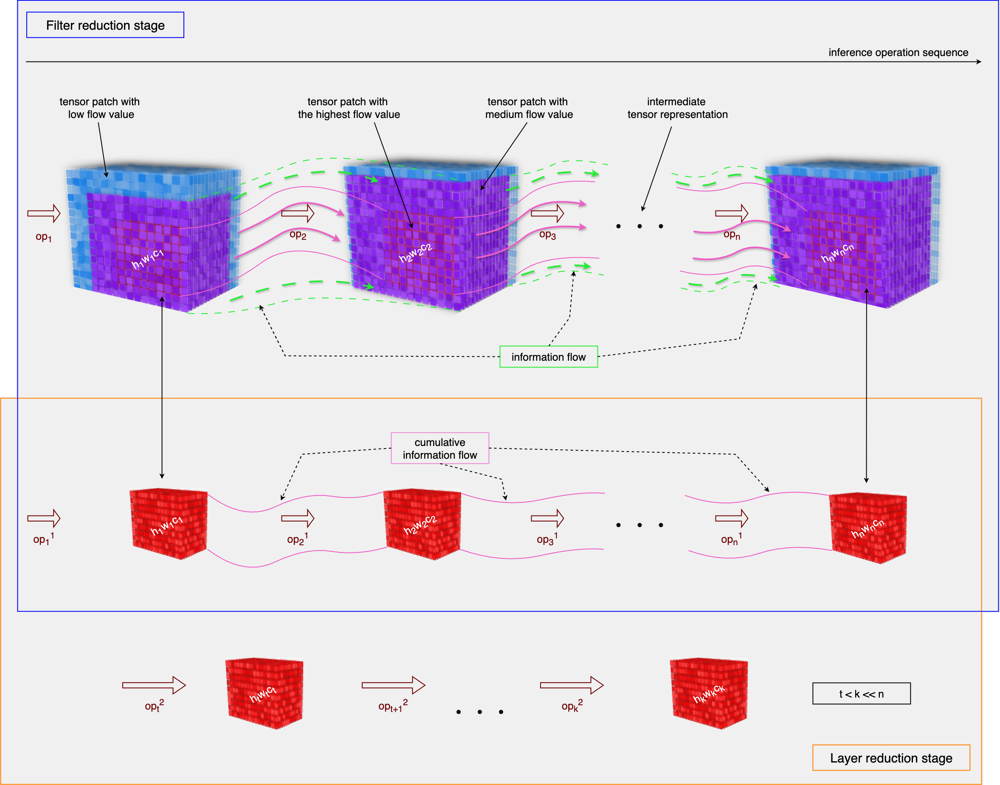
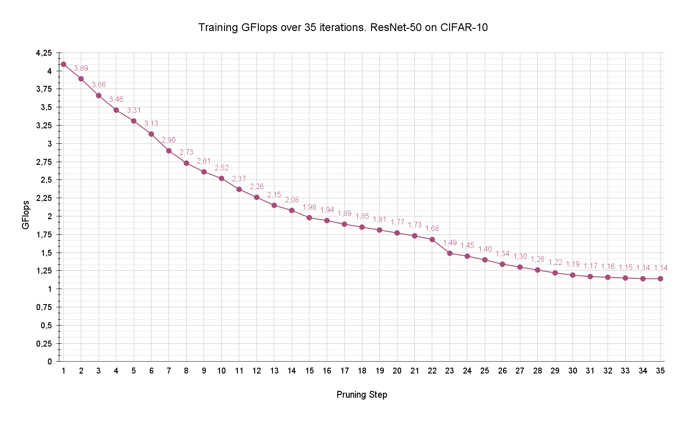
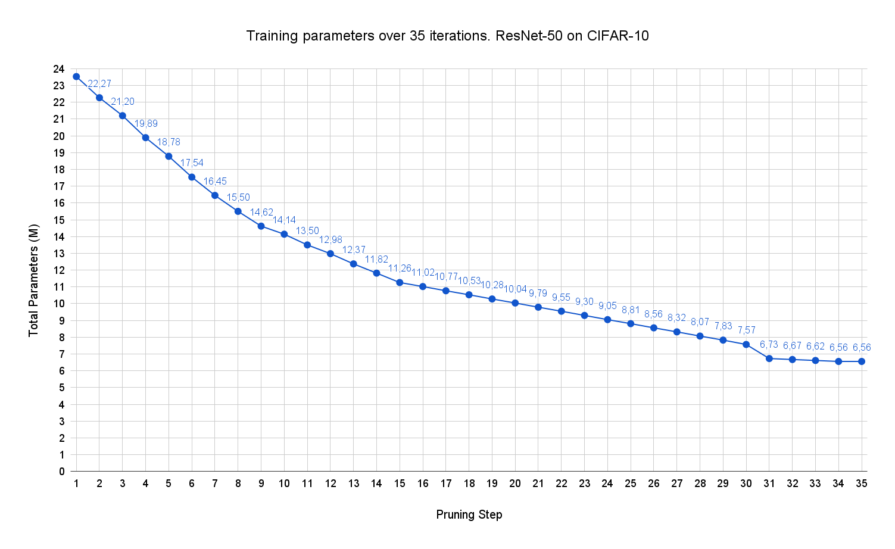
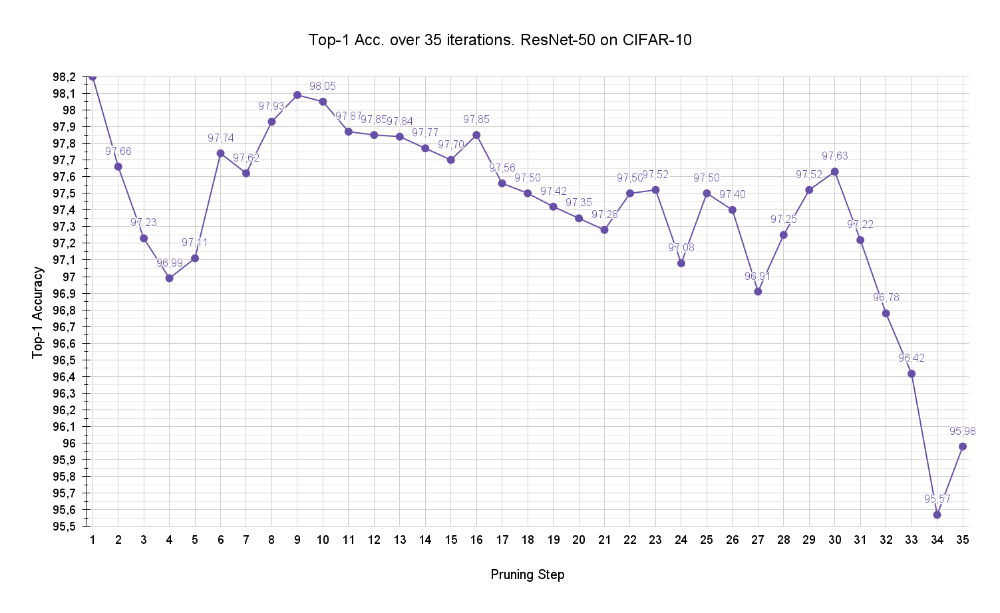
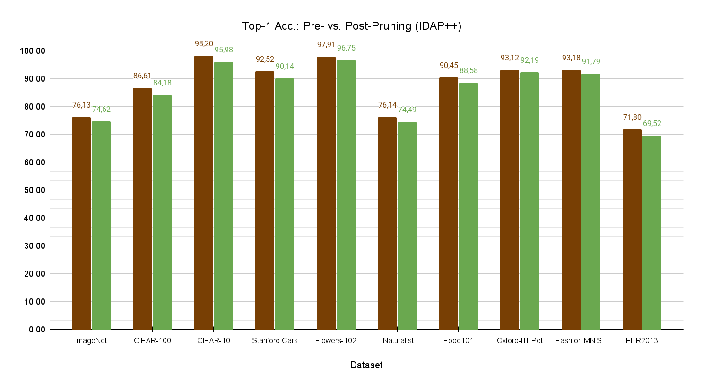
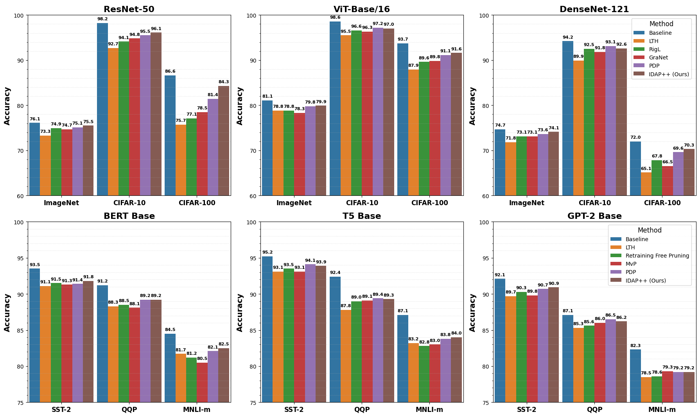

# IDAP++: ADVANCING DIVERGENCE-BASED PRUNING VIA FILTER-LEVEL AND LAYER-LEVEL OPTIMIZATION

### Codebase for ICLR 2026 Submission

This repository provides the official implementation of IDAP++, a novel neural network compression approach that unifies both filter-level (width) and architecture-level (depth) pruning through information flow divergence analysis. The proposed method establishes a unified approach applicable to diverse neural architectures, including convolutional networks and transformer-based models. 

We propose the first pruning methodology that systematically optimizes neural networks along both width (filter-level) and depth (layer-level) dimensions through a unified flow-divergence
criterion. The framework combines:
- Divergence-Aware Filter Pruning (IDAP)
- Flow-Guided Layer Truncation


### Prerequisites
- Python 3.10+
- PyTorch 2.0+
- CUDA-compatible GPU
- Other dependencies listed in `requirements.txt`

### Installation
1. Clone the repository:
```bash
git clone https://github.com/user852154/divergence_aware_pruning.git
cd divergence_aware_pruning
```

2. Create and activate a virtual environment:
```bash
python -m venv venv
source venv/bin/activate
```

3. Install dependencies:
```bash
pip install -r requirements.txt
```

### Visualization of information flow through network depth


### Results

1. **Pruning Results for Different Architectures Using IDAP++: Base vs. Pruned Models (Acc@1, GFlops, Δ%)**

The table below presents the outcomes of our experiments, offering a comparative analysis of pruning across various model architectures and datasets. It reports top-1 accuracy (Acc@1) for both the original and pruned computer vision classification models, along with their computational cost measured in GFlops. The Δ% columns indicate the relative changes in accuracy and computational complexity resulting from pruning.

<div style="overflow-x: auto; margin: 20px 0;">
<table border="2" style="width: 100%;">
  <caption style="font-weight: bold; font-size: 1.1em; margin-bottom: 10px; text-align: center;">Comparative pruning results across different architectures and datasets. Image Classification Task</caption>
  <thead>
    <tr style="background-color: #f2f2f2;">
      <th rowspan="2" style="text-align: left;">Dataset</th>
      <th rowspan="2" style="text-align: left;">Architecture</th>
      <th colspan="3">GFlops</th>
      <th colspan="3">Top-1 Acc</th>
    </tr>
    <tr style="background-color: #f2f2f2;">
      <th>Base</th>
      <th>Pruned</th>
      <th>↓%</th>
      <th>Base</th>
      <th>Pruned</th>
      <th>↓%</th>
    </tr>
  </thead>
  <tbody>
    <tr>
      <td rowspan="10" style="vertical-align: top; font-weight: bold;">CIFAR-10</td>
      <td style="background-color: #f7f7f7;">DenseNet-121</td><td style="background-color: #f7f7f7;">2.8</td><td style="background-color: #f7f7f7;">0.9</td><td style="background-color: #f7f7f7;">-68</td><td style="background-color: #f7f7f7;">94.20</td><td style="background-color: #f7f7f7;">94.03</td><td style="background-color: #f7f7f7;">-0.18</td>
    </tr>
    <tr>
      <td>VGG19 (BN)</td><td>19.6</td><td>5.9</td><td>-70</td><td>93.46</td><td>92.91</td><td>-0.58</td>
    </tr>
    <tr>
      <td style="background-color: #f7f7f7;">ResNet-50</td><td style="background-color: #f7f7f7;">4.1</td><td style="background-color: #f7f7f7;">1.2</td><td style="background-color: #f7f7f7;">-71</td><td style="background-color: #f7f7f7;">98.19</td><td style="background-color: #f7f7f7;">97.63</td><td style="background-color: #f7f7f7;">-0.57</td>
    </tr>
    <tr>
      <td>Inception-v3</td><td>5.7</td><td>1.7</td><td>-70</td><td>95.33</td><td>94.87</td><td>-0.48</td>
    </tr>
    <tr>
      <td style="background-color: #f7f7f7;">MobileNetV3-L</td><td style="background-color: #f7f7f7;">0.2</td><td style="background-color: #f7f7f7;">0.1</td><td style="background-color: #f7f7f7;">-43</td><td style="background-color: #f7f7f7;">89.80</td><td style="background-color: #f7f7f7;">89.34</td><td style="background-color: #f7f7f7;">-0.52</td>
    </tr>
    <tr>
      <td>ShuffleNetV2 x2.0</td><td>0.5</td><td>0.1</td><td>-81</td><td>90.45</td><td>89.95</td><td>-0.55</td>
    </tr>
    <tr>
      <td style="background-color: #f7f7f7;">ConvNeXt-Small</td><td style="background-color: #f7f7f7;">8.6</td><td style="background-color: #f7f7f7;">2.3</td><td style="background-color: #f7f7f7;">-73</td><td style="background-color: #f7f7f7;">94.21</td><td style="background-color: #f7f7f7;">93.78</td><td style="background-color: #f7f7f7;">-0.45</td>
    </tr>
    <tr>
      <td>EfficientNet-B4</td><td>4.2</td><td>1.5</td><td>-64</td><td>96.90</td><td>96.51</td><td>-0.41</td>
    </tr>
    <tr>
      <td style="background-color: #f7f7f7;">EfficientNet V2-S</td><td style="background-color: #f7f7f7;">8.8</td><td style="background-color: #f7f7f7;">2.9</td><td style="background-color: #f7f7f7;">-67</td><td style="background-color: #f7f7f7;">97.12</td><td style="background-color: #f7f7f7;">96.79</td><td style="background-color: #f7f7f7;">-0.33</td>
    </tr>
    <tr>
      <td>ViT-Base/16</td><td>17.5</td><td>5.1</td><td>-71</td><td>98.61</td><td>98.18</td><td>-0.44</td>
    </tr>
    <!-- CIFAR-100 -->
    <tr style="border-top: 2px solid #333;">
      <td rowspan="10" style="vertical-align: top; font-weight: bold;">CIFAR-100</td>
      <td style="background-color: #f7f7f7;">DenseNet-121</td><td style="background-color: #f7f7f7;">2.8</td><td style="background-color: #f7f7f7;">1.0</td><td style="background-color: #f7f7f7;">-64</td><td style="background-color: #f7f7f7;">72.07</td><td style="background-color: #f7f7f7;">71.29</td><td style="background-color: #f7f7f7;">-1.07</td>
    </tr>
    <tr>
      <td>VGG19 (BN)</td><td>19.6</td><td>6.8</td><td>-65</td><td>73.89</td><td>72.57</td><td>-1.79</td>
    </tr>
    <tr>
      <td style="background-color: #f7f7f7;">ResNet-50</td><td style="background-color: #f7f7f7;">4.1</td><td style="background-color: #f7f7f7;">1.3</td><td style="background-color: #f7f7f7;">-68</td><td style="background-color: #f7f7f7;">86.61</td><td style="background-color: #f7f7f7;">85.09</td><td style="background-color: #f7f7f7;">-1.76</td>
    </tr>
    <tr>
      <td>Inception-v3</td><td>5.7</td><td>1.9</td><td>-67</td><td>82.15</td><td>80.62</td><td>-1.86</td>
    </tr>
    <tr>
      <td style="background-color: #f7f7f7;">MobileNetV3-L</td><td style="background-color: #f7f7f7;">0.2</td><td style="background-color: #f7f7f7;">0.1</td><td style="background-color: #f7f7f7;">-54</td><td style="background-color: #f7f7f7;">77.70</td><td style="background-color: #f7f7f7;">76.93</td><td style="background-color: #f7f7f7;">-1.00</td>
    </tr>
    <tr>
      <td>ShuffleNetV2 x2.0</td><td>0.5</td><td>0.2</td><td>-61</td><td>75.33</td><td>74.16</td><td>-1.55</td>
    </tr>
    <tr>
      <td style="background-color: #f7f7f7;">ConvNeXt-Small</td><td style="background-color: #f7f7f7;">8.6</td><td style="background-color: #f7f7f7;">2.5</td><td style="background-color: #f7f7f7;">-71</td><td style="background-color: #f7f7f7;">85.59</td><td style="background-color: #f7f7f7;">84.09</td><td style="background-color: #f7f7f7;">-1.75</td>
    </tr>
    <tr>
      <td>EfficientNet-B4</td><td>4.2</td><td>1.7</td><td>-60</td><td>90.12</td><td>88.84</td><td>-1.42</td>
    </tr>
    <tr>
      <td style="background-color: #f7f7f7;">EfficientNet V2-S</td><td style="background-color: #f7f7f7;">8.8</td><td style="background-color: #f7f7f7;">3.2</td><td style="background-color: #f7f7f7;">-64</td><td style="background-color: #f7f7f7;">88.44</td><td style="background-color: #f7f7f7;">87.13</td><td style="background-color: #f7f7f7;">-1.48</td>
    </tr>
    <tr>
      <td>ViT-Base/16</td><td>17.5</td><td>6.8</td><td>-61</td><td>94.24</td><td>93.16</td><td>-1.15</td>
    </tr>
    <!-- Fashion MNIST -->
    <tr style="border-top: 2px solid #333;">
      <td rowspan="10" style="vertical-align: top; font-weight: bold;">Fashion MNIST</td>
      <td style="background-color: #f7f7f7;">DenseNet-121</td><td style="background-color: #f7f7f7;">2.8</td><td style="background-color: #f7f7f7;">1.0</td><td style="background-color: #f7f7f7;">-64</td><td style="background-color: #f7f7f7;">93.00</td><td style="background-color: #f7f7f7;">92.29</td><td style="background-color: #f7f7f7;">-0.77</td>
    </tr>
    <tr>
      <td>VGG19 (BN)</td>
      <td>19.6</td>
      <td>5.4</td>
      <td>-72</td>
      <td>91.77</td>
      <td>91.13</td>
      <td>-0.69</td>
    </tr>
    <tr>
      <td style="background-color: #f7f7f7;">ResNet-50</td>
      <td style="background-color: #f7f7f7;">4.1</td>
      <td style="background-color: #f7f7f7;">1.1</td>
      <td style="background-color: #f7f7f7;">-73</td>
      <td style="background-color: #f7f7f7;">93.18</td>
      <td style="background-color: #f7f7f7;">92.73</td>
      <td style="background-color: #f7f7f7;">-0.45</td>
    </tr>
    <tr>
      <td>Inception-v3</td>
      <td>5.7</td>
      <td>1.6</td>
      <td>-72</td>
      <td>92.78</td>
      <td>92.30</td>
      <td>-0.52</td>
    </tr>
    <tr>
      <td style="background-color: #f7f7f7;">MobileNetV3-L</td>
      <td style="background-color: #f7f7f7;">0.2</td>
      <td style="background-color: #f7f7f7;">0.1</td>
      <td style="background-color: #f7f7f7;">-55</td>
      <td style="background-color: #f7f7f7;">89.80</td>
      <td style="background-color: #f7f7f7;">89.34</td>
      <td style="background-color: #f7f7f7;">-0.46</td>
    </tr>
    <tr>
      <td>ShuffleNetV2 x2.0</td>
      <td>0.5</td>
      <td>0.1</td>
      <td>-78</td>
      <td>90.89</td>
      <td>90.31</td>
      <td>-0.58</td>
    </tr>
    <tr>
      <td style="background-color: #f7f7f7;">ConvNeXt-Small</td>
      <td style="background-color: #f7f7f7;">8.6</td>
      <td style="background-color: #f7f7f7;">3.5</td>
      <td style="background-color: #f7f7f7;">-59</td>
      <td style="background-color: #f7f7f7;">89.66</td>
      <td style="background-color: #f7f7f7;">89.27</td>
      <td style="background-color: #f7f7f7;">-0.90</td>
    </tr>
    <tr>
      <td>EfficientNet-B4</td><td>4.2</td><td>1.6</td><td>-62</td><td>94.97</td><td>94.54</td><td>-0.46</td>
    </tr>
    <tr>
      <td style="background-color: #f7f7f7;">EfficientNet V2-S</td>
      <td style="background-color: #f7f7f7;">8.8</td>
      <td style="background-color: #f7f7f7;">2.8</td>
      <td style="background-color: #f7f7f7;">-68</td>
      <td style="background-color: #f7f7f7;">95.35</td>
      <td style="background-color: #f7f7f7;">94.88</td>
      <td style="background-color: #f7f7f7;">-0.49</td>
    </tr>
    <tr>
      <td>ViT-Base/16</td><td>17.5</td><td>6.4</td><td>-63</td><td>94.80</td><td>94.30</td><td>-0.47</td>
    </tr>
    <!-- ImageNet -->
    <tr style="border-top: 2px solid #333;">
      <td rowspan="10" style="vertical-align: top; font-weight: bold;">ImageNet</td>
      <td style="background-color: #f7f7f7;">DenseNet-121</td><td style="background-color: #f7f7f7;">2.8</td><td style="background-color: #f7f7f7;">1.0</td><td style="background-color: #f7f7f7;">-65</td><td style="background-color: #f7f7f7;">74.65</td><td style="background-color: #f7f7f7;">73.96</td><td style="background-color: #f7f7f7;">-0.92</td>
    </tr>
    <tr>
      <td>VGG19 (BN)</td><td>19.6</td><td>7.2</td><td>-63</td><td>73.12</td><td>71.62</td><td>-1.50</td>
    </tr>
    <tr>
      <td style="background-color: #f7f7f7;">ResNet-50</td><td style="background-color: #f7f7f7;">4.1</td><td style="background-color: #f7f7f7;">1.6</td><td style="background-color: #f7f7f7;">-61</td><td style="background-color: #f7f7f7;">76.14</td><td style="background-color: #f7f7f7;">75.19</td><td style="background-color: #f7f7f7;">-1.25</td>
    </tr>
    <tr>
      <td>Inception-v3</td><td>5.7</td><td>2.1</td><td>-63</td><td>77.16</td><td>75.86</td><td>-1.69</td>
    </tr>
    <tr>
      <td style="background-color: #f7f7f7;">MobileNetV3-L</td><td style="background-color: #f7f7f7;">0.2</td><td style="background-color: #f7f7f7;">0.1</td>
      <td style="background-color: #f7f7f7;">-53</td><td style="background-color: #f7f7f7;">74.03</td><td style="background-color: #f7f7f7;">72.83</td><td style="background-color: #f7f7f7;">-1.63</td>
    </tr>
    <tr>
      <td>ShuffleNetV2 x2.0</td><td>0.5</td><td>0.2</td><td>-60</td><td>76.22</td><td>74.85</td><td>-1.37</td>
    </tr>
    <tr>
      <td style="background-color: #f7f7f7;">ConvNeXt-Small</td><td style="background-color: #f7f7f7;">8.6</td><td style="background-color: #f7f7f7;">2.6</td><td style="background-color: #f7f7f7;">-70</td><td style="background-color: #f7f7f7;">82.06</td><td style="background-color: #f7f7f7;">80.99</td><td style="background-color: #f7f7f7;">-1.82</td>
    </tr>
    <tr>
      <td>EfficientNet-B4</td><td>4.2</td><td>1.6</td><td>-62</td><td>83.37</td><td>81.71</td><td>-1.66</td>
    </tr>
    <tr>
      <td style="background-color: #f7f7f7;">EfficientNet V2-S</td><td style="background-color: #f7f7f7;">8.8</td><td style="background-color: #f7f7f7;">3.4</td><td style="background-color: #f7f7f7;">-61</td><td style="background-color: #f7f7f7;">84.21</td><td style="background-color: #f7f7f7;">82.82</td><td style="background-color: #f7f7f7;">-1.66</td>
    </tr>
    <tr>
      <td>ViT-Base/16</td><td>17.5</td><td>6.9</td><td>-61</td><td>80.17</td><td>79.85</td><td>-1.51</td>
    </tr>
    <tr style="border-top: 2px solid #333;">
      <td rowspan="10" style="vertical-align: top; font-weight: bold;">Stanford Cars</td>
      <td style="background-color: #f7f7f7;">DenseNet-121</td><td style="background-color: #f7f7f7;">2.8</td><td style="background-color: #f7f7f7;">1.0</td><td style="background-color: #f7f7f7;">-64</td><td style="background-color: #f7f7f7;">83.13</td><td style="background-color: #f7f7f7;">81.95</td><td style="background-color: #f7f7f7;">-1.18</td>
    </tr>
    <tr>
      <td>VGG19 (BN)</td><td>19.6</td><td>7.1</td><td>-64</td><td>86.99</td><td>85.70</td><td>-1.29</td>
    </tr>
    <tr>
      <td style="background-color: #f7f7f7;">ResNet-50</td><td style="background-color: #f7f7f7;">4.1</td><td style="background-color: #f7f7f7;">1.4</td><td style="background-color: #f7f7f7;">-66</td><td style="background-color: #f7f7f7;">92.52</td><td style="background-color: #f7f7f7;">90.99</td><td style="background-color: #f7f7f7;">-1.53</td>
    </tr>
    <tr>
      <td>Inception-v3</td><td>5.7</td><td>2.0</td><td>-65</td><td>83.86</td><td>82.27</td><td>-1.67</td>
    </tr>
    <tr>
      <td style="background-color: #f7f7f7;">MobileNetV3-L</td><td style="background-color: #f7f7f7;">0.2</td><td style="background-color: #f7f7f7;">0.1</td><td style="background-color: #f7f7f7;">-45</td><td style="background-color: #f7f7f7;">68.32</td><td style="background-color: #f7f7f7;">67.43</td><td style="background-color: #f7f7f7;">-1.29</td>
    </tr>
    <tr>
      <td>ShuffleNetV2 x2.0</td><td>0.5</td><td>0.2</td><td>-57</td><td>82.56</td><td>81.39</td><td>-1.42</td>
    </tr>
    <tr>
      <td style="background-color: #f7f7f7;">ConvNeXt-Small</td><td style="background-color: #f7f7f7;">8.6</td><td style="background-color: #f7f7f7;">2.9</td><td style="background-color: #f7f7f7;">-66</td><td style="background-color: #f7f7f7;">86.22</td><td style="background-color: #f7f7f7;">81.21</td><td style="background-color: #f7f7f7;">-1.18</td>
    </tr>
    <tr>
      <td>EfficientNet-B4</td><td>4.2</td><td>1.6</td><td>-60</td><td>91.34</td><td>90.06</td><td>-1.28</td>
    </tr>
    <tr>
      <td style="background-color: #f7f7f7;">EfficientNet V2-S</td><td style="background-color: #f7f7f7;">8.8</td><td style="background-color: #f7f7f7;">3.3</td><td style="background-color: #f7f7f7;">-63</td><td style="background-color: #f7f7f7;">90.24</td><td style="background-color: #f7f7f7;">89.61</td><td style="background-color: #f7f7f7;">-0.63</td>
    </tr>
    <tr>
      <td>ViT-Base/16</td><td>17.5</td><td>6.9</td><td>-61</td><td>93.73</td><td>92.21</td><td>-1.62</td>
    </tr>    
    <tr style="border-top: 2px solid #333;">
      <td rowspan="10" style="vertical-align: top; font-weight: bold;">iNaturalist</td>
      <td style="background-color: #f7f7f7;">DenseNet-121</td><td style="background-color: #f7f7f7;">2.8</td><td style="background-color: #f7f7f7;">1.0</td><td style="background-color: #f7f7f7;">-64</td><td style="background-color: #f7f7f7;">69.75</td><td style="background-color: #f7f7f7;">68.73</td><td style="background-color: #f7f7f7;">-1.46</td>
    </tr>
    <tr>
      <td>VGG19 (BN)</td><td>19.6</td><td>6.9</td><td>-65</td><td>67.20</td><td>65.43</td><td>-1.77</td>
    </tr>
    <tr>
      <td style="background-color: #f7f7f7;">ResNet-50</td><td style="background-color: #f7f7f7;">4.1</td><td style="background-color: #f7f7f7;">1.6</td><td style="background-color: #f7f7f7;">-61</td><td style="background-color: #f7f7f7;">76.15</td><td style="background-color: #f7f7f7;">74.68</td><td style="background-color: #f7f7f7;">-1.93</td>
    </tr>
    <tr>
      <td>Inception-v3</td><td>5.7</td><td>2.1</td><td>-63</td><td>72.35</td><td>71.13</td><td>-1.22</td>
    </tr>
    <tr>
      <td style="background-color: #f7f7f7;">MobileNetV3-L</td><td style="background-color: #f7f7f7;">0.2</td><td style="background-color: #f7f7f7;">0.1</td><td style="background-color: #f7f7f7;">-45</td><td style="background-color: #f7f7f7;">68.31</td><td style="background-color: #f7f7f7;">67.43</td><td style="background-color: #f7f7f7;">-1.29</td>
    </tr>
    <tr>
      <td>ShuffleNetV2 x2.0</td><td>0.5</td><td>0.2</td><td>-58</td><td>66.77</td><td>65.58</td><td>-1.78</td>
    </tr>
    <tr>
      <td style="background-color: #f7f7f7;">ConvNeXt-Small</td><td style="background-color: #f7f7f7;">8.6</td><td style="background-color: #f7f7f7;">3.4</td><td style="background-color: #f7f7f7;">-60</td><td style="background-color: #f7f7f7;">68.90</td><td style="background-color: #f7f7f7;">67.43</td><td style="background-color: #f7f7f7;">-1.47</td>
    </tr>
    <tr>
      <td>EfficientNet-B4</td><td>4.2</td><td>1.6</td><td>-62</td><td>70.58</td><td>68.64</td><td>-1.28</td>
    </tr>
    <tr>
      <td style="background-color: #f7f7f7;">EfficientNet V2-S</td><td style="background-color: #f7f7f7;">8.8</td><td style="background-color: #f7f7f7;">3.4</td><td style="background-color: #f7f7f7;">-63</td><td style="background-color: #f7f7f7;">74.30</td><td style="background-color: #f7f7f7;">73.10</td><td style="background-color: #f7f7f7;">-1.20</td>
    </tr>
    <tr>
      <td>ViT-Base/16</td><td>17.5</td><td>6.9</td><td>-61</td><td>68.66</td><td>67.83</td><td>-1.21</td>
    </tr>
  <tr style="border-top: 2px solid #333;">
    <td rowspan="10" style="vertical-align: top; font-weight: bold;">Food101</td>
    <td style="background-color: #f7f7f7;">DenseNet-121</td><td style="background-color: #f7f7f7;">2.8</td><td style="background-color: #f7f7f7;">0.9</td><td style="background-color: #f7f7f7;">-68</td><td style="background-color: #f7f7f7;">87.35</td><td style="background-color: #f7f7f7;">85.70</td><td style="background-color: #f7f7f7;">-1.89</td>
  </tr>
  <tr>
    <td>VGG19 (BN)</td><td>19.6</td><td>6.3</td><td>-68</td><td>86.32</td><td>84.32</td><td>-1.57</td>
  </tr>
  <tr>
    <td style="background-color: #f7f7f7;">ResNet-50</td><td style="background-color: #f7f7f7;">4.1</td><td style="background-color: #f7f7f7;">1.5</td><td style="background-color: #f7f7f7;">-63</td><td style="background-color: #f7f7f7;">90.46</td><td style="background-color: #f7f7f7;">89.30</td><td style="background-color: #f7f7f7;">-1.16</td>
  </tr>
  <tr>
    <td>Inception-v3</td><td>5.7</td><td>2.0</td><td>-65</td><td>88.12</td><td>86.78</td><td>-1.52</td>
  </tr>
  <tr>
    <td style="background-color: #f7f7f7;">MobileNetV3-L</td><td style="background-color: #f7f7f7;">0.2</td><td style="background-color: #f7f7f7;">0.1</td><td style="background-color: #f7f7f7;">-53</td><td style="background-color: #f7f7f7;">86.05</td><td style="background-color: #f7f7f7;">83.75</td><td style="background-color: #f7f7f7;">-2.30</td>
  </tr>
  <tr>
    <td>ShuffleNetV2 x2.0</td><td>0.5</td><td>0.2</td><td>-58</td><td>84.23</td><td>82.84</td><td>-1.39</td>
  </tr>
  <tr>
    <td style="background-color: #f7f7f7;">ConvNeXt-Small</td><td style="background-color: #f7f7f7;">8.6</td><td style="background-color: #f7f7f7;">3.6</td><td style="background-color: #f7f7f7;">-58</td><td style="background-color: #f7f7f7;">86.25</td><td style="background-color: #f7f7f7;">83.75</td><td style="background-color: #f7f7f7;">-2.50</td>
  </tr>
  <tr>
    <td>EfficientNet-B4</td><td>4.2</td><td>1.6</td><td>-62</td><td>90.36</td><td>89.05</td><td>-1.31</td>
  </tr>
  <tr>
    <td style="background-color: #f7f7f7;">EfficientNet V2-S</td><td style="background-color: #f7f7f7;">8.8</td><td style="background-color: #f7f7f7;">3.2</td><td style="background-color: #f7f7f7;">-64</td><td style="background-color: #f7f7f7;">90.56</td><td style="background-color: #f7f7f7;">89.29</td><td style="background-color: #f7f7f7;">-1.40</td>
  </tr>
  <tr>
    <td>ViT-Base/16</td><td>17.5</td><td>6.7</td><td>-62</td><td>87.44</td><td>86.14</td><td>-1.45</td>
  </tr>
  <tr style="border-top: 2px solid #333;">
    <td rowspan="10" style="vertical-align: top; font-weight: bold;">Oxford-IIIT Pet</td>
    <td style="background-color: #f7f7f7;">DenseNet-121</td><td style="background-color: #f7f7f7;">2.8</td><td style="background-color: #f7f7f7;">0.8</td><td style="background-color: #f7f7f7;">-71</td><td style="background-color: #f7f7f7;">85.24</td><td style="background-color: #f7f7f7;">84.20</td><td style="background-color: #f7f7f7;">-1.22</td>
    </tr>
    <tr>
      <td>VGG19 (BN)</td><td>19.6</td><td>6.7</td><td>-66</td><td>85.20</td><td>85.20</td><td>-1.44</td>
    </tr>
    <tr>
      <td style="background-color: #f7f7f7;">ResNet-50</td><td style="background-color: #f7f7f7;">4.1</td><td style="background-color: #f7f7f7;">1.6</td><td style="background-color: #f7f7f7;">-61</td><td style="background-color: #f7f7f7;">93.11</td><td style="background-color: #f7f7f7;">92.88</td><td style="background-color: #f7f7f7;">-0.26</td>
    </tr>
    <tr>
      <td>Inception-v3</td><td>5.7</td><td>1.9</td><td>-66</td><td>89.34</td><td>88.17</td><td>-1.31</td>
    </tr>
    <tr>
      <td style="background-color: #f7f7f7;">MobileNetV3-L</td><td style="background-color: #f7f7f7;">0.2</td><td style="background-color: #f7f7f7;">0.1</td><td style="background-color: #f7f7f7;">-45</td><td style="background-color: #f7f7f7;">85.53</td><td style="background-color: #f7f7f7;">84.52</td><td style="background-color: #f7f7f7;">-1.19</td>
    </tr>
    <tr>
      <td>ShuffleNetV2 x2.0</td><td>0.5</td><td>0.2</td><td>-63</td><td>83.67</td><td>82.43</td><td>-1.49</td>
    </tr>
    <tr>
      <td style="background-color: #f7f7f7;">ConvNeXt-Small</td><td style="background-color: #f7f7f7;">8.6</td><td style="background-color: #f7f7f7;">3.1</td><td style="background-color: #f7f7f7;">-64</td><td style="background-color: #f7f7f7;">84.08</td><td style="background-color: #f7f7f7;">83.00</td><td style="background-color: #f7f7f7;">-1.29</td>
    </tr>
    <tr>
      <td>EfficientNet-B4</td><td>4.2</td><td>1.7</td><td>-60</td><td>87.85</td><td>86.98</td><td>-0.99</td>
    </tr>
    <tr>
      <td style="background-color: #f7f7f7;">EfficientNet V2-S</td><td style="background-color: #f7f7f7;">8.8</td><td style="background-color: #f7f7f7;">3.6</td><td style="background-color: #f7f7f7;">-59</td><td style="background-color: #f7f7f7;">88.36</td><td style="background-color: #f7f7f7;">88.19</td><td style="background-color: #f7f7f7;">-0.17</td>
    </tr>
    <tr>
      <td>ViT-Base/16</td><td>17.5</td><td>5.9</td><td>-66</td><td>89.58</td><td>88.21</td><td>-1.37</td>
    </tr>
  <tr style="border-top: 2px solid #333;">
    <td rowspan="10" style="vertical-align: top; font-weight: bold;">FER2013</td>
    <td style="background-color: #f7f7f7;">DenseNet-121</td><td style="background-color: #f7f7f7;">2.8</td><td style="background-color: #f7f7f7;">0.9</td><td style="background-color: #f7f7f7;">-68</td><td style="background-color: #f7f7f7;">65.13</td><td style="background-color: #f7f7f7;">64.17</td><td style="background-color: #f7f7f7;">-1.47</td>
    </tr>
    <tr>
      <td>VGG19 (BN)</td><td>19.6</td><td>6.8</td><td>-65</td><td>68.34</td><td>67.10</td><td>-1.81</td>
    </tr>
    <tr>
      <td style="background-color: #f7f7f7;">ResNet-50</td><td style="background-color: #f7f7f7;">4.1</td><td style="background-color: #f7f7f7;">1.4</td><td style="background-color: #f7f7f7;">-66</td><td style="background-color: #f7f7f7;">71.81</td><td style="background-color: #f7f7f7;">70.66</td><td style="background-color: #f7f7f7;">-1.60</td>
    </tr>
    <tr>
      <td>Inception-v3</td><td>5.7</td><td>2.0</td><td>-65</td><td>70.46</td><td>69.11</td><td>-1.91</td>
    </tr>
    <tr>
      <td style="background-color: #f7f7f7;">MobileNetV3-L</td><td style="background-color: #f7f7f7;">0.2</td><td style="background-color: #f7f7f7;">0.1</td><td style="background-color: #f7f7f7;">-42</td><td style="background-color: #f7f7f7;">69.88</td><td style="background-color: #f7f7f7;">67.43</td><td style="background-color: #f7f7f7;">-2.45</td>
    </tr>
    <tr>
      <td>ShuffleNetV2 x2.0</td><td>0.5</td><td>0.2</td><td>-58</td><td>67.45</td><td>66.25</td><td>-1.20</td>
    </tr>
    <tr>
      <td style="background-color: #f7f7f7;">ConvNeXt-Small</td><td style="background-color: #f7f7f7;">8.6</td><td style="background-color: #f7f7f7;">3.0</td><td style="background-color: #f7f7f7;">-64</td><td style="background-color: #f7f7f7;">76.10</td><td style="background-color: #f7f7f7;">74.84</td><td style="background-color: #f7f7f7;">-1.26</td>
    </tr>
    <tr>
      <td>EfficientNet-B4</td><td>4.2</td><td>1.6</td><td>-62</td><td>74.16</td><td>73.27</td><td>-0.89</td>
    </tr>
    <tr>
      <td style="background-color: #f7f7f7;">EfficientNet V2-S</td><td style="background-color: #f7f7f7;">8.8</td><td style="background-color: #f7f7f7;">3.3</td><td style="background-color: #f7f7f7;">-62</td><td style="background-color: #f7f7f7;">76.89</td><td style="background-color: #f7f7f7;">75.48</td><td style="background-color: #f7f7f7;">-1.83</td>
    </tr>
    <tr>
      <td>ViT-Base/16</td><td>17.5</td><td>6.3</td><td>-64</td><td>70.21</td><td>68.97</td><td>-1.76</td>
    </tr>

<table border="2" style="border-collapse: collapse; width: 100%; text-align: center;">
    <caption style="caption-side: top; font-weight: bold; padding: 8px;">Pruning results across Vision Tasks
    </caption>
    <thead>
        <tr>
        <th>Dataset</th>
        <th>Architecture</th>
        <th class="num">GFlops (Base)</th>
        <th class="num">GFlops (Pruned)</th>
        <th class="num">Δ%</th>
        <th class="num">Metric (Base)</th>
        <th class="num">Metric (Pruned)</th>
        <th class="num">Δ%</th>
        </tr>
    </thead>
    <tbody>
        <tr class="section" style="font-weight: bold;"><td colspan="8">Image Classification Task (Metric: Top-1 Accuracy, %)</td></tr>
        <tr>
            <td data-label="Dataset">CIFAR-100</td>
            <td data-label="Architecture">ResNet-50</td>
            <td class="num" data-label="GFlops (Base)">4.1</td>
            <td class="num" data-label="GFlops (Pruned)">1.3</td>
            <td class="num negative" data-label="Δ%">-68</td>
            <td class="num" data-label="Metric (Base)">86.6</td>
            <td class="num" data-label="Metric (Pruned)">85.1</td>
            <td class="num negative" data-label="Δ%">-1.8</td>
        </tr>
        <tr>
            <td> </td>
            <td>ShuffleNetV2 x2.0</td>
            <td class="num">0.5</td>
            <td class="num">0.2</td>
            <td class="num negative">-61</td>
            <td class="num">75.3</td>
            <td class="num">74.2</td>
            <td class="num negative">-1.5</td>
        </tr>
        <tr>
            <td> </td>
            <td>EfficientNet-B4</td>
            <td class="num">4.2</td>
            <td class="num">1.7</td>
            <td class="num negative">-60</td>
            <td class="num">90.1</td>
            <td class="num">88.8</td>
            <td class="num negative">-1.4</td>
        </tr>
        <tr>
            <td> </td>
            <td>ViT-Base/16</td>
            <td class="num">17.5</td>
            <td class="num">6.8</td>
            <td class="num negative">-61</td>
            <td class="num">94.2</td>
            <td class="num">93.2</td>
            <td class="num negative">-1.2</td>
        </tr>
        <tr>
            <td>ImageNet</td>
            <td>ResNet-50</td>
            <td class="num">4.1</td>
            <td class="num">1.6</td>
            <td class="num negative">-61</td>
            <td class="num">76.1</td>
            <td class="num">75.2</td>
            <td class="num negative">-1.2</td>
        </tr>
        <tr>
            <td> </td>
            <td>ShuffleNetV2 x2.0</td>
            <td class="num">0.5</td>
            <td class="num">0.2</td>
            <td class="num negative">-60</td>
            <td class="num">76.2</td>
            <td class="num">75.2</td>
            <td class="num negative">-1.4</td>
        </tr>
        <tr>
            <td> </td>
            <td>EfficientNet-B4</td>
            <td class="num">4.2</td>
            <td class="num">1.6</td>
            <td class="num negative">-62</td>
            <td class="num">83.4</td>
            <td class="num">82.0</td>
            <td class="num negative">-1.7</td>
        </tr>
        <tr>
            <td> </td>
            <td>ViT-Base/16</td>
            <td class="num">17.5</td>
            <td class="num">6.9</td>
            <td class="num negative">-61</td>
            <td class="num">81.1</td>
            <td class="num">79.9</td>
            <td class="num negative">-1.5</td>
        </tr>
        <tr>
            <td>Stanford Cars</td>
            <td>ResNet-50</td>
            <td class="num">4.1</td>
            <td class="num">1.4</td>
            <td class="num negative">-66</td>
            <td class="num">92.5</td>
            <td class="num">91.0</td>
            <td class="num negative">-1.7</td>
        </tr>
        <tr>
            <td> </td>
            <td>ShuffleNetV2 x2.0</td>
            <td class="num">0.5</td>
            <td class="num">0.2</td>
            <td class="num negative">-57</td>
            <td class="num">82.6</td>
            <td class="num">81.4</td>
            <td class="num negative">-1.4</td>
        </tr>
        <tr>
            <td> </td>
            <td>EfficientNet-B4</td>
            <td class="num">4.2</td>
            <td class="num">1.6</td>
            <td class="num negative">-62</td>
            <td class="num">91.3</td>
            <td class="num">90.2</td>
            <td class="num negative">-1.3</td>
        </tr>
        <tr>
            <td> </td>
            <td>ViT-Base/16</td>
            <td class="num">17.5</td>
            <td class="num">6.0</td>
            <td class="num negative">-66</td>
            <td class="num">93.7</td>
            <td class="num">92.2</td>
            <td class="num negative">-1.6</td>
        </tr>
        <tr>
            <td>Food101</td>
            <td>ResNet-50</td>
            <td class="num">4.1</td>
            <td class="num">1.5</td>
            <td class="num negative">-63</td>
            <td class="num">90.5</td>
            <td class="num">89.4</td>
            <td class="num negative">-1.2</td>
        </tr>
        <tr>
            <td> </td>
            <td>ShuffleNetV2 x2.0</td>
            <td class="num">0.5</td>
            <td class="num">0.2</td>
            <td class="num negative">-58</td>
            <td class="num">84.2</td>
            <td class="num">83.1</td>
            <td class="num negative">-1.4</td>
        </tr>
        <tr>
            <td> </td>
            <td>EfficientNet-B4</td>
            <td class="num">4.2</td>
            <td class="num">1.6</td>
            <td class="num negative">-62</td>
            <td class="num">91.2</td>
            <td class="num">90.0</td>
            <td class="num negative">-1.3</td>
        </tr>
        <tr>
            <td> </td>
            <td>ViT-Base/16</td>
            <td class="num">17.5</td>
            <td class="num">6.7</td>
            <td class="num negative">-62</td>
            <td class="num">87.4</td>
            <td class="num">86.1</td>
            <td class="num negative">-1.4</td>
        </tr>
        <tr class="section" style="font-weight: bold;"><td colspan="8">Object Detection Task (Metric: mAP)</td></tr>
        <tr>
            <td>Pascal VOC</td>
            <td>Faster R-CNN (ResNet-50)</td>
            <td class="num">150.2</td>
            <td class="num">61.6</td>
            <td class="num negative">-59</td>
            <td class="num">78.4</td>
            <td class="num">76.7</td>
            <td class="num negative">-2.2</td>
        </tr>
        <tr>
            <td> </td>
            <td>YOLOv4 (ShuffleNetV2)</td>
            <td class="num">52.3</td>
            <td class="num">22.1</td>
            <td class="num negative">-58</td>
            <td class="num">77.5</td>
            <td class="num">75.8</td>
            <td class="num negative">-2.2</td>
        </tr>
        <tr>
            <td> </td>
            <td>DETR (ViT-Base/16)</td>
            <td class="num">80.5</td>
            <td class="num">34.3</td>
            <td class="num negative">-57</td>
            <td class="num">79.1</td>
            <td class="num">77.2</td>
            <td class="num negative">-2.5</td>
        </tr>
        <tr>
            <td>COCO 2017</td>
            <td>Faster R-CNN (ResNet-50)</td>
            <td class="num">180.5</td>
            <td class="num">73.8</td>
            <td class="num negative">-59</td>
            <td class="num">41.2</td>
            <td class="num">39.8</td>
            <td class="num negative">-3.5</td>
        </tr>
        <tr>
            <td> </td>
            <td>YOLOv4 (ShuffleNetV2)</td>
            <td class="num">60.8</td>
            <td class="num">26.6</td>
            <td class="num negative">-56</td>
            <td class="num">39.5</td>
            <td class="num">38.0</td>
            <td class="num negative">-3.9</td>
        </tr>
        <tr>
            <td> </td>
            <td>DETR (ViT-Base/16)</td>
            <td class="num">86.4</td>
            <td class="num">36.9</td>
            <td class="num negative">-57</td>
            <td class="num">42.0</td>
            <td class="num">40.5</td>
            <td class="num negative">-3.7</td>
        </tr>
        <tr>
            <td>Open Images</td>
            <td>Faster R-CNN (ResNet-50)</td>
            <td class="num">210.8</td>
            <td class="num">84.3</td>
            <td class="num negative">-60</td>
            <td class="num">63.5</td>
            <td class="num">61.6</td>
            <td class="num negative">-3.1</td>
        </tr>
        <tr>
            <td> </td>
            <td>YOLOv4 (ShuffleNetV2)</td>
            <td class="num">75.2</td>
            <td class="num">32.3</td>
            <td class="num negative">-57</td>
            <td class="num">61.0</td>
            <td class="num">59.3</td>
            <td class="num negative">-2.9</td>
        </tr>
        <tr>
            <td> </td>
            <td>DETR (ViT-Base/16)</td>
            <td class="num">100.7</td>
            <td class="num">42.3</td>
            <td class="num negative">-58</td>
            <td class="num">64.2</td>
            <td class="num">62.1</td>
            <td class="num negative">-3.4</td>
        </tr>
        <tr>
            <td>Objects365</td>
            <td>Faster R-CNN (ResNet-50)</td>
            <td class="num">232.1</td>
            <td class="num">90.5</td>
            <td class="num negative">-61</td>
            <td class="num">45.8</td>
            <td class="num">43.9</td>
            <td class="num negative">-4.3</td>
        </tr>
        <tr>
            <td> </td>
            <td>YOLOv4 (ShuffleNetV2)</td>
            <td class="num">82.5</td>
            <td class="num">34.7</td>
            <td class="num negative">-58</td>
            <td class="num">44.1</td>
            <td class="num">42.4</td>
            <td class="num negative">-4.0</td>
        </tr>
        <tr>
            <td> </td>
            <td>DETR (ViT-Base/16)</td>
            <td class="num">112.3</td>
            <td class="num">46.2</td>
            <td class="num negative">-59</td>
            <td class="num">47.2</td>
            <td class="num">45.3</td>
            <td class="num negative">-4.2</td>
        </tr>
        <tr class="section" style="font-weight: bold;"><td colspan="8">Image Segmentation Task (Metric: mIoU)</td></tr>
        <tr>
            <td>Cityscapes</td>
            <td>FCN (VGG19-BN)</td>
            <td class="num">212.5</td>
            <td class="num">82.9</td>
            <td class="num negative">-61</td>
            <td class="num">70.2</td>
            <td class="num">68.9</td>
            <td class="num negative">-1.9</td>
        </tr>
        <tr>
            <td> </td>
            <td>U-Net (ResNet-50)</td>
            <td class="num">181.3</td>
            <td class="num">70.7</td>
            <td class="num negative">-61</td>
            <td class="num">77.5</td>
            <td class="num">76.0</td>
            <td class="num negative">-1.9</td>
        </tr>
        <tr>
            <td> </td>
            <td>SegFormer (ViT-Base/16)</td>
            <td class="num">150.9</td>
            <td class="num">58.9</td>
            <td class="num negative">-61</td>
            <td class="num">80.0</td>
            <td class="num">78.4</td>
            <td class="num negative">-2.0</td>
        </tr>
        <tr>
            <td>Pascal VOC</td>
            <td>FCN (VGG19-BN)</td>
            <td class="num">201.8</td>
            <td class="num">75.1</td>
            <td class="num negative">-63</td>
            <td class="num">69.5</td>
            <td class="num">68.3</td>
            <td class="num negative">-1.7</td>
        </tr>
        <tr>
            <td> </td>
            <td>U-Net (ResNet-50)</td>
            <td class="num">170.2</td>
            <td class="num">62.1</td>
            <td class="num negative">-64</td>
            <td class="num">75.8</td>
            <td class="num">74.2</td>
            <td class="num negative">-2.1</td>
        </tr>
        <tr>
            <td> </td>
            <td>SegFormer (ViT-Base/16)</td>
            <td class="num">142.1</td>
            <td class="num">52.8</td>
            <td class="num negative">-63</td>
            <td class="num">78.0</td>
            <td class="num">76.3</td>
            <td class="num negative">-2.2</td>
        </tr>
        <tr>
            <td>COCO 2017</td>
            <td>FCN (VGG19-BN)</td>
            <td class="num">233.0</td>
            <td class="num">85.9</td>
            <td class="num negative">-63</td>
            <td class="num">36.7</td>
            <td class="num">35.1</td>
            <td class="num negative">-4.4</td>
        </tr>
        <tr>
            <td> </td>
            <td>U-Net (ResNet-50)</td>
            <td class="num">192.5</td>
            <td class="num">72.2</td>
            <td class="num negative">-62</td>
            <td class="num">44.8</td>
            <td class="num">43.5</td>
            <td class="num negative">-2.9</td>
        </tr>
        <tr>
            <td> </td>
            <td>SegFormer (ViT-Base/16)</td>
            <td class="num">162.8</td>
            <td class="num">62.9</td>
            <td class="num negative">-61</td>
            <td class="num">47.0</td>
            <td class="num">45.1</td>
            <td class="num negative">-4.0</td>
        </tr>
        <tr>
            <td>ADE20K</td>
            <td>FCN (VGG19-BN)</td>
            <td class="num">225.1</td>
            <td class="num">83.6</td>
            <td class="num negative">-63</td>
            <td class="num">36.7</td>
            <td class="num">34.9</td>
            <td class="num negative">-4.9</td>
        </tr>
        <tr>
            <td> </td>
            <td>U-Net (ResNet-50)</td>
            <td class="num">188.7</td>
            <td class="num">68.5</td>
            <td class="num negative">-64</td>
            <td class="num">44.8</td>
            <td class="num">42.8</td>
            <td class="num negative">-4.5</td>
        </tr>
        <tr>
            <td> </td>
            <td>SegFormer (ViT-Base/16)</td>
            <td class="num">158.4</td>
            <td class="num">53.5</td>
            <td class="num negative">-66</td>
            <td class="num">47.0</td>
            <td class="num">45.0</td>
            <td class="num negative">-4.3</td>
        </tr>
        <tr class="section" style="font-weight: bold;"><td colspan="8">Image Generation Task (Metric: FID. Less is better)</td></tr>
        <tr>
            <td>CIFAR-10</td>
            <td>DCGAN</td>
            <td class="num">12.2</td>
            <td class="num">4.8</td>
            <td class="num negative">-61</td>
            <td class="num">24.1</td>
            <td class="num positive">25.9</td>
            <td class="num positive">+6.9</td>
        </tr>
        <tr>
            <td>COCO-Stuff</td>
            <td>VQGAN</td>
            <td class="num">18.3</td>
            <td class="num">7.5</td>
            <td class="num negative">-59</td>
            <td class="num">18.5</td>
            <td class="num positive">20.1</td>
            <td class="num positive">+8.0</td>
        </tr>
        <tr>
            <td>COCO 2017</td>
            <td>Stable Diffusion v1.5</td>
            <td class="num">85.7</td>
            <td class="num">34.3</td>
            <td class="num negative">-60</td>
            <td class="num">12.3</td>
            <td class="num positive">13.5</td>
            <td class="num positive">+8.9</td>
        </tr>
    </tbody>
</table>


2. **Comparative Accuracy of Our Method and Prior Pruning Techniques on CIFAR-10**

The table below presents a comparison between our method and other pruning techniques on different datasets, where around 50-80% of the model weights are removed. The results show that our approach achieves comparable weight reduction while preserving higher accuracy than alternative methods.

**Computer Vision Models:**

<table border="2" cellpadding="5" cellspacing="0" style="border-collapse: collapse; width: 100%;">
    <thead>
        <tr>
            <th style="text-align: center;">Model</th>
            <th style="text-align: center;">Method</th>
            <th style="text-align: center;">ImageNet</th>
            <th style="text-align: center;">CIFAR-10</th>
            <th style="text-align: center;">CIFAR-100</th>
        </tr>
    </thead>
    <tbody>
        <tr>
            <td rowspan="6" style="text-align: center; vertical-align: middle;">ResNet-50</td>
            <td>Baseline</td>
            <td style="text-align: center;">76.1</td>
            <td style="text-align: center;">98.2</td>
            <td style="text-align: center;">86.6</td>
        </tr>
        <tr>
            <td>LTH</td>
            <td style="text-align: center;">73.2</td>
            <td style="text-align: center;">92.3</td>
            <td style="text-align: center;">75.5</td>
        </tr>
        <tr>
            <td>RigL</td>
            <td style="text-align: center;">74.6</td>
            <td style="text-align: center;">93.9</td>
            <td style="text-align: center;">77.0</td>
        </tr>
        <tr>
            <td>GraNet</td>
            <td style="text-align: center;">74.5</td>
            <td style="text-align: center;">94.4</td>
            <td style="text-align: center;">78.2</td>
        </tr>
        <tr>
            <td>PDP</td>
            <td style="text-align: center;">74.9</td>
            <td style="text-align: center;">95.1</td>
            <td style="text-align: center;">81.3</td>
        </tr>
        <tr>
            <td><b>IDAP++ (Ours)</b></td>
            <td style="text-align: center;"><b>75.1</b></td>
            <td style="text-align: center;"><b>96.0</b></td>
            <td style="text-align: center;"><b>84.2</b></td>
        </tr>
        <tr>
            <td rowspan="6" style="text-align: center; vertical-align: middle;">ViT-Base/16</td>
            <td>Baseline</td>
            <td style="text-align: center;">81.1</td>
            <td style="text-align: center;">98.6</td>
            <td style="text-align: center;">93.7</td>
        </tr>
        <tr>
            <td>LTH</td>
            <td style="text-align: center;">78.5</td>
            <td style="text-align: center;">95.2</td>
            <td style="text-align: center;">87.5</td>
        </tr>
        <tr>
            <td>RigL</td>
            <td style="text-align: center;">78.7</td>
            <td style="text-align: center;">96.3</td>
            <td style="text-align: center;">89.2</td>
        </tr>
        <tr>
            <td>GraNet</td>
            <td style="text-align: center;">78.3</td>
            <td style="text-align: center;">95.9</td>
            <td style="text-align: center;">89.8</td>
        </tr>
        <tr>
            <td>PDP</td>
            <td style="text-align: center;">79.4</td>
            <td style="text-align: center;">96.8</td>
            <td style="text-align: center;">91.0</td>
        </tr>
        <tr>
            <td><b>IDAP++ (Ours)</b></td>
            <td style="text-align: center;"><b>79.5</b></td>
            <td style="text-align: center;"><b>96.9</b></td>
            <td style="text-align: center;"><b>91.6</b></td>
        </tr>
        <tr>
            <td rowspan="6" style="text-align: center; vertical-align: middle;">DenseNet-121</td>
            <td>Baseline</td>
            <td style="text-align: center;">74.7</td>
            <td style="text-align: center;">94.2</td>
            <td style="text-align: center;">72.0</td>
        </tr>
        <tr>
            <td>LTH</td>
            <td style="text-align: center;">71.5</td>
            <td style="text-align: center;">89.8</td>
            <td style="text-align: center;">64.8</td>
        </tr>
        <tr>
            <td>RigL</td>
            <td style="text-align: center;">73.0</td>
            <td style="text-align: center;">92.1</td>
            <td style="text-align: center;">67.5</td>
        </tr>
        <tr>
            <td>GraNet</td>
            <td style="text-align: center;">72.8</td>
            <td style="text-align: center;">91.8</td>
            <td style="text-align: center;">66.3</td>
        </tr>
        <tr>
            <td>PDP</td>
            <td style="text-align: center;">73.5</td>
            <td style="text-align: center;">92.7</td>
            <td style="text-align: center;">69.5</td>
        </tr>
        <tr>
            <td><b>IDAP++ (Ours)</b></td>
            <td style="text-align: center;"><b>73.8</b></td>
            <td style="text-align: center;"><b>92.5</b></td>
            <td style="text-align: center;"><b>70.1</b></td>
        </tr>
    </tbody>
</table>

**NLP Models:**

<table border="2" cellpadding="5" cellspacing="0" style="border-collapse: collapse; width: 100%;">
    <thead>
        <tr>
            <th style="text-align: center;">Model</th>
            <th style="text-align: center;">Method</th>
            <th style="text-align: center;">SST-2</th>
            <th style="text-align: center;">QQP</th>
            <th style="text-align: center;">MNLI-m</th>
        </tr>
    </thead>
    <tbody>
        <tr>
            <td rowspan="6" style="text-align: center; vertical-align: middle;">BERT Base</td>
            <td>Baseline</td>
            <td style="text-align: center;">93.5</td>
            <td style="text-align: center;">91.2</td>
            <td style="text-align: center;">84.5</td>
        </tr>
        <tr>
            <td>LTH</td>
            <td style="text-align: center;">90.7</td>
            <td style="text-align: center;">87.9</td>
            <td style="text-align: center;">81.4</td>
        </tr>
        <tr>
            <td>Retraining Free Pruning</td>
            <td style="text-align: center;">91.4</td>
            <td style="text-align: center;">88.4</td>
            <td style="text-align: center;">81.2</td>
        </tr>
        <tr>
            <td>MvP</td>
            <td style="text-align: center;">91.1</td>
            <td style="text-align: center;">88.0</td>
            <td style="text-align: center;">80.2</td>
        </tr>
        <tr>
            <td>PDP</td>
            <td style="text-align: center;">91.0</td>
            <td style="text-align: center;">88.8</td>
            <td style="text-align: center;">82.0</td>
        </tr>
        <tr>
            <td><b>IDAP++ (Ours)</b></td>
            <td style="text-align: center;"><b>91.4</b></td>
            <td style="text-align: center;"><b>89.1</b></td>
            <td style="text-align: center;"><b>82.5</b></td>
        </tr>
        <tr>
            <td rowspan="6" style="text-align: center; vertical-align: middle;">T5 Base</td>
            <td>Baseline</td>
            <td style="text-align: center;">95.2</td>
            <td style="text-align: center;">92.4</td>
            <td style="text-align: center;">87.1</td>
        </tr>
        <tr>
            <td>LTH</td>
            <td style="text-align: center;">92.7</td>
            <td style="text-align: center;">87.6</td>
            <td style="text-align: center;">83.2</td>
        </tr>
        <tr>
            <td>Retraining Free Pruning</td>
            <td style="text-align: center;">93.2</td>
            <td style="text-align: center;">88.7</td>
            <td style="text-align: center;">82.8</td>
        </tr>
        <tr>
            <td>MvP</td>
            <td style="text-align: center;">92.6</td>
            <td style="text-align: center;">89.0</td>
            <td style="text-align: center;">82.7</td>
        </tr>
        <tr>
            <td>PDP</td>
            <td style="text-align: center;">93.7</td>
            <td style="text-align: center;">89.1</td>
            <td style="text-align: center;">83.6</td>
        </tr>
        <tr>
            <td><b>IDAP++ (Ours)</b></td>
            <td style="text-align: center;"><b>93.7</b></td>
            <td style="text-align: center;"><b>89.2</b></td>
            <td style="text-align: center;"><b>83.7</b></td>
        </tr>
        <tr>
            <td rowspan="6" style="text-align: center; vertical-align: middle;">GPT-2 Base</td>
            <td>Baseline</td>
            <td style="text-align: center;">92.1</td>
            <td style="text-align: center;">87.1</td>
            <td style="text-align: center;">82.3</td>
        </tr>
        <tr>
            <td>LTH</td>
            <td style="text-align: center;">89.6</td>
            <td style="text-align: center;">84.9</td>
            <td style="text-align: center;">78.5</td>
        </tr>
        <tr>
            <td>Retraining Free Pruning</td>
            <td style="text-align: center;">90.1</td>
            <td style="text-align: center;">85.2</td>
            <td style="text-align: center;">78.3</td>
        </tr>
        <tr>
            <td>MvP</td>
            <td style="text-align: center;">89.7</td>
            <td style="text-align: center;">85.8</td>
            <td style="text-align: center;">79.1</td>
        </tr>
        <tr>
            <td>PDP</td>
            <td style="text-align: center;">90.7</td>
            <td style="text-align: center;">86.1</td>
            <td style="text-align: center;">78.9</td>
        </tr>
        <tr>
            <td><b>IDAP++ (Ours)</b></td>
            <td style="text-align: center;"><b>90.6</b></td>
            <td style="text-align: center;"><b>86.2</b></td>
            <td style="text-align: center;"><b>79.0</b></td>
        </tr>
    </tbody>
</table>

3. **Model Compression Dynamics of ResNet-50 on CIFAR-10 Using the Two-Stage IDAP++ Framework**

The table below demonstrates the pruning dynamics of the ResNet-50 model on the CIFAR-10 dataset using our IDAP++ algorithm over 35 pruning steps. The results show the gradual reduction in model parameters and computational complexity while maintaining high accuracy throughout most of the pruning process.

<table border="2" cellpadding="5" cellspacing="0" style="border-collapse: collapse; width: 100%;">
    <thead>
        <tr>
            <th style="text-align: center;">Pruning Step</th>
            <th style="text-align: center;">Stage</th>
            <th style="text-align: center;">Params (M)</th>
            <th style="text-align: center;">GFlops</th>
            <th style="text-align: center;">Top-1 Acc. (%)</th>
            <th style="text-align: center;">Top-5 Acc. (%)</th>
            <th style="text-align: center;">Δ Top-1 Acc.</th>
        </tr>
    </thead>
    <tbody>
        <tr><td style="text-align: center;">1</td><td style="text-align: center;">Baseline</td><td style="text-align: center;">23.53</td><td style="text-align: center;">4.09</td><td style="text-align: center;">98.20</td><td style="text-align: center;">99.86</td><td style="text-align: center;">0.00</td></tr>
        <tr><td style="text-align: center;">2</td><td style="text-align: center;">Filter Prune</td><td style="text-align: center;">22.27</td><td style="text-align: center;">3.89</td><td style="text-align: center;">97.66</td><td style="text-align: center;">99.85</td><td style="text-align: center;">-0.54</td></tr>
        <tr><td style="text-align: center;">3</td><td style="text-align: center;">Filter Prune</td><td style="text-align: center;">21.20</td><td style="text-align: center;">3.66</td><td style="text-align: center;">97.23</td><td style="text-align: center;">99.84</td><td style="text-align: center;">-0.97</td></tr>
        <tr><td style="text-align: center;">4</td><td style="text-align: center;">Filter Prune</td><td style="text-align: center;">19.89</td><td style="text-align: center;">3.46</td><td style="text-align: center;">96.99</td><td style="text-align: center;">99.73</td><td style="text-align: center;">-1.21</td></tr>
        <tr><td style="text-align: center;">5</td><td style="text-align: center;">Filter Prune</td><td style="text-align: center;">18.78</td><td style="text-align: center;">3.31</td><td style="text-align: center;">97.11</td><td style="text-align: center;">99.89</td><td style="text-align: center;">-1.09</td></tr>
        <tr><td style="text-align: center;">6</td><td style="text-align: center;">Filter Prune</td><td style="text-align: center;">17.54</td><td style="text-align: center;">3.13</td><td style="text-align: center;">97.74</td><td style="text-align: center;">99.89</td><td style="text-align: center;">-0.46</td></tr>
        <tr><td style="text-align: center;">7</td><td style="text-align: center;">Filter Prune</td><td style="text-align: center;">16.45</td><td style="text-align: center;">2.90</td><td style="text-align: center;">97.62</td><td style="text-align: center;">99.84</td><td style="text-align: center;">-0.58</td></tr>
        <tr><td style="text-align: center;">8</td><td style="text-align: center;">Filter Prune</td><td style="text-align: center;">15.50</td><td style="text-align: center;">2.73</td><td style="text-align: center;">97.93</td><td style="text-align: center;">99.87</td><td style="text-align: center;">-0.27</td></tr>
        <tr><td style="text-align: center;">9</td><td style="text-align: center;">Filter Prune</td><td style="text-align: center;">14.62</td><td style="text-align: center;">2.61</td><td style="text-align: center;">98.09</td><td style="text-align: center;">99.76</td><td style="text-align: center;">-0.11</td></tr>
        <tr><td style="text-align: center;">10</td><td style="text-align: center;">Filter Prune</td><td style="text-align: center;">14.14</td><td style="text-align: center;">2.52</td><td style="text-align: center;">98.05</td><td style="text-align: center;">99.75</td><td style="text-align: center;">-0.15</td></tr>
        <tr><td style="text-align: center;">11</td><td style="text-align: center;">Filter Prune</td><td style="text-align: center;">13.50</td><td style="text-align: center;">2.37</td><td style="text-align: center;">97.87</td><td style="text-align: center;">99.77</td><td style="text-align: center;">-0.33</td></tr>
        <tr><td style="text-align: center;">12</td><td style="text-align: center;">Filter Prune</td><td style="text-align: center;">12.98</td><td style="text-align: center;">2.26</td><td style="text-align: center;">97.85</td><td style="text-align: center;">99.81</td><td style="text-align: center;">-0.35</td></tr>
        <tr><td style="text-align: center;">13</td><td style="text-align: center;">Filter Prune</td><td style="text-align: center;">12.37</td><td style="text-align: center;">2.15</td><td style="text-align: center;">97.84</td><td style="text-align: center;">99.77</td><td style="text-align: center;">-0.36</td></tr>
        <tr><td style="text-align: center;">14</td><td style="text-align: center;">Filter Prune</td><td style="text-align: center;">11.82</td><td style="text-align: center;">2.08</td><td style="text-align: center;">97.77</td><td style="text-align: center;">99.79</td><td style="text-align: center;">-0.43</td></tr>
        <tr><td style="text-align: center;">15</td><td style="text-align: center;">Filter Prune</td><td style="text-align: center;">11.26</td><td style="text-align: center;">1.98</td><td style="text-align: center;">97.70</td><td style="text-align: center;">99.76</td><td style="text-align: center;">-0.50</td></tr>
        <tr><td style="text-align: center;">16</td><td style="text-align: center;">Filter Prune</td><td style="text-align: center;">11.02</td><td style="text-align: center;">1.94</td><td style="text-align: center;">97.85</td><td style="text-align: center;">99.80</td><td style="text-align: center;">-0.35</td></tr>
        <tr><td style="text-align: center;">17</td><td style="text-align: center;">Filter Prune</td><td style="text-align: center;">10.77</td><td style="text-align: center;">1.89</td><td style="text-align: center;">97.56</td><td style="text-align: center;">99.81</td><td style="text-align: center;">-0.64</td></tr>
        <tr><td style="text-align: center;">18</td><td style="text-align: center;">Filter Prune</td><td style="text-align: center;">10.53</td><td style="text-align: center;">1.85</td><td style="text-align: center;">97.50</td><td style="text-align: center;">99.79</td><td style="text-align: center;">-0.70</td></tr>
        <tr><td style="text-align: center;">19</td><td style="text-align: center;">Filter Prune</td><td style="text-align: center;">10.28</td><td style="text-align: center;">1.81</td><td style="text-align: center;">97.42</td><td style="text-align: center;">99.80</td><td style="text-align: center;">-0.78</td></tr>
        <tr><td style="text-align: center;">20</td><td style="text-align: center;">Filter Prune</td><td style="text-align: center;">10.04</td><td style="text-align: center;">1.77</td><td style="text-align: center;">97.35</td><td style="text-align: center;">99.78</td><td style="text-align: center;">-0.85</td></tr>
        <tr><td style="text-align: center;">21</td><td style="text-align: center;">Filter Prune</td><td style="text-align: center;">9.79</td><td style="text-align: center;">1.73</td><td style="text-align: center;">97.28</td><td style="text-align: center;">99.75</td><td style="text-align: center;">-0.92</td></tr>
        <tr><td style="text-align: center;">22</td><td style="text-align: center;">Filter Prune</td><td style="text-align: center;">9.55</td><td style="text-align: center;">1.68</td><td style="text-align: center;">97.50</td><td style="text-align: center;">99.77</td><td style="text-align: center;">-0.70</td></tr>
        <tr><td style="text-align: center;">23</td><td style="text-align: center;">Filter Prune</td><td style="text-align: center;">9.30</td><td style="text-align: center;">1.49</td><td style="text-align: center;">97.52</td><td style="text-align: center;">99.78</td><td style="text-align: center;">-0.68</td></tr>
        <tr><td style="text-align: center;">24</td><td style="text-align: center;">Filter Prune</td><td style="text-align: center;">9.05</td><td style="text-align: center;">1.45</td><td style="text-align: center;">97.08</td><td style="text-align: center;">99.77</td><td style="text-align: center;">-1.12</td></tr>
        <tr><td style="text-align: center;">25</td><td style="text-align: center;">Filter Prune</td><td style="text-align: center;">8.81</td><td style="text-align: center;">1.40</td><td style="text-align: center;">97.50</td><td style="text-align: center;">99.80</td><td style="text-align: center;">-0.70</td></tr>
        <tr><td style="text-align: center;">26</td><td style="text-align: center;">Filter Prune</td><td style="text-align: center;">8.56</td><td style="text-align: center;">1.34</td><td style="text-align: center;">97.40</td><td style="text-align: center;">99.81</td><td style="text-align: center;">-0.80</td></tr>
        <tr><td style="text-align: center;">27</td><td style="text-align: center;">Filter Prune</td><td style="text-align: center;">8.32</td><td style="text-align: center;">1.30</td><td style="text-align: center;">96.91</td><td style="text-align: center;">99.79</td><td style="text-align: center;">-1.29</td></tr>
        <tr><td style="text-align: center;">28</td><td style="text-align: center;">Filter Prune</td><td style="text-align: center;">8.07</td><td style="text-align: center;">1.26</td><td style="text-align: center;">97.25</td><td style="text-align: center;">99.78</td><td style="text-align: center;">-0.95</td></tr>
        <tr><td style="text-align: center;">29</td><td style="text-align: center;">Filter Prune</td><td style="text-align: center;">7.83</td><td style="text-align: center;">1.22</td><td style="text-align: center;">97.52</td><td style="text-align: center;">99.80</td><td style="text-align: center;">-0.68</td></tr>
        <tr><td style="text-align: center;">30</td><td style="text-align: center;">Filter Prune</td><td style="text-align: center;">7.57</td><td style="text-align: center;">1.19</td><td style="text-align: center;">97.63</td><td style="text-align: center;">99.81</td><td style="text-align: center;">-0.57</td></tr>
        <tr><td style="text-align: center;">31</td><td style="text-align: center;">Layer Trunc</td><td style="text-align: center;">6.73</td><td style="text-align: center;">1.17</td><td style="text-align: center;">97.22</td><td style="text-align: center;">99.39</td><td style="text-align: center;">-0.98</td></tr>
        <tr><td style="text-align: center;">32</td><td style="text-align: center;">Layer Trunc</td><td style="text-align: center;">6.67</td><td style="text-align: center;">1.16</td><td style="text-align: center;">96.78</td><td style="text-align: center;">98.94</td><td style="text-align: center;">-1.42</td></tr>
        <tr><td style="text-align: center;">33</td><td style="text-align: center;">Layer Trunc</td><td style="text-align: center;">6.62</td><td style="text-align: center;">1.15</td><td style="text-align: center;">96.42</td><td style="text-align: center;">98.57</td><td style="text-align: center;">-1.78</td></tr>
        <tr><td style="text-align: center;">34</td><td style="text-align: center;">Layer Trunc</td><td style="text-align: center;">6.56</td><td style="text-align: center;">1.14</td><td style="text-align: center;">95.57</td><td style="text-align: center;">98.03</td><td style="text-align: center;">-2.63</td></tr>
        <tr><td style="text-align: center;">35</td><td style="text-align: center;">Final Fine-Tune</td><td style="text-align: center;">6.56</td><td style="text-align: center;">1.14</td><td style="text-align: center;">95.98</td><td style="text-align: center;">98.12</td><td style="text-align: center;">-2.22</td></tr>
    </tbody>
</table>


4. **Inference Time Summary by Architecture (RTX 3060, Batch Size = 1, FP32)**

The table below presents a comparison of inference times before and after pruning for various neural network architectures. It includes measurements of the base (unpruned) and pruned inference times in milliseconds, as well as the resulting speedup factor achieved through pruning. The results show that across all tested models, pruning leads to a notable reduction in inference time, with speedup factors ranging from 1.57× (EfficientNetV2-S) to 2.16× (MobileNetV3-Large).

<table border="2" cellpadding="5" cellspacing="0" style="border-collapse: collapse; width: 100%;">
    <thead>
        <tr>
            <th style="text-align: center;">Architecture</th>
            <th style="text-align: center;">Inference Time Base (ms)</th>
            <th style="text-align: center;">Inference Time Pruned (ms)</th>
            <th style="text-align: center;">Speedup ×</th>
        </tr>
    </thead>
    <tbody>
        <tr>
            <td style="text-align: center;">ResNet-50</td>
            <td style="text-align: center;">8,5</td>
            <td style="text-align: center;">4,3</td>
            <td style="text-align: center;">1,98</td>
        </tr>
        <tr>
            <td style="text-align: center;">EfficientNet-B4</td>
            <td style="text-align: center;">8,8</td>
            <td style="text-align: center;">4,6</td>
            <td style="text-align: center;">1,91</td>
        </tr>
        <tr>
            <td style="text-align: center;">ViT-Base/16</td>
            <td style="text-align: center;">33,2</td>
            <td style="text-align: center;">20,3</td>
            <td style="text-align: center;">1,64</td>
        </tr>
        <tr>
            <td style="text-align: center;">MobileNetV3-Large</td>
            <td style="text-align: center;">4,1</td>
            <td style="text-align: center;">1,9</td>
            <td style="text-align: center;">2,16</td>
        </tr>
        <tr>
            <td style="text-align: center;">DenseNet-121</td>
            <td style="text-align: center;">6,2</td>
            <td style="text-align: center;">3,3</td>
            <td style="text-align: center;">1,88</td>
        </tr>
        <tr>
            <td style="text-align: center;">ConvNeXt-Small</td>
            <td style="text-align: center;">17,5</td>
            <td style="text-align: center;">10,5</td>
            <td style="text-align: center;">1,67</td>
        </tr>
        <tr>
            <td style="text-align: center;">VGG19-BN</td>
            <td style="text-align: center;">38,2</td>
            <td style="text-align: center;">18,0</td>
            <td style="text-align: center;">2,12</td>
        </tr>
        <tr>
            <td style="text-align: center;">ShuffleNet V2 x2.0</td>
            <td style="text-align: center;">3,5</td>
            <td style="text-align: center;">1,8</td>
            <td style="text-align: center;">1,94</td>
        </tr>
        <tr>
            <td style="text-align: center;">Inception-v3</td>
            <td style="text-align: center;">11,6</td>
            <td style="text-align: center;">5,5</td>
            <td style="text-align: center;">2,11</td>
        </tr>
        <tr>
            <td style="text-align: center;">EfficientNetV2-S</td>
            <td style="text-align: center;">17,4</td>
            <td style="text-align: center;">11,1</td>
            <td style="text-align: center;">1,57</td>
        </tr>
        <tr>
            <td style="text-align: center;">Faster R-CNN (ResNet-50)</td>
            <td style="text-align: center;">48,0</td>
            <td style="text-align: center;">28,0</td>
            <td style="text-align: center;">1,71</td>
        </tr>
        <tr>
            <td style="text-align: center;">YOLOv4 (ShuffleNetV2)</td>
            <td style="text-align: center;">12,5</td>
            <td style="text-align: center;">6,8</td>
            <td style="text-align: center;">1,84</td>
        </tr>
        <tr>
            <td style="text-align: center;">DETR (ViT-Base/16)</td>
            <td style="text-align: center;">75,0</td>
            <td style="text-align: center;">48,0</td>
            <td style="text-align: center;">1,56</td>
        </tr>
        <tr>
            <td style="text-align: center;">FCN (VGG19-BN)</td>
            <td style="text-align: center;">52,0</td>
            <td style="text-align: center;">26,5</td>
            <td style="text-align: center;">1,96</td>
        </tr>
        <tr>
            <td style="text-align: center;">U-Net (ResNet-50)</td>
            <td style="text-align: center;">28,0</td>
            <td style="text-align: center;">15,5</td>
            <td style="text-align: center;">1,81</td>
        </tr>
        <tr>
            <td style="text-align: center;">SegFormer (ViT-Base/16)</td>
            <td style="text-align: center;">65,0</td>
            <td style="text-align: center;">41,0</td>
            <td style="text-align: center;">1,59</td>
        </tr>
        <tr>
            <td style="text-align: center;">BERT Base</td>
            <td style="text-align: center;">45,0</td>
            <td style="text-align: center;">28,0</td>
            <td style="text-align: center;">1,61</td>
        </tr>
        <tr>
            <td style="text-align: center;">GPT-2 Base</td>
            <td style="text-align: center;">120,0</td>
            <td style="text-align: center;">80,0</td>
            <td style="text-align: center;">1,50</td>
        </tr>
        <tr>
            <td style="text-align: center;">T5 Base</td>
            <td style="text-align: center;">95,0</td>
            <td style="text-align: center;">62,0</td>
            <td style="text-align: center;">1,53</td>
        </tr>
    </tbody>
</table>


### Training Dynamics (ResNet50, CIFAR-10)
The figures below illustrate the training dynamics of ResNet-50 on the CIFAR-10 dataset, showing how various metrics evolve during the pruning process. The plots demonstrate the changes in computational complexity (GFLOPs), parameter count, and Top-1 accuracy across pruning steps, providing a comprehensive view of the model's behavior during optimization.













### Reproducing Results
To reproduce the results reported in our paper:
1. Follow the installation instructions above
2. Download the preprocessed datasets using the provided scripts
3. Run the training and evaluation scripts
4. Use plot_training_metrics.py script to generate training dynamics plots and metrics visualization

### Acknowledgments
We would like to express our gratitude to the following sources for providing pre-trained models that were used in this research:

- The authors of "ResNet strikes back: An improved training procedure in timm" (Wightman et al., 2021) for their foundational work on ResNet architectures;
- The authors of "Which backbone to use: A resource-efficient domain specific comparison for computer vision" (Jeevan & Sethi, 2024) for their contributions to efficient model architectures;
- The authors of "DepGraph: Towards any structural pruning" (Fang et al., 2023) for their codebase for the structural pruning;
- The PyTorch Vision team for their comprehensive model zoo (https://docs.pytorch.org/vision/0.19/models).

### License
This project is licensed under the MIT License - see the [LICENSE](LICENSE) file for details.

